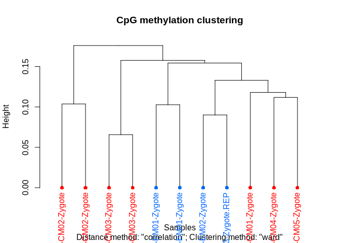
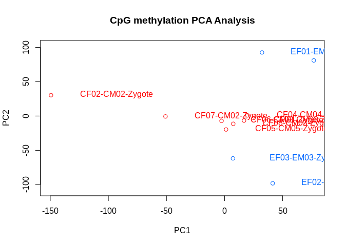
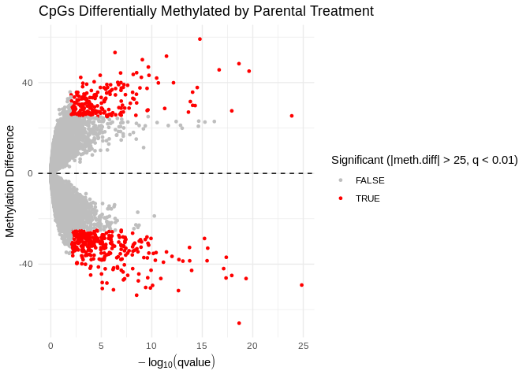
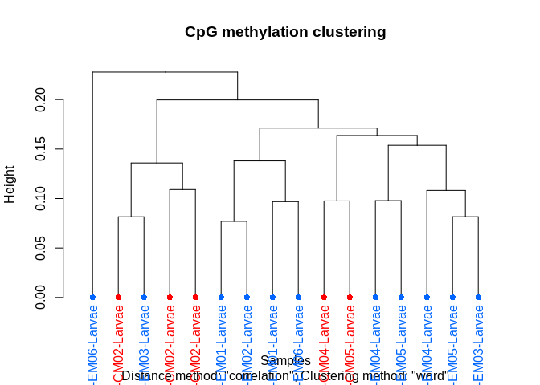
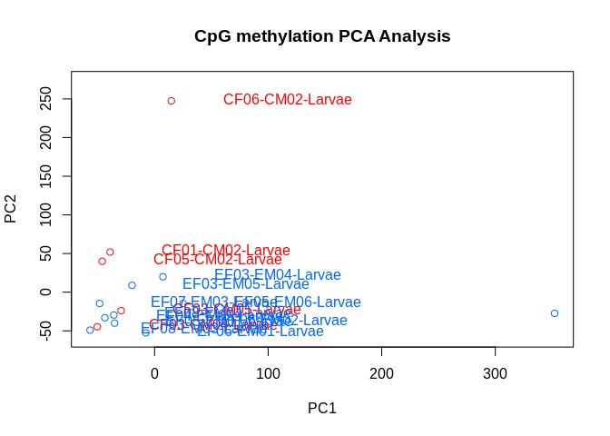
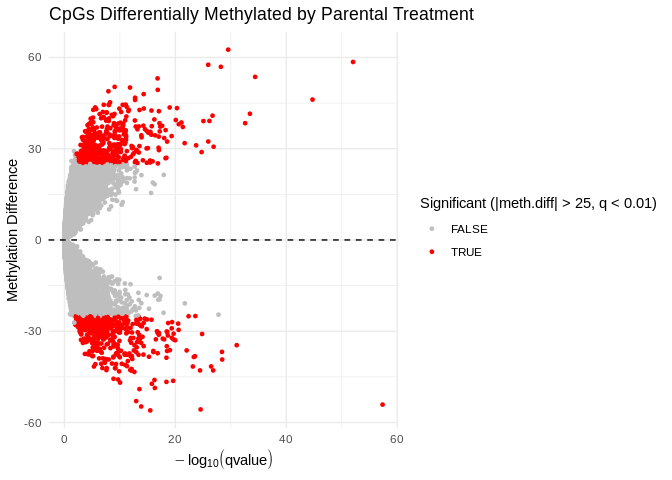

06.2-diff-methyl-split-lifestage-low-cov
================
Kathleen Durkin
2025-06-10

- <a href="#1-download-methylation-calls-if-needed"
  id="toc-1-download-methylation-calls-if-needed">1 Download methylation
  calls if needed</a>
- <a href="#2-methylkit" id="toc-2-methylkit">2 methylKit</a>
- <a href="#3-combo" id="toc-3-combo">3 Combo</a>
  - <a href="#31-create-object" id="toc-31-create-object">3.1 Create
    object</a>
  - <a href="#32-filter" id="toc-32-filter">3.2 Filter</a>
  - <a href="#33-normalization" id="toc-33-normalization">3.3
    Normalization</a>
  - <a href="#34-merge" id="toc-34-merge">3.4 Merge</a>
  - <a href="#35-data-structureoutlier-detection"
    id="toc-35-data-structureoutlier-detection">3.5 Data structure/Outlier
    detection</a>
  - <a href="#36-differential-methylation"
    id="toc-36-differential-methylation">3.6 Differential methylation</a>
    - <a href="#361-cpg-sites" id="toc-361-cpg-sites">3.6.1 CpG sites</a>
- <a href="#4-zygote" id="toc-4-zygote">4 Zygote</a>
  - <a href="#41-create-object" id="toc-41-create-object">4.1 Create
    object</a>
  - <a href="#42-filter" id="toc-42-filter">4.2 Filter</a>
  - <a href="#43-normalization" id="toc-43-normalization">4.3
    Normalization</a>
  - <a href="#44-merge" id="toc-44-merge">4.4 Merge</a>
  - <a href="#45-data-structureoutlier-detection"
    id="toc-45-data-structureoutlier-detection">4.5 Data structure/Outlier
    detection</a>
  - <a href="#46-differential-methylation"
    id="toc-46-differential-methylation">4.6 Differential methylation</a>
    - <a href="#461-cpg-sites" id="toc-461-cpg-sites">4.6.1 CpG sites</a>
- <a href="#5-larvae" id="toc-5-larvae">5 Larvae</a>
  - <a href="#51-create-object" id="toc-51-create-object">5.1 Create
    object</a>
  - <a href="#52-filter" id="toc-52-filter">5.2 Filter</a>
  - <a href="#53-normalization" id="toc-53-normalization">5.3
    Normalization</a>
  - <a href="#54-merge" id="toc-54-merge">5.4 Merge</a>
  - <a href="#55-data-structureoutlier-detection"
    id="toc-55-data-structureoutlier-detection">5.5 Data structure/Outlier
    detection</a>
  - <a href="#56-differential-methylation"
    id="toc-56-differential-methylation">5.6 Differential methylation</a>
    - <a href="#561-cpg-sites" id="toc-561-cpg-sites">5.6.1 CpG sites</a>
- <a href="#6-notes" id="toc-6-notes">6 Notes</a>

Performing differential methylation analysis using the `methylkit`
package. As before, I’m considering the two lifestages (Zygote and
Larvae) in combination and separately, and am using parameters
concurrent with Rondon et al. 2017 and Venkataraman et al. 2024.

Since my last analysis iteration (`06.1-differential-methylation-split`)
suggested the Zygote samples may be hampering DML analysis because of
low data quality/quantity, I want to take these into better account
during filtering.

Consulting the [Bismark MultiQC
report](https://gannet.fish.washington.edu/gitrepos/ceasmallr/output/02.20-bismark-methylation-extraction/multiqc_report.html)
I see several samples have notably low counts for “Number of C’s
analyzed”, indicating low data quantity. Since one of the MethylKit
filtering steps retains only cytosine positions (C’s) for which all
samples have data, these low-count samples count be limiting the
analysis.

I’ll exclude any samples with less than 100M C’s analyzed:

- CF01-CM01-Zygote (40.4 M)

- CF08-CM04-Larvae (6.2 M)

- CF08-CM05-Larvae (6.2 M)

- EF04-EM04-Zygote (97.3 M)

- EF05-EM05-Zygote (53.8 M)

I’ll also consider some alternate filtering settings (e.g., changing the
minimum coverage)

Inputs:

- Methylation calls extracted from WGBS reads using `Bismark`:
  `[].fastp-trim_bismark_bt2_pe.deduplicated.bismark.cov.gz`, stored on
  [Gannet](https://gannet.fish.washington.edu/gitrepos/ceasmallr/output/02.20-bismark-methylation-extraction/)

# 1 Download methylation calls if needed

``` bash
# Run wget to retrieve FastQs and MD5 files
# Note: the --no-clobber command will skip re-downloading any files that are already present in the output directory
wget \
--directory-prefix ../data/bismark-methyl-extraction \
--recursive \
--no-check-certificate \
--continue \
--cut-dirs 4 \
--no-host-directories \
--no-parent \
--quiet \
--no-clobber \
--accept="*.deduplicated.bismark.cov.gz,checksums.md5" https://gannet.fish.washington.edu/gitrepos/ceasmallr/output/02.20-bismark-methylation-extraction/
```

``` bash
cd ../data/bismark-methyl-extraction/

echo "How many methylation calling files were downloaded?"
ls *.deduplicated.bismark.cov.gz | wc -l

echo ""

echo "Check file checksums:"
grep '.deduplicated.bismark.cov.gz' checksums.md5 | md5sum -c -
```

We should have N=32 (n=15 ControlxControl crosses, n=17 ExposedxExposed
crosses)

# 2 methylKit

Load packages

``` r
# Install packages if necessary
# if (!require("BiocManager", quietly = TRUE))
#     install.packages("BiocManager")
# BiocManager::install("methylKit")
# BiocManager::install("genomation")

# Load
library(tidyr)
library(dplyr)
```

    ## 
    ## Attaching package: 'dplyr'

    ## The following objects are masked from 'package:stats':
    ## 
    ##     filter, lag

    ## The following objects are masked from 'package:base':
    ## 
    ##     intersect, setdiff, setequal, union

``` r
library(methylKit)
```

    ## Loading required package: GenomicRanges

    ## Loading required package: stats4

    ## Loading required package: BiocGenerics

    ## 
    ## Attaching package: 'BiocGenerics'

    ## The following objects are masked from 'package:dplyr':
    ## 
    ##     combine, intersect, setdiff, union

    ## The following objects are masked from 'package:stats':
    ## 
    ##     IQR, mad, sd, var, xtabs

    ## The following objects are masked from 'package:base':
    ## 
    ##     anyDuplicated, aperm, append, as.data.frame, basename, cbind,
    ##     colnames, dirname, do.call, duplicated, eval, evalq, Filter, Find,
    ##     get, grep, grepl, intersect, is.unsorted, lapply, Map, mapply,
    ##     match, mget, order, paste, pmax, pmax.int, pmin, pmin.int,
    ##     Position, rank, rbind, Reduce, rownames, sapply, setdiff, sort,
    ##     table, tapply, union, unique, unsplit, which.max, which.min

    ## Loading required package: S4Vectors

    ## 
    ## Attaching package: 'S4Vectors'

    ## The following objects are masked from 'package:dplyr':
    ## 
    ##     first, rename

    ## The following object is masked from 'package:tidyr':
    ## 
    ##     expand

    ## The following objects are masked from 'package:base':
    ## 
    ##     expand.grid, I, unname

    ## Loading required package: IRanges

    ## 
    ## Attaching package: 'IRanges'

    ## The following objects are masked from 'package:dplyr':
    ## 
    ##     collapse, desc, slice

    ## Loading required package: GenomeInfoDb

    ## 
    ## Attaching package: 'methylKit'

    ## The following object is masked from 'package:dplyr':
    ## 
    ##     select

    ## The following object is masked from 'package:tidyr':
    ## 
    ##     unite

``` r
library(genomation)
```

    ## Loading required package: grid

    ## Warning: replacing previous import 'Biostrings::pattern' by 'grid::pattern'
    ## when loading 'genomation'

    ## 
    ## Attaching package: 'genomation'

    ## The following objects are masked from 'package:methylKit':
    ## 
    ##     getFeatsWithTargetsStats, getFlanks, getMembers,
    ##     getTargetAnnotationStats, plotTargetAnnotation

``` r
library(GenomicRanges)
library(gridExtra)
```

    ## 
    ## Attaching package: 'gridExtra'

    ## The following object is masked from 'package:BiocGenerics':
    ## 
    ##     combine

    ## The following object is masked from 'package:dplyr':
    ## 
    ##     combine

``` r
library(ggplot2)
```

Using tutorial:
<https://nbis-workshop-epigenomics.readthedocs.io/en/latest/content/tutorials/methylationSeq/Seq_Tutorial.html#introduction>

# 3 Combo

Rerun differential methylation analysis using both the lifestages, with
updated settings

## 3.1 Create object

``` r
# Define path to my samples directory
data_dir <- "../data/bismark-methyl-extraction"

# List all .bismark.cov.gz files in the samples directory
file.list <- list.files(path = data_dir, pattern = "\\.bismark.cov.gz$", full.names = TRUE)
# Exclude samples with less than 100M cytosines analyzed (poor coverage)
file.list <- file.list[!grepl("CF01-CM01-Zygote|CF08-CM04-Larvae|CF08-CM05-Larvae|EF04-EM04-Zygote|EF05-EM05-Zygote", file.list)]


# Extract just the filenames
file.names <- basename(file.list)

# Create sample IDs by stripping file extensions
sample.ids <- sub("_R1_001.fastp-trim_bismark_bt2_pe.deduplicated.bismark.cov.gz", "", file.names)
sample.ids <- sub("_R1_001.fastp-trim.REPAIRED_bismark_bt2_pe.deduplicated.bismark.cov.gz", ".REP", sample.ids)


# Assign treatment based on first letter of filename
# E = parents exposed to OA treatment
# C = parents held in control
treatment <- ifelse(startsWith(file.names, "E"), 1,
                    ifelse(startsWith(file.names, "C"), 0, NA))

# Read in methylation data
myobj <- methRead(as.list(file.list),
  sample.id = as.list(sample.ids),
  pipeline = "bismarkCoverage",
  assembly = "mm10",
  treatment = treatment,
  mincov = 5
)
```

    ## Received list of locations.

    ## Uncompressing file.

    ## Reading file.

    ## Uncompressing file.

    ## Reading file.

    ## Uncompressing file.

    ## Reading file.

    ## Uncompressing file.

    ## Reading file.

    ## Uncompressing file.

    ## Reading file.

    ## Uncompressing file.

    ## Reading file.

    ## Uncompressing file.

    ## Reading file.

    ## Uncompressing file.

    ## Reading file.

    ## Uncompressing file.

    ## Reading file.

    ## Uncompressing file.

    ## Reading file.

    ## Uncompressing file.

    ## Reading file.

    ## Uncompressing file.

    ## Reading file.

    ## Uncompressing file.

    ## Reading file.

    ## Uncompressing file.

    ## Reading file.

    ## Uncompressing file.

    ## Reading file.

    ## Uncompressing file.

    ## Reading file.

    ## Uncompressing file.

    ## Reading file.

    ## Uncompressing file.

    ## Reading file.

    ## Uncompressing file.

    ## Reading file.

    ## Uncompressing file.

    ## Reading file.

    ## Uncompressing file.

    ## Reading file.

    ## Uncompressing file.

    ## Reading file.

    ## Uncompressing file.

    ## Reading file.

    ## Uncompressing file.

    ## Reading file.

    ## Uncompressing file.

    ## Reading file.

    ## Uncompressing file.

    ## Reading file.

    ## Uncompressing file.

    ## Reading file.

``` r
# Inspect
str(myobj)
```

    ## Formal class 'methylRawList' [package "methylKit"] with 2 slots
    ##   ..@ .Data    :List of 27
    ##   .. ..$ :'data.frame':  5851814 obs. of  7 variables:
    ## Formal class 'methylRaw' [package "methylKit"] with 8 slots
    ##   .. .. .. ..@ .Data     :List of 7
    ##   .. .. .. .. ..$ : chr [1:5851814] "NC_007175.2" "NC_007175.2" "NC_007175.2" "NC_007175.2" ...
    ##   .. .. .. .. ..$ : int [1:5851814] 50 51 52 88 89 147 148 193 194 246 ...
    ##   .. .. .. .. ..$ : int [1:5851814] 50 51 52 88 89 147 148 193 194 246 ...
    ##   .. .. .. .. ..$ : chr [1:5851814] "*" "*" "*" "*" ...
    ##   .. .. .. .. ..$ : int [1:5851814] 15 59 16 113 184 163 188 211 142 221 ...
    ##   .. .. .. .. ..$ : int [1:5851814] 0 1 0 4 3 0 3 1 0 3 ...
    ##   .. .. .. .. ..$ : int [1:5851814] 15 58 16 109 181 163 185 210 142 218 ...
    ##   .. .. .. ..@ sample.id : chr "CF01-CM02-Larvae"
    ##   .. .. .. ..@ assembly  : chr "mm10"
    ##   .. .. .. ..@ context   : chr "CpG"
    ##   .. .. .. ..@ resolution: chr "base"
    ##   .. .. .. ..@ names     : chr [1:7] "chr" "start" "end" "strand" ...
    ##   .. .. .. ..@ row.names : int [1:5851814] 1 2 3 4 5 6 7 8 9 10 ...
    ##   .. .. .. ..@ .S3Class  : chr "data.frame"
    ##   .. ..$ :'data.frame':  840883 obs. of  7 variables:
    ## Formal class 'methylRaw' [package "methylKit"] with 8 slots
    ##   .. .. .. ..@ .Data     :List of 7
    ##   .. .. .. .. ..$ : chr [1:840883] "NC_007175.2" "NC_007175.2" "NC_007175.2" "NC_007175.2" ...
    ##   .. .. .. .. ..$ : int [1:840883] 49 50 51 52 88 89 147 148 149 193 ...
    ##   .. .. .. .. ..$ : int [1:840883] 49 50 51 52 88 89 147 148 149 193 ...
    ##   .. .. .. .. ..$ : chr [1:840883] "*" "*" "*" "*" ...
    ##   .. .. .. .. ..$ : int [1:840883] 80 19 82 19 206 173 235 257 8 63 ...
    ##   .. .. .. .. ..$ : int [1:840883] 3 2 2 0 10 9 6 12 0 1 ...
    ##   .. .. .. .. ..$ : int [1:840883] 77 17 80 19 196 164 229 245 8 62 ...
    ##   .. .. .. ..@ sample.id : chr "CF02-CM02-Zygote"
    ##   .. .. .. ..@ assembly  : chr "mm10"
    ##   .. .. .. ..@ context   : chr "CpG"
    ##   .. .. .. ..@ resolution: chr "base"
    ##   .. .. .. ..@ names     : chr [1:7] "chr" "start" "end" "strand" ...
    ##   .. .. .. ..@ row.names : int [1:840883] 1 2 3 4 5 6 7 8 9 10 ...
    ##   .. .. .. ..@ .S3Class  : chr "data.frame"
    ##   .. ..$ :'data.frame':  1967167 obs. of  7 variables:
    ## Formal class 'methylRaw' [package "methylKit"] with 8 slots
    ##   .. .. .. ..@ .Data     :List of 7
    ##   .. .. .. .. ..$ : chr [1:1967167] "NC_007175.2" "NC_007175.2" "NC_007175.2" "NC_007175.2" ...
    ##   .. .. .. .. ..$ : int [1:1967167] 50 51 52 88 89 147 148 149 193 194 ...
    ##   .. .. .. .. ..$ : int [1:1967167] 50 51 52 88 89 147 148 149 193 194 ...
    ##   .. .. .. .. ..$ : chr [1:1967167] "*" "*" "*" "*" ...
    ##   .. .. .. .. ..$ : int [1:1967167] 25 51 29 101 325 107 397 7 84 237 ...
    ##   .. .. .. .. ..$ : int [1:1967167] 0 2 0 1 6 1 12 0 3 6 ...
    ##   .. .. .. .. ..$ : int [1:1967167] 25 49 29 100 319 106 385 7 81 231 ...
    ##   .. .. .. ..@ sample.id : chr "CF03-CM03-Zygote"
    ##   .. .. .. ..@ assembly  : chr "mm10"
    ##   .. .. .. ..@ context   : chr "CpG"
    ##   .. .. .. ..@ resolution: chr "base"
    ##   .. .. .. ..@ names     : chr [1:7] "chr" "start" "end" "strand" ...
    ##   .. .. .. ..@ row.names : int [1:1967167] 1 2 3 4 5 6 7 8 9 10 ...
    ##   .. .. .. ..@ .S3Class  : chr "data.frame"
    ##   .. ..$ :'data.frame':  4848779 obs. of  7 variables:
    ## Formal class 'methylRaw' [package "methylKit"] with 8 slots
    ##   .. .. .. ..@ .Data     :List of 7
    ##   .. .. .. .. ..$ : chr [1:4848779] "NC_007175.2" "NC_007175.2" "NC_007175.2" "NC_007175.2" ...
    ##   .. .. .. .. ..$ : int [1:4848779] 51 88 89 147 148 193 194 246 247 257 ...
    ##   .. .. .. .. ..$ : int [1:4848779] 51 88 89 147 148 193 194 246 247 257 ...
    ##   .. .. .. .. ..$ : chr [1:4848779] "*" "*" "*" "*" ...
    ##   .. .. .. .. ..$ : int [1:4848779] 44 92 83 127 70 231 55 242 35 256 ...
    ##   .. .. .. .. ..$ : int [1:4848779] 4 2 0 3 1 8 1 8 1 4 ...
    ##   .. .. .. .. ..$ : int [1:4848779] 40 90 83 124 69 223 54 234 34 252 ...
    ##   .. .. .. ..@ sample.id : chr "CF03-CM04-Larvae"
    ##   .. .. .. ..@ assembly  : chr "mm10"
    ##   .. .. .. ..@ context   : chr "CpG"
    ##   .. .. .. ..@ resolution: chr "base"
    ##   .. .. .. ..@ names     : chr [1:7] "chr" "start" "end" "strand" ...
    ##   .. .. .. ..@ row.names : int [1:4848779] 1 2 3 4 5 6 7 8 9 10 ...
    ##   .. .. .. ..@ .S3Class  : chr "data.frame"
    ##   .. ..$ :'data.frame':  5351344 obs. of  7 variables:
    ## Formal class 'methylRaw' [package "methylKit"] with 8 slots
    ##   .. .. .. ..@ .Data     :List of 7
    ##   .. .. .. .. ..$ : chr [1:5351344] "NC_007175.2" "NC_007175.2" "NC_007175.2" "NC_007175.2" ...
    ##   .. .. .. .. ..$ : int [1:5351344] 50 51 52 88 89 147 148 193 194 246 ...
    ##   .. .. .. .. ..$ : int [1:5351344] 50 51 52 88 89 147 148 193 194 246 ...
    ##   .. .. .. .. ..$ : chr [1:5351344] "*" "*" "*" "*" ...
    ##   .. .. .. .. ..$ : int [1:5351344] 10 17 11 38 130 58 147 114 109 150 ...
    ##   .. .. .. .. ..$ : int [1:5351344] 0 1 0 1 1 2 4 6 4 5 ...
    ##   .. .. .. .. ..$ : int [1:5351344] 10 16 11 37 129 56 143 108 105 145 ...
    ##   .. .. .. ..@ sample.id : chr "CF03-CM05-Larvae"
    ##   .. .. .. ..@ assembly  : chr "mm10"
    ##   .. .. .. ..@ context   : chr "CpG"
    ##   .. .. .. ..@ resolution: chr "base"
    ##   .. .. .. ..@ names     : chr [1:7] "chr" "start" "end" "strand" ...
    ##   .. .. .. ..@ row.names : int [1:5351344] 1 2 3 4 5 6 7 8 9 10 ...
    ##   .. .. .. ..@ .S3Class  : chr "data.frame"
    ##   .. ..$ :'data.frame':  2688484 obs. of  7 variables:
    ## Formal class 'methylRaw' [package "methylKit"] with 8 slots
    ##   .. .. .. ..@ .Data     :List of 7
    ##   .. .. .. .. ..$ : chr [1:2688484] "NC_007175.2" "NC_007175.2" "NC_007175.2" "NC_007175.2" ...
    ##   .. .. .. .. ..$ : int [1:2688484] 50 51 52 88 89 147 148 149 193 194 ...
    ##   .. .. .. .. ..$ : int [1:2688484] 50 51 52 88 89 147 148 149 193 194 ...
    ##   .. .. .. .. ..$ : chr [1:2688484] "*" "*" "*" "*" ...
    ##   .. .. .. .. ..$ : int [1:2688484] 85 116 99 252 669 323 731 13 263 496 ...
    ##   .. .. .. .. ..$ : int [1:2688484] 1 1 1 8 9 8 21 0 8 9 ...
    ##   .. .. .. .. ..$ : int [1:2688484] 84 115 98 244 660 315 710 13 255 487 ...
    ##   .. .. .. ..@ sample.id : chr "CF04-CM04-Zygote"
    ##   .. .. .. ..@ assembly  : chr "mm10"
    ##   .. .. .. ..@ context   : chr "CpG"
    ##   .. .. .. ..@ resolution: chr "base"
    ##   .. .. .. ..@ names     : chr [1:7] "chr" "start" "end" "strand" ...
    ##   .. .. .. ..@ row.names : int [1:2688484] 1 2 3 4 5 6 7 8 9 10 ...
    ##   .. .. .. ..@ .S3Class  : chr "data.frame"
    ##   .. ..$ :'data.frame':  7065718 obs. of  7 variables:
    ## Formal class 'methylRaw' [package "methylKit"] with 8 slots
    ##   .. .. .. ..@ .Data     :List of 7
    ##   .. .. .. .. ..$ : chr [1:7065718] "NC_007175.2" "NC_007175.2" "NC_007175.2" "NC_007175.2" ...
    ##   .. .. .. .. ..$ : int [1:7065718] 50 51 52 88 89 147 148 193 194 246 ...
    ##   .. .. .. .. ..$ : int [1:7065718] 50 51 52 88 89 147 148 193 194 246 ...
    ##   .. .. .. .. ..$ : chr [1:7065718] "*" "*" "*" "*" ...
    ##   .. .. .. .. ..$ : int [1:7065718] 5 24 6 50 77 85 80 110 61 124 ...
    ##   .. .. .. .. ..$ : int [1:7065718] 0 0 0 1 0 0 0 1 0 0 ...
    ##   .. .. .. .. ..$ : int [1:7065718] 5 24 6 49 77 85 80 109 61 124 ...
    ##   .. .. .. ..@ sample.id : chr "CF05-CM02-Larvae"
    ##   .. .. .. ..@ assembly  : chr "mm10"
    ##   .. .. .. ..@ context   : chr "CpG"
    ##   .. .. .. ..@ resolution: chr "base"
    ##   .. .. .. ..@ names     : chr [1:7] "chr" "start" "end" "strand" ...
    ##   .. .. .. ..@ row.names : int [1:7065718] 1 2 3 4 5 6 7 8 9 10 ...
    ##   .. .. .. ..@ .S3Class  : chr "data.frame"
    ##   .. ..$ :'data.frame':  3875130 obs. of  7 variables:
    ## Formal class 'methylRaw' [package "methylKit"] with 8 slots
    ##   .. .. .. ..@ .Data     :List of 7
    ##   .. .. .. .. ..$ : chr [1:3875130] "NC_007175.2" "NC_007175.2" "NC_007175.2" "NC_007175.2" ...
    ##   .. .. .. .. ..$ : int [1:3875130] 50 51 52 88 89 131 147 148 149 193 ...
    ##   .. .. .. .. ..$ : int [1:3875130] 50 51 52 88 89 131 147 148 149 193 ...
    ##   .. .. .. .. ..$ : chr [1:3875130] "*" "*" "*" "*" ...
    ##   .. .. .. .. ..$ : int [1:3875130] 107 110 113 239 855 5 373 902 19 435 ...
    ##   .. .. .. .. ..$ : int [1:3875130] 4 2 2 7 19 0 8 18 1 12 ...
    ##   .. .. .. .. ..$ : int [1:3875130] 103 108 111 232 836 5 365 884 18 423 ...
    ##   .. .. .. ..@ sample.id : chr "CF05-CM05-Zygote"
    ##   .. .. .. ..@ assembly  : chr "mm10"
    ##   .. .. .. ..@ context   : chr "CpG"
    ##   .. .. .. ..@ resolution: chr "base"
    ##   .. .. .. ..@ names     : chr [1:7] "chr" "start" "end" "strand" ...
    ##   .. .. .. ..@ row.names : int [1:3875130] 1 2 3 4 5 6 7 8 9 10 ...
    ##   .. .. .. ..@ .S3Class  : chr "data.frame"
    ##   .. ..$ :'data.frame':  2417862 obs. of  7 variables:
    ## Formal class 'methylRaw' [package "methylKit"] with 8 slots
    ##   .. .. .. ..@ .Data     :List of 7
    ##   .. .. .. .. ..$ : chr [1:2417862] "NC_007175.2" "NC_007175.2" "NC_007175.2" "NC_007175.2" ...
    ##   .. .. .. .. ..$ : int [1:2417862] 50 51 52 88 89 147 148 149 193 194 ...
    ##   .. .. .. .. ..$ : int [1:2417862] 50 51 52 88 89 147 148 149 193 194 ...
    ##   .. .. .. .. ..$ : chr [1:2417862] "*" "*" "*" "*" ...
    ##   .. .. .. .. ..$ : int [1:2417862] 51 65 59 143 467 172 569 9 134 358 ...
    ##   .. .. .. .. ..$ : int [1:2417862] 2 4 0 5 10 4 20 0 3 6 ...
    ##   .. .. .. .. ..$ : int [1:2417862] 49 61 59 138 457 168 549 9 131 352 ...
    ##   .. .. .. ..@ sample.id : chr "CF06-CM01-Zygote"
    ##   .. .. .. ..@ assembly  : chr "mm10"
    ##   .. .. .. ..@ context   : chr "CpG"
    ##   .. .. .. ..@ resolution: chr "base"
    ##   .. .. .. ..@ names     : chr [1:7] "chr" "start" "end" "strand" ...
    ##   .. .. .. ..@ row.names : int [1:2417862] 1 2 3 4 5 6 7 8 9 10 ...
    ##   .. .. .. ..@ .S3Class  : chr "data.frame"
    ##   .. ..$ :'data.frame':  2369237 obs. of  7 variables:
    ## Formal class 'methylRaw' [package "methylKit"] with 8 slots
    ##   .. .. .. ..@ .Data     :List of 7
    ##   .. .. .. .. ..$ : chr [1:2369237] "NC_007175.2" "NC_007175.2" "NC_007175.2" "NC_007175.2" ...
    ##   .. .. .. .. ..$ : int [1:2369237] 50 52 88 89 147 148 193 194 246 247 ...
    ##   .. .. .. .. ..$ : int [1:2369237] 50 52 88 89 147 148 193 194 246 247 ...
    ##   .. .. .. .. ..$ : chr [1:2369237] "*" "*" "*" "*" ...
    ##   .. .. .. .. ..$ : int [1:2369237] 12 14 8 136 13 140 10 91 16 31 ...
    ##   .. .. .. .. ..$ : int [1:2369237] 0 2 0 0 0 8 0 4 1 2 ...
    ##   .. .. .. .. ..$ : int [1:2369237] 12 12 8 136 13 132 10 87 15 29 ...
    ##   .. .. .. ..@ sample.id : chr "CF06-CM02-Larvae"
    ##   .. .. .. ..@ assembly  : chr "mm10"
    ##   .. .. .. ..@ context   : chr "CpG"
    ##   .. .. .. ..@ resolution: chr "base"
    ##   .. .. .. ..@ names     : chr [1:7] "chr" "start" "end" "strand" ...
    ##   .. .. .. ..@ row.names : int [1:2369237] 1 2 3 4 5 6 7 8 9 10 ...
    ##   .. .. .. ..@ .S3Class  : chr "data.frame"
    ##   .. ..$ :'data.frame':  1177245 obs. of  7 variables:
    ## Formal class 'methylRaw' [package "methylKit"] with 8 slots
    ##   .. .. .. ..@ .Data     :List of 7
    ##   .. .. .. .. ..$ : chr [1:1177245] "NC_007175.2" "NC_007175.2" "NC_007175.2" "NC_007175.2" ...
    ##   .. .. .. .. ..$ : int [1:1177245] 50 51 52 88 89 147 148 149 169 193 ...
    ##   .. .. .. .. ..$ : int [1:1177245] 50 51 52 88 89 147 148 149 169 193 ...
    ##   .. .. .. .. ..$ : chr [1:1177245] "*" "*" "*" "*" ...
    ##   .. .. .. .. ..$ : int [1:1177245] 86 205 102 483 586 587 611 9 9 514 ...
    ##   .. .. .. .. ..$ : int [1:1177245] 2 1 0 6 5 4 9 0 0 10 ...
    ##   .. .. .. .. ..$ : int [1:1177245] 84 204 102 477 581 583 602 9 9 504 ...
    ##   .. .. .. ..@ sample.id : chr "CF07-CM02-Zygote"
    ##   .. .. .. ..@ assembly  : chr "mm10"
    ##   .. .. .. ..@ context   : chr "CpG"
    ##   .. .. .. ..@ resolution: chr "base"
    ##   .. .. .. ..@ names     : chr [1:7] "chr" "start" "end" "strand" ...
    ##   .. .. .. ..@ row.names : int [1:1177245] 1 2 3 4 5 6 7 8 9 10 ...
    ##   .. .. .. ..@ .S3Class  : chr "data.frame"
    ##   .. ..$ :'data.frame':  964840 obs. of  7 variables:
    ## Formal class 'methylRaw' [package "methylKit"] with 8 slots
    ##   .. .. .. ..@ .Data     :List of 7
    ##   .. .. .. .. ..$ : chr [1:964840] "NC_007175.2" "NC_007175.2" "NC_007175.2" "NC_007175.2" ...
    ##   .. .. .. .. ..$ : int [1:964840] 49 50 51 52 88 89 147 148 149 193 ...
    ##   .. .. .. .. ..$ : int [1:964840] 49 50 51 52 88 89 147 148 149 193 ...
    ##   .. .. .. .. ..$ : chr [1:964840] "*" "*" "*" "*" ...
    ##   .. .. .. .. ..$ : int [1:964840] 106 36 110 37 241 357 266 453 6 79 ...
    ##   .. .. .. .. ..$ : int [1:964840] 2 0 4 1 11 4 7 6 0 3 ...
    ##   .. .. .. .. ..$ : int [1:964840] 104 36 106 36 230 353 259 447 6 76 ...
    ##   .. .. .. ..@ sample.id : chr "CF08-CM03-Zygote"
    ##   .. .. .. ..@ assembly  : chr "mm10"
    ##   .. .. .. ..@ context   : chr "CpG"
    ##   .. .. .. ..@ resolution: chr "base"
    ##   .. .. .. ..@ names     : chr [1:7] "chr" "start" "end" "strand" ...
    ##   .. .. .. ..@ row.names : int [1:964840] 1 2 3 4 5 6 7 8 9 10 ...
    ##   .. .. .. ..@ .S3Class  : chr "data.frame"
    ##   .. ..$ :'data.frame':  2460792 obs. of  7 variables:
    ## Formal class 'methylRaw' [package "methylKit"] with 8 slots
    ##   .. .. .. ..@ .Data     :List of 7
    ##   .. .. .. .. ..$ : chr [1:2460792] "NC_007175.2" "NC_007175.2" "NC_007175.2" "NC_007175.2" ...
    ##   .. .. .. .. ..$ : int [1:2460792] 50 51 52 88 89 131 147 148 149 169 ...
    ##   .. .. .. .. ..$ : int [1:2460792] 50 51 52 88 89 131 147 148 149 169 ...
    ##   .. .. .. .. ..$ : chr [1:2460792] "*" "*" "*" "*" ...
    ##   .. .. .. .. ..$ : int [1:2460792] 105 44 112 81 1070 6 114 1217 21 5 ...
    ##   .. .. .. .. ..$ : int [1:2460792] 8 0 7 3 26 0 4 42 2 0 ...
    ##   .. .. .. .. ..$ : int [1:2460792] 97 44 105 78 1044 6 110 1175 19 5 ...
    ##   .. .. .. ..@ sample.id : chr "EF01-EM01-Zygote"
    ##   .. .. .. ..@ assembly  : chr "mm10"
    ##   .. .. .. ..@ context   : chr "CpG"
    ##   .. .. .. ..@ resolution: chr "base"
    ##   .. .. .. ..@ names     : chr [1:7] "chr" "start" "end" "strand" ...
    ##   .. .. .. ..@ row.names : int [1:2460792] 1 2 3 4 5 6 7 8 9 10 ...
    ##   .. .. .. ..@ .S3Class  : chr "data.frame"
    ##   .. ..$ :'data.frame':  3260550 obs. of  7 variables:
    ## Formal class 'methylRaw' [package "methylKit"] with 8 slots
    ##   .. .. .. ..@ .Data     :List of 7
    ##   .. .. .. .. ..$ : chr [1:3260550] "NC_007175.2" "NC_007175.2" "NC_007175.2" "NC_007175.2" ...
    ##   .. .. .. .. ..$ : int [1:3260550] 49 50 51 52 88 89 147 148 193 194 ...
    ##   .. .. .. .. ..$ : int [1:3260550] 49 50 51 52 88 89 147 148 193 194 ...
    ##   .. .. .. .. ..$ : chr [1:3260550] "*" "*" "*" "*" ...
    ##   .. .. .. .. ..$ : int [1:3260550] 257 39 269 44 534 436 804 567 604 385 ...
    ##   .. .. .. .. ..$ : int [1:3260550] 1 0 3 0 5 1 7 10 5 7 ...
    ##   .. .. .. .. ..$ : int [1:3260550] 256 39 266 44 529 435 797 557 599 378 ...
    ##   .. .. .. ..@ sample.id : chr "EF02-EM02-Zygote"
    ##   .. .. .. ..@ assembly  : chr "mm10"
    ##   .. .. .. ..@ context   : chr "CpG"
    ##   .. .. .. ..@ resolution: chr "base"
    ##   .. .. .. ..@ names     : chr [1:7] "chr" "start" "end" "strand" ...
    ##   .. .. .. ..@ row.names : int [1:3260550] 1 2 3 4 5 6 7 8 9 10 ...
    ##   .. .. .. ..@ .S3Class  : chr "data.frame"
    ##   .. ..$ :'data.frame':  959245 obs. of  7 variables:
    ## Formal class 'methylRaw' [package "methylKit"] with 8 slots
    ##   .. .. .. ..@ .Data     :List of 7
    ##   .. .. .. .. ..$ : chr [1:959245] "NC_007175.2" "NC_007175.2" "NC_007175.2" "NC_007175.2" ...
    ##   .. .. .. .. ..$ : int [1:959245] 50 51 52 88 89 147 148 149 193 194 ...
    ##   .. .. .. .. ..$ : int [1:959245] 50 51 52 88 89 147 148 149 193 194 ...
    ##   .. .. .. .. ..$ : chr [1:959245] "*" "*" "*" "*" ...
    ##   .. .. .. .. ..$ : int [1:959245] 27 68 29 105 262 108 302 6 46 170 ...
    ##   .. .. .. .. ..$ : int [1:959245] 0 0 0 1 10 2 4 1 4 9 ...
    ##   .. .. .. .. ..$ : int [1:959245] 27 68 29 104 252 106 298 5 42 161 ...
    ##   .. .. .. ..@ sample.id : chr "EF03-EM03-Zygote.REP"
    ##   .. .. .. ..@ assembly  : chr "mm10"
    ##   .. .. .. ..@ context   : chr "CpG"
    ##   .. .. .. ..@ resolution: chr "base"
    ##   .. .. .. ..@ names     : chr [1:7] "chr" "start" "end" "strand" ...
    ##   .. .. .. ..@ row.names : int [1:959245] 1 2 3 4 5 6 7 8 9 10 ...
    ##   .. .. .. ..@ .S3Class  : chr "data.frame"
    ##   .. ..$ :'data.frame':  4981586 obs. of  7 variables:
    ## Formal class 'methylRaw' [package "methylKit"] with 8 slots
    ##   .. .. .. ..@ .Data     :List of 7
    ##   .. .. .. .. ..$ : chr [1:4981586] "NC_007175.2" "NC_007175.2" "NC_007175.2" "NC_007175.2" ...
    ##   .. .. .. .. ..$ : int [1:4981586] 50 51 52 88 89 147 148 149 193 194 ...
    ##   .. .. .. .. ..$ : int [1:4981586] 50 51 52 88 89 147 148 149 193 194 ...
    ##   .. .. .. .. ..$ : chr [1:4981586] "*" "*" "*" "*" ...
    ##   .. .. .. .. ..$ : int [1:4981586] 12 16 15 44 132 58 137 5 62 101 ...
    ##   .. .. .. .. ..$ : int [1:4981586] 1 1 0 3 7 7 1 0 2 0 ...
    ##   .. .. .. .. ..$ : int [1:4981586] 11 15 15 41 125 51 136 5 60 101 ...
    ##   .. .. .. ..@ sample.id : chr "EF03-EM04-Larvae"
    ##   .. .. .. ..@ assembly  : chr "mm10"
    ##   .. .. .. ..@ context   : chr "CpG"
    ##   .. .. .. ..@ resolution: chr "base"
    ##   .. .. .. ..@ names     : chr [1:7] "chr" "start" "end" "strand" ...
    ##   .. .. .. ..@ row.names : int [1:4981586] 1 2 3 4 5 6 7 8 9 10 ...
    ##   .. .. .. ..@ .S3Class  : chr "data.frame"
    ##   .. ..$ :'data.frame':  5265992 obs. of  7 variables:
    ## Formal class 'methylRaw' [package "methylKit"] with 8 slots
    ##   .. .. .. ..@ .Data     :List of 7
    ##   .. .. .. .. ..$ : chr [1:5265992] "NC_007175.2" "NC_007175.2" "NC_007175.2" "NC_007175.2" ...
    ##   .. .. .. .. ..$ : int [1:5265992] 50 51 52 88 89 147 148 193 194 246 ...
    ##   .. .. .. .. ..$ : int [1:5265992] 50 51 52 88 89 147 148 193 194 246 ...
    ##   .. .. .. .. ..$ : chr [1:5265992] "*" "*" "*" "*" ...
    ##   .. .. .. .. ..$ : int [1:5265992] 9 15 9 23 126 33 156 46 112 53 ...
    ##   .. .. .. .. ..$ : int [1:5265992] 0 0 0 1 6 2 4 1 0 1 ...
    ##   .. .. .. .. ..$ : int [1:5265992] 9 15 9 22 120 31 152 45 112 52 ...
    ##   .. .. .. ..@ sample.id : chr "EF03-EM05-Larvae"
    ##   .. .. .. ..@ assembly  : chr "mm10"
    ##   .. .. .. ..@ context   : chr "CpG"
    ##   .. .. .. ..@ resolution: chr "base"
    ##   .. .. .. ..@ names     : chr [1:7] "chr" "start" "end" "strand" ...
    ##   .. .. .. ..@ row.names : int [1:5265992] 1 2 3 4 5 6 7 8 9 10 ...
    ##   .. .. .. ..@ .S3Class  : chr "data.frame"
    ##   .. ..$ :'data.frame':  6759382 obs. of  7 variables:
    ## Formal class 'methylRaw' [package "methylKit"] with 8 slots
    ##   .. .. .. ..@ .Data     :List of 7
    ##   .. .. .. .. ..$ : chr [1:6759382] "NC_007175.2" "NC_007175.2" "NC_007175.2" "NC_007175.2" ...
    ##   .. .. .. .. ..$ : int [1:6759382] 50 51 52 88 89 147 148 193 194 246 ...
    ##   .. .. .. .. ..$ : int [1:6759382] 50 51 52 88 89 147 148 193 194 246 ...
    ##   .. .. .. .. ..$ : chr [1:6759382] "*" "*" "*" "*" ...
    ##   .. .. .. .. ..$ : int [1:6759382] 10 34 11 69 91 117 101 172 89 193 ...
    ##   .. .. .. .. ..$ : int [1:6759382] 0 0 0 0 1 0 0 5 0 2 ...
    ##   .. .. .. .. ..$ : int [1:6759382] 10 34 11 69 90 117 101 167 89 191 ...
    ##   .. .. .. ..@ sample.id : chr "EF04-EM05-Larvae"
    ##   .. .. .. ..@ assembly  : chr "mm10"
    ##   .. .. .. ..@ context   : chr "CpG"
    ##   .. .. .. ..@ resolution: chr "base"
    ##   .. .. .. ..@ names     : chr [1:7] "chr" "start" "end" "strand" ...
    ##   .. .. .. ..@ row.names : int [1:6759382] 1 2 3 4 5 6 7 8 9 10 ...
    ##   .. .. .. ..@ .S3Class  : chr "data.frame"
    ##   .. ..$ :'data.frame':  4374079 obs. of  7 variables:
    ## Formal class 'methylRaw' [package "methylKit"] with 8 slots
    ##   .. .. .. ..@ .Data     :List of 7
    ##   .. .. .. .. ..$ : chr [1:4374079] "NC_007175.2" "NC_007175.2" "NC_007175.2" "NC_007175.2" ...
    ##   .. .. .. .. ..$ : int [1:4374079] 50 51 52 88 89 147 148 193 194 246 ...
    ##   .. .. .. .. ..$ : int [1:4374079] 50 51 52 88 89 147 148 193 194 246 ...
    ##   .. .. .. .. ..$ : chr [1:4374079] "*" "*" "*" "*" ...
    ##   .. .. .. .. ..$ : int [1:4374079] 8 54 10 87 147 150 145 256 106 282 ...
    ##   .. .. .. .. ..$ : int [1:4374079] 0 0 1 2 2 3 2 1 1 2 ...
    ##   .. .. .. .. ..$ : int [1:4374079] 8 54 9 85 145 147 143 255 105 280 ...
    ##   .. .. .. ..@ sample.id : chr "EF05-EM01-Larvae"
    ##   .. .. .. ..@ assembly  : chr "mm10"
    ##   .. .. .. ..@ context   : chr "CpG"
    ##   .. .. .. ..@ resolution: chr "base"
    ##   .. .. .. ..@ names     : chr [1:7] "chr" "start" "end" "strand" ...
    ##   .. .. .. ..@ row.names : int [1:4374079] 1 2 3 4 5 6 7 8 9 10 ...
    ##   .. .. .. ..@ .S3Class  : chr "data.frame"
    ##   .. ..$ :'data.frame':  7805846 obs. of  7 variables:
    ## Formal class 'methylRaw' [package "methylKit"] with 8 slots
    ##   .. .. .. ..@ .Data     :List of 7
    ##   .. .. .. .. ..$ : chr [1:7805846] "NC_007175.2" "NC_007175.2" "NC_007175.2" "NC_007175.2" ...
    ##   .. .. .. .. ..$ : int [1:7805846] 51 88 89 147 148 193 194 246 247 257 ...
    ##   .. .. .. .. ..$ : int [1:7805846] 51 88 89 147 148 193 194 246 247 257 ...
    ##   .. .. .. .. ..$ : chr [1:7805846] "*" "*" "*" "*" ...
    ##   .. .. .. .. ..$ : int [1:7805846] 35 58 58 82 73 144 58 152 43 161 ...
    ##   .. .. .. .. ..$ : int [1:7805846] 1 0 4 4 6 6 5 10 7 9 ...
    ##   .. .. .. .. ..$ : int [1:7805846] 34 58 54 78 67 138 53 142 36 152 ...
    ##   .. .. .. ..@ sample.id : chr "EF05-EM06-Larvae"
    ##   .. .. .. ..@ assembly  : chr "mm10"
    ##   .. .. .. ..@ context   : chr "CpG"
    ##   .. .. .. ..@ resolution: chr "base"
    ##   .. .. .. ..@ names     : chr [1:7] "chr" "start" "end" "strand" ...
    ##   .. .. .. ..@ row.names : int [1:7805846] 1 2 3 4 5 6 7 8 9 10 ...
    ##   .. .. .. ..@ .S3Class  : chr "data.frame"
    ##   .. ..$ :'data.frame':  7027364 obs. of  7 variables:
    ## Formal class 'methylRaw' [package "methylKit"] with 8 slots
    ##   .. .. .. ..@ .Data     :List of 7
    ##   .. .. .. .. ..$ : chr [1:7027364] "NC_007175.2" "NC_007175.2" "NC_007175.2" "NC_007175.2" ...
    ##   .. .. .. .. ..$ : int [1:7027364] 50 51 88 89 147 148 193 194 246 247 ...
    ##   .. .. .. .. ..$ : int [1:7027364] 50 51 88 89 147 148 193 194 246 247 ...
    ##   .. .. .. .. ..$ : chr [1:7027364] "*" "*" "*" "*" ...
    ##   .. .. .. .. ..$ : int [1:7027364] 5 48 74 67 95 86 124 67 137 30 ...
    ##   .. .. .. .. ..$ : int [1:7027364] 0 0 0 0 0 1 2 1 1 1 ...
    ##   .. .. .. .. ..$ : int [1:7027364] 5 48 74 67 95 85 122 66 136 29 ...
    ##   .. .. .. ..@ sample.id : chr "EF06-EM01-Larvae"
    ##   .. .. .. ..@ assembly  : chr "mm10"
    ##   .. .. .. ..@ context   : chr "CpG"
    ##   .. .. .. ..@ resolution: chr "base"
    ##   .. .. .. ..@ names     : chr [1:7] "chr" "start" "end" "strand" ...
    ##   .. .. .. ..@ row.names : int [1:7027364] 1 2 3 4 5 6 7 8 9 10 ...
    ##   .. .. .. ..@ .S3Class  : chr "data.frame"
    ##   .. ..$ :'data.frame':  5162358 obs. of  7 variables:
    ## Formal class 'methylRaw' [package "methylKit"] with 8 slots
    ##   .. .. .. ..@ .Data     :List of 7
    ##   .. .. .. .. ..$ : chr [1:5162358] "NC_007175.2" "NC_007175.2" "NC_007175.2" "NC_007175.2" ...
    ##   .. .. .. .. ..$ : int [1:5162358] 50 51 52 88 89 147 148 193 194 246 ...
    ##   .. .. .. .. ..$ : int [1:5162358] 50 51 52 88 89 147 148 193 194 246 ...
    ##   .. .. .. .. ..$ : chr [1:5162358] "*" "*" "*" "*" ...
    ##   .. .. .. .. ..$ : int [1:5162358] 15 23 16 36 173 57 177 89 117 111 ...
    ##   .. .. .. .. ..$ : int [1:5162358] 0 0 0 0 3 1 4 1 2 8 ...
    ##   .. .. .. .. ..$ : int [1:5162358] 15 23 16 36 170 56 173 88 115 103 ...
    ##   .. .. .. ..@ sample.id : chr "EF06-EM02-Larvae"
    ##   .. .. .. ..@ assembly  : chr "mm10"
    ##   .. .. .. ..@ context   : chr "CpG"
    ##   .. .. .. ..@ resolution: chr "base"
    ##   .. .. .. ..@ names     : chr [1:7] "chr" "start" "end" "strand" ...
    ##   .. .. .. ..@ row.names : int [1:5162358] 1 2 3 4 5 6 7 8 9 10 ...
    ##   .. .. .. ..@ .S3Class  : chr "data.frame"
    ##   .. ..$ :'data.frame':  383637 obs. of  7 variables:
    ## Formal class 'methylRaw' [package "methylKit"] with 8 slots
    ##   .. .. .. ..@ .Data     :List of 7
    ##   .. .. .. .. ..$ : chr [1:383637] "NC_007175.2" "NC_007175.2" "NC_007175.2" "NC_007175.2" ...
    ##   .. .. .. .. ..$ : int [1:383637] 50 51 52 88 89 147 148 193 194 246 ...
    ##   .. .. .. .. ..$ : int [1:383637] 50 51 52 88 89 147 148 193 194 246 ...
    ##   .. .. .. .. ..$ : chr [1:383637] "*" "*" "*" "*" ...
    ##   .. .. .. .. ..$ : int [1:383637] 24 73 27 152 266 199 354 129 234 141 ...
    ##   .. .. .. .. ..$ : int [1:383637] 0 0 1 4 10 5 17 8 7 5 ...
    ##   .. .. .. .. ..$ : int [1:383637] 24 73 26 148 256 194 337 121 227 136 ...
    ##   .. .. .. ..@ sample.id : chr "EF06-EM06-Larvae"
    ##   .. .. .. ..@ assembly  : chr "mm10"
    ##   .. .. .. ..@ context   : chr "CpG"
    ##   .. .. .. ..@ resolution: chr "base"
    ##   .. .. .. ..@ names     : chr [1:7] "chr" "start" "end" "strand" ...
    ##   .. .. .. ..@ row.names : int [1:383637] 1 2 3 4 5 6 7 8 9 10 ...
    ##   .. .. .. ..@ .S3Class  : chr "data.frame"
    ##   .. ..$ :'data.frame':  486201 obs. of  7 variables:
    ## Formal class 'methylRaw' [package "methylKit"] with 8 slots
    ##   .. .. .. ..@ .Data     :List of 7
    ##   .. .. .. .. ..$ : chr [1:486201] "NC_007175.2" "NC_007175.2" "NC_007175.2" "NC_007175.2" ...
    ##   .. .. .. .. ..$ : int [1:486201] 50 51 52 88 89 147 148 193 194 246 ...
    ##   .. .. .. .. ..$ : int [1:486201] 50 51 52 88 89 147 148 193 194 246 ...
    ##   .. .. .. .. ..$ : chr [1:486201] "*" "*" "*" "*" ...
    ##   .. .. .. .. ..$ : int [1:486201] 19 112 18 236 168 330 238 141 125 173 ...
    ##   .. .. .. .. ..$ : int [1:486201] 0 0 0 0 1 2 6 0 1 4 ...
    ##   .. .. .. .. ..$ : int [1:486201] 19 112 18 236 167 328 232 141 124 169 ...
    ##   .. .. .. ..@ sample.id : chr "EF07-EM01-Zygote"
    ##   .. .. .. ..@ assembly  : chr "mm10"
    ##   .. .. .. ..@ context   : chr "CpG"
    ##   .. .. .. ..@ resolution: chr "base"
    ##   .. .. .. ..@ names     : chr [1:7] "chr" "start" "end" "strand" ...
    ##   .. .. .. ..@ row.names : int [1:486201] 1 2 3 4 5 6 7 8 9 10 ...
    ##   .. .. .. ..@ .S3Class  : chr "data.frame"
    ##   .. ..$ :'data.frame':  5284607 obs. of  7 variables:
    ## Formal class 'methylRaw' [package "methylKit"] with 8 slots
    ##   .. .. .. ..@ .Data     :List of 7
    ##   .. .. .. .. ..$ : chr [1:5284607] "NC_007175.2" "NC_007175.2" "NC_007175.2" "NC_007175.2" ...
    ##   .. .. .. .. ..$ : int [1:5284607] 50 51 52 88 89 147 148 193 194 246 ...
    ##   .. .. .. .. ..$ : int [1:5284607] 50 51 52 88 89 147 148 193 194 246 ...
    ##   .. .. .. .. ..$ : chr [1:5284607] "*" "*" "*" "*" ...
    ##   .. .. .. .. ..$ : int [1:5284607] 5 30 6 54 59 84 78 110 55 121 ...
    ##   .. .. .. .. ..$ : int [1:5284607] 0 1 0 0 1 0 0 1 1 1 ...
    ##   .. .. .. .. ..$ : int [1:5284607] 5 29 6 54 58 84 78 109 54 120 ...
    ##   .. .. .. ..@ sample.id : chr "EF07-EM03-Larvae"
    ##   .. .. .. ..@ assembly  : chr "mm10"
    ##   .. .. .. ..@ context   : chr "CpG"
    ##   .. .. .. ..@ resolution: chr "base"
    ##   .. .. .. ..@ names     : chr [1:7] "chr" "start" "end" "strand" ...
    ##   .. .. .. ..@ row.names : int [1:5284607] 1 2 3 4 5 6 7 8 9 10 ...
    ##   .. .. .. ..@ .S3Class  : chr "data.frame"
    ##   .. ..$ :'data.frame':  5748055 obs. of  7 variables:
    ## Formal class 'methylRaw' [package "methylKit"] with 8 slots
    ##   .. .. .. ..@ .Data     :List of 7
    ##   .. .. .. .. ..$ : chr [1:5748055] "NC_007175.2" "NC_007175.2" "NC_007175.2" "NC_007175.2" ...
    ##   .. .. .. .. ..$ : int [1:5748055] 51 88 89 147 148 193 194 246 247 257 ...
    ##   .. .. .. .. ..$ : int [1:5748055] 51 88 89 147 148 193 194 246 247 257 ...
    ##   .. .. .. .. ..$ : chr [1:5748055] "*" "*" "*" "*" ...
    ##   .. .. .. .. ..$ : int [1:5748055] 15 24 44 52 36 116 19 112 6 118 ...
    ##   .. .. .. .. ..$ : int [1:5748055] 0 0 1 0 1 1 0 0 0 1 ...
    ##   .. .. .. .. ..$ : int [1:5748055] 15 24 43 52 35 115 19 112 6 117 ...
    ##   .. .. .. ..@ sample.id : chr "EF08-EM03-Larvae"
    ##   .. .. .. ..@ assembly  : chr "mm10"
    ##   .. .. .. ..@ context   : chr "CpG"
    ##   .. .. .. ..@ resolution: chr "base"
    ##   .. .. .. ..@ names     : chr [1:7] "chr" "start" "end" "strand" ...
    ##   .. .. .. ..@ row.names : int [1:5748055] 1 2 3 4 5 6 7 8 9 10 ...
    ##   .. .. .. ..@ .S3Class  : chr "data.frame"
    ##   .. ..$ :'data.frame':  4717695 obs. of  7 variables:
    ## Formal class 'methylRaw' [package "methylKit"] with 8 slots
    ##   .. .. .. ..@ .Data     :List of 7
    ##   .. .. .. .. ..$ : chr [1:4717695] "NC_007175.2" "NC_007175.2" "NC_007175.2" "NC_007175.2" ...
    ##   .. .. .. .. ..$ : int [1:4717695] 50 51 52 88 89 147 148 193 194 246 ...
    ##   .. .. .. .. ..$ : int [1:4717695] 50 51 52 88 89 147 148 193 194 246 ...
    ##   .. .. .. .. ..$ : chr [1:4717695] "*" "*" "*" "*" ...
    ##   .. .. .. .. ..$ : int [1:4717695] 17 15 19 29 159 32 152 57 97 71 ...
    ##   .. .. .. .. ..$ : int [1:4717695] 0 1 0 0 4 1 3 2 1 0 ...
    ##   .. .. .. .. ..$ : int [1:4717695] 17 14 19 29 155 31 149 55 96 71 ...
    ##   .. .. .. ..@ sample.id : chr "EF08-EM04-Larvae"
    ##   .. .. .. ..@ assembly  : chr "mm10"
    ##   .. .. .. ..@ context   : chr "CpG"
    ##   .. .. .. ..@ resolution: chr "base"
    ##   .. .. .. ..@ names     : chr [1:7] "chr" "start" "end" "strand" ...
    ##   .. .. .. ..@ row.names : int [1:4717695] 1 2 3 4 5 6 7 8 9 10 ...
    ##   .. .. .. ..@ .S3Class  : chr "data.frame"
    ##   ..@ treatment: num [1:27] 0 0 0 0 0 0 0 0 0 0 ...

``` r
head(myobj[[1]])
```

    ##           chr start end strand coverage numCs numTs
    ## 1 NC_007175.2    50  50      *       15     0    15
    ## 2 NC_007175.2    51  51      *       59     1    58
    ## 3 NC_007175.2    52  52      *       16     0    16
    ## 4 NC_007175.2    88  88      *      113     4   109
    ## 5 NC_007175.2    89  89      *      184     3   181
    ## 6 NC_007175.2   147 147      *      163     0   163

## 3.2 Filter

We want to filter out bases with low coverage (\<10 reads) because they
will reduce reliability in downstream analyses. We also want to discard
any bases with exceptionally high coverage (in the 99.9th percentile),
as this is an indication of PCR amplification bias.

``` r
myobj.filt <- filterByCoverage(myobj,
                      lo.count=5,
                      lo.perc=NULL,
                      hi.count=NULL,
                      hi.perc=99.9)
```

## 3.3 Normalization

Next, we normalize the coverage values among samples.

``` r
myobj.filt.norm <- normalizeCoverage(myobj.filt, method = "median")
```

## 3.4 Merge

Data doesn’t appear to be two-stranded, so will use `destrand=FALSE`

``` r
meth <- methylKit::unite(myobj.filt.norm, destrand=FALSE)
```

    ## uniting...

``` r
nrow(meth)
```

    ## [1] 22874

After removing low-quantity samples and reducing minimum coverage, we
retain 22,874 CpG sites (this is a vast improvement on previous 114)

## 3.5 Data structure/Outlier detection

``` r
clusterSamples(meth, dist="correlation", method="ward", plot=TRUE)
```

    ## The "ward" method has been renamed to "ward.D"; note new "ward.D2"

<!-- -->

    ## 
    ## Call:
    ## hclust(d = d, method = HCLUST.METHODS[hclust.method])
    ## 
    ## Cluster method   : ward.D 
    ## Distance         : pearson 
    ## Number of objects: 27

``` r
PCASamples(meth)
```

<!-- -->

## 3.6 Differential methylation

### 3.6.1 CpG sites

``` r
# Test for differential methylation
# Apply Benjamini-Hochberg adjustment for multiple testing (default)
myDiff <- calculateDiffMeth(meth, adjust="BH")
```

    ## two groups detected:
    ##  will calculate methylation difference as the difference of
    ## treatment (group: 1) - control (group: 0)

``` r
# Not sure what minimum difference is appropriate here. Rondon et al. 2017 used 25%, Venkataraman et al. 2024 used 50%
myDiff_sig_diff25 <- getMethylDiff(myDiff, difference = 25, qvalue = 0.01)
myDiff_sig_diff50 <- getMethylDiff(myDiff, difference = 50, qvalue = 0.01)
```

    ## Warning in max(i): no non-missing arguments to max; returning -Inf

``` r
nrow(myDiff_sig_diff25)
```

    ## [1] 81

``` r
nrow(myDiff_sig_diff50)
```

    ## [1] 0

There are 81 CpG sites that are differentially methylated based on
parental exposure at a minimum 25% methylation difference, 0 DMLS at a
minimum 50% difference

``` r
# volcano plot to get an overview of differential methylation
myDiff$significant <- abs(myDiff$meth.diff) > 25 & myDiff$qvalue < 0.01

# Plot
ggplot(myDiff, aes(x = -log10(qvalue), y = meth.diff, color = significant)) +
  geom_point(size = 1) +
  scale_color_manual(values = c("gray" = "gray", "TRUE" = "red", "FALSE" = "gray")) +
  geom_hline(yintercept = 0, linetype = "dashed", color = "black") +
  theme_minimal() +
  labs(
    x = expression(-log[10](qvalue)),
    y = "Methylation Difference",
    color = "Significant (|meth.diff| > 25, q < 0.01)",
    title = "CpGs Differentially Methylated by Parental Treatment"
  )
```

<!-- -->

Save combo DMLs. Note that methylKit output is 1-based start. To save as
a BED file, with 0-based start, I need to adjust the start postions
before saving

``` r
myDiff_sig_diff25$chromStart <- myDiff_sig_diff25$start - 1  # BED is 0-based start
myDiff_sig_diff25$chromEnd <- myDiff_sig_diff25$end          # End is exclusive in BED, but same here because it's a point

# Arrange in BED column order
myDiff_sig_diff25_BED <- getData(myDiff_sig_diff25)[, c("chr", "chromStart", "chromEnd", "strand", "meth.diff")]

# Save as BED file
write.table(
  myDiff_sig_diff25_BED,
  file = "../output/06.2-diff-methyl-split-lifestage-low-cov/combo_diff25_DML.bed",
  quote = FALSE,
  sep = "\t",
  row.names = FALSE,
  col.names = FALSE
)
```

Now run differential methylation analysis separately on the zygote and
larvae groups

# 4 Zygote

## 4.1 Create object

``` r
# Define path to my samples directory
data_dir <- "../data/bismark-methyl-extraction"

# List all .bismark.cov.gz files in the samples directory
## Only list Zygote files
file.list_zygote <- list.files(path = data_dir, pattern = ".*Zygote.*\\.bismark.cov.gz$", full.names = TRUE)
# Exclude samples with less than 100M cytosines analyzed (poor coverage)
file.list_zygote <- file.list_zygote[!grepl("CF01-CM01-Zygote|CF08-CM04-Larvae|CF08-CM05-Larvae|EF04-EM04-Zygote|EF05-EM05-Zygote", file.list_zygote)]

# Extract just the filenames
file.names_zygote <- basename(file.list_zygote)

# Create sample IDs by stripping file extensions
sample.ids_zygote <- sub("_R1_001.fastp-trim_bismark_bt2_pe.deduplicated.bismark.cov.gz", "", file.names_zygote)
sample.ids_zygote <- sub("_R1_001.fastp-trim.REPAIRED_bismark_bt2_pe.deduplicated.bismark.cov.gz", ".REP", sample.ids_zygote)


# Assign treatment based on first letter of filename
# E = parents exposed to OA treatment
# C = parents held in control
treatment_zygote <- ifelse(startsWith(file.names_zygote, "E"), 1,
                      ifelse(startsWith(file.names_zygote, "C"), 0, NA))

# Read in methylation data
myobj_zygote <- methRead(as.list(file.list_zygote),
  sample.id = as.list(sample.ids_zygote),
  pipeline = "bismarkCoverage",
  assembly = "mm10",
  treatment = treatment_zygote,
  mincov = 5
)
```

    ## Received list of locations.

    ## Uncompressing file.

    ## Reading file.

    ## Uncompressing file.

    ## Reading file.

    ## Uncompressing file.

    ## Reading file.

    ## Uncompressing file.

    ## Reading file.

    ## Uncompressing file.

    ## Reading file.

    ## Uncompressing file.

    ## Reading file.

    ## Uncompressing file.

    ## Reading file.

    ## Uncompressing file.

    ## Reading file.

    ## Uncompressing file.

    ## Reading file.

    ## Uncompressing file.

    ## Reading file.

    ## Uncompressing file.

    ## Reading file.

``` r
# Inspect
str(myobj_zygote)
```

    ## Formal class 'methylRawList' [package "methylKit"] with 2 slots
    ##   ..@ .Data    :List of 11
    ##   .. ..$ :'data.frame':  840883 obs. of  7 variables:
    ## Formal class 'methylRaw' [package "methylKit"] with 8 slots
    ##   .. .. .. ..@ .Data     :List of 7
    ##   .. .. .. .. ..$ : chr [1:840883] "NC_007175.2" "NC_007175.2" "NC_007175.2" "NC_007175.2" ...
    ##   .. .. .. .. ..$ : int [1:840883] 49 50 51 52 88 89 147 148 149 193 ...
    ##   .. .. .. .. ..$ : int [1:840883] 49 50 51 52 88 89 147 148 149 193 ...
    ##   .. .. .. .. ..$ : chr [1:840883] "*" "*" "*" "*" ...
    ##   .. .. .. .. ..$ : int [1:840883] 80 19 82 19 206 173 235 257 8 63 ...
    ##   .. .. .. .. ..$ : int [1:840883] 3 2 2 0 10 9 6 12 0 1 ...
    ##   .. .. .. .. ..$ : int [1:840883] 77 17 80 19 196 164 229 245 8 62 ...
    ##   .. .. .. ..@ sample.id : chr "CF02-CM02-Zygote"
    ##   .. .. .. ..@ assembly  : chr "mm10"
    ##   .. .. .. ..@ context   : chr "CpG"
    ##   .. .. .. ..@ resolution: chr "base"
    ##   .. .. .. ..@ names     : chr [1:7] "chr" "start" "end" "strand" ...
    ##   .. .. .. ..@ row.names : int [1:840883] 1 2 3 4 5 6 7 8 9 10 ...
    ##   .. .. .. ..@ .S3Class  : chr "data.frame"
    ##   .. ..$ :'data.frame':  1967167 obs. of  7 variables:
    ## Formal class 'methylRaw' [package "methylKit"] with 8 slots
    ##   .. .. .. ..@ .Data     :List of 7
    ##   .. .. .. .. ..$ : chr [1:1967167] "NC_007175.2" "NC_007175.2" "NC_007175.2" "NC_007175.2" ...
    ##   .. .. .. .. ..$ : int [1:1967167] 50 51 52 88 89 147 148 149 193 194 ...
    ##   .. .. .. .. ..$ : int [1:1967167] 50 51 52 88 89 147 148 149 193 194 ...
    ##   .. .. .. .. ..$ : chr [1:1967167] "*" "*" "*" "*" ...
    ##   .. .. .. .. ..$ : int [1:1967167] 25 51 29 101 325 107 397 7 84 237 ...
    ##   .. .. .. .. ..$ : int [1:1967167] 0 2 0 1 6 1 12 0 3 6 ...
    ##   .. .. .. .. ..$ : int [1:1967167] 25 49 29 100 319 106 385 7 81 231 ...
    ##   .. .. .. ..@ sample.id : chr "CF03-CM03-Zygote"
    ##   .. .. .. ..@ assembly  : chr "mm10"
    ##   .. .. .. ..@ context   : chr "CpG"
    ##   .. .. .. ..@ resolution: chr "base"
    ##   .. .. .. ..@ names     : chr [1:7] "chr" "start" "end" "strand" ...
    ##   .. .. .. ..@ row.names : int [1:1967167] 1 2 3 4 5 6 7 8 9 10 ...
    ##   .. .. .. ..@ .S3Class  : chr "data.frame"
    ##   .. ..$ :'data.frame':  2688484 obs. of  7 variables:
    ## Formal class 'methylRaw' [package "methylKit"] with 8 slots
    ##   .. .. .. ..@ .Data     :List of 7
    ##   .. .. .. .. ..$ : chr [1:2688484] "NC_007175.2" "NC_007175.2" "NC_007175.2" "NC_007175.2" ...
    ##   .. .. .. .. ..$ : int [1:2688484] 50 51 52 88 89 147 148 149 193 194 ...
    ##   .. .. .. .. ..$ : int [1:2688484] 50 51 52 88 89 147 148 149 193 194 ...
    ##   .. .. .. .. ..$ : chr [1:2688484] "*" "*" "*" "*" ...
    ##   .. .. .. .. ..$ : int [1:2688484] 85 116 99 252 669 323 731 13 263 496 ...
    ##   .. .. .. .. ..$ : int [1:2688484] 1 1 1 8 9 8 21 0 8 9 ...
    ##   .. .. .. .. ..$ : int [1:2688484] 84 115 98 244 660 315 710 13 255 487 ...
    ##   .. .. .. ..@ sample.id : chr "CF04-CM04-Zygote"
    ##   .. .. .. ..@ assembly  : chr "mm10"
    ##   .. .. .. ..@ context   : chr "CpG"
    ##   .. .. .. ..@ resolution: chr "base"
    ##   .. .. .. ..@ names     : chr [1:7] "chr" "start" "end" "strand" ...
    ##   .. .. .. ..@ row.names : int [1:2688484] 1 2 3 4 5 6 7 8 9 10 ...
    ##   .. .. .. ..@ .S3Class  : chr "data.frame"
    ##   .. ..$ :'data.frame':  3875130 obs. of  7 variables:
    ## Formal class 'methylRaw' [package "methylKit"] with 8 slots
    ##   .. .. .. ..@ .Data     :List of 7
    ##   .. .. .. .. ..$ : chr [1:3875130] "NC_007175.2" "NC_007175.2" "NC_007175.2" "NC_007175.2" ...
    ##   .. .. .. .. ..$ : int [1:3875130] 50 51 52 88 89 131 147 148 149 193 ...
    ##   .. .. .. .. ..$ : int [1:3875130] 50 51 52 88 89 131 147 148 149 193 ...
    ##   .. .. .. .. ..$ : chr [1:3875130] "*" "*" "*" "*" ...
    ##   .. .. .. .. ..$ : int [1:3875130] 107 110 113 239 855 5 373 902 19 435 ...
    ##   .. .. .. .. ..$ : int [1:3875130] 4 2 2 7 19 0 8 18 1 12 ...
    ##   .. .. .. .. ..$ : int [1:3875130] 103 108 111 232 836 5 365 884 18 423 ...
    ##   .. .. .. ..@ sample.id : chr "CF05-CM05-Zygote"
    ##   .. .. .. ..@ assembly  : chr "mm10"
    ##   .. .. .. ..@ context   : chr "CpG"
    ##   .. .. .. ..@ resolution: chr "base"
    ##   .. .. .. ..@ names     : chr [1:7] "chr" "start" "end" "strand" ...
    ##   .. .. .. ..@ row.names : int [1:3875130] 1 2 3 4 5 6 7 8 9 10 ...
    ##   .. .. .. ..@ .S3Class  : chr "data.frame"
    ##   .. ..$ :'data.frame':  2417862 obs. of  7 variables:
    ## Formal class 'methylRaw' [package "methylKit"] with 8 slots
    ##   .. .. .. ..@ .Data     :List of 7
    ##   .. .. .. .. ..$ : chr [1:2417862] "NC_007175.2" "NC_007175.2" "NC_007175.2" "NC_007175.2" ...
    ##   .. .. .. .. ..$ : int [1:2417862] 50 51 52 88 89 147 148 149 193 194 ...
    ##   .. .. .. .. ..$ : int [1:2417862] 50 51 52 88 89 147 148 149 193 194 ...
    ##   .. .. .. .. ..$ : chr [1:2417862] "*" "*" "*" "*" ...
    ##   .. .. .. .. ..$ : int [1:2417862] 51 65 59 143 467 172 569 9 134 358 ...
    ##   .. .. .. .. ..$ : int [1:2417862] 2 4 0 5 10 4 20 0 3 6 ...
    ##   .. .. .. .. ..$ : int [1:2417862] 49 61 59 138 457 168 549 9 131 352 ...
    ##   .. .. .. ..@ sample.id : chr "CF06-CM01-Zygote"
    ##   .. .. .. ..@ assembly  : chr "mm10"
    ##   .. .. .. ..@ context   : chr "CpG"
    ##   .. .. .. ..@ resolution: chr "base"
    ##   .. .. .. ..@ names     : chr [1:7] "chr" "start" "end" "strand" ...
    ##   .. .. .. ..@ row.names : int [1:2417862] 1 2 3 4 5 6 7 8 9 10 ...
    ##   .. .. .. ..@ .S3Class  : chr "data.frame"
    ##   .. ..$ :'data.frame':  1177245 obs. of  7 variables:
    ## Formal class 'methylRaw' [package "methylKit"] with 8 slots
    ##   .. .. .. ..@ .Data     :List of 7
    ##   .. .. .. .. ..$ : chr [1:1177245] "NC_007175.2" "NC_007175.2" "NC_007175.2" "NC_007175.2" ...
    ##   .. .. .. .. ..$ : int [1:1177245] 50 51 52 88 89 147 148 149 169 193 ...
    ##   .. .. .. .. ..$ : int [1:1177245] 50 51 52 88 89 147 148 149 169 193 ...
    ##   .. .. .. .. ..$ : chr [1:1177245] "*" "*" "*" "*" ...
    ##   .. .. .. .. ..$ : int [1:1177245] 86 205 102 483 586 587 611 9 9 514 ...
    ##   .. .. .. .. ..$ : int [1:1177245] 2 1 0 6 5 4 9 0 0 10 ...
    ##   .. .. .. .. ..$ : int [1:1177245] 84 204 102 477 581 583 602 9 9 504 ...
    ##   .. .. .. ..@ sample.id : chr "CF07-CM02-Zygote"
    ##   .. .. .. ..@ assembly  : chr "mm10"
    ##   .. .. .. ..@ context   : chr "CpG"
    ##   .. .. .. ..@ resolution: chr "base"
    ##   .. .. .. ..@ names     : chr [1:7] "chr" "start" "end" "strand" ...
    ##   .. .. .. ..@ row.names : int [1:1177245] 1 2 3 4 5 6 7 8 9 10 ...
    ##   .. .. .. ..@ .S3Class  : chr "data.frame"
    ##   .. ..$ :'data.frame':  964840 obs. of  7 variables:
    ## Formal class 'methylRaw' [package "methylKit"] with 8 slots
    ##   .. .. .. ..@ .Data     :List of 7
    ##   .. .. .. .. ..$ : chr [1:964840] "NC_007175.2" "NC_007175.2" "NC_007175.2" "NC_007175.2" ...
    ##   .. .. .. .. ..$ : int [1:964840] 49 50 51 52 88 89 147 148 149 193 ...
    ##   .. .. .. .. ..$ : int [1:964840] 49 50 51 52 88 89 147 148 149 193 ...
    ##   .. .. .. .. ..$ : chr [1:964840] "*" "*" "*" "*" ...
    ##   .. .. .. .. ..$ : int [1:964840] 106 36 110 37 241 357 266 453 6 79 ...
    ##   .. .. .. .. ..$ : int [1:964840] 2 0 4 1 11 4 7 6 0 3 ...
    ##   .. .. .. .. ..$ : int [1:964840] 104 36 106 36 230 353 259 447 6 76 ...
    ##   .. .. .. ..@ sample.id : chr "CF08-CM03-Zygote"
    ##   .. .. .. ..@ assembly  : chr "mm10"
    ##   .. .. .. ..@ context   : chr "CpG"
    ##   .. .. .. ..@ resolution: chr "base"
    ##   .. .. .. ..@ names     : chr [1:7] "chr" "start" "end" "strand" ...
    ##   .. .. .. ..@ row.names : int [1:964840] 1 2 3 4 5 6 7 8 9 10 ...
    ##   .. .. .. ..@ .S3Class  : chr "data.frame"
    ##   .. ..$ :'data.frame':  2460792 obs. of  7 variables:
    ## Formal class 'methylRaw' [package "methylKit"] with 8 slots
    ##   .. .. .. ..@ .Data     :List of 7
    ##   .. .. .. .. ..$ : chr [1:2460792] "NC_007175.2" "NC_007175.2" "NC_007175.2" "NC_007175.2" ...
    ##   .. .. .. .. ..$ : int [1:2460792] 50 51 52 88 89 131 147 148 149 169 ...
    ##   .. .. .. .. ..$ : int [1:2460792] 50 51 52 88 89 131 147 148 149 169 ...
    ##   .. .. .. .. ..$ : chr [1:2460792] "*" "*" "*" "*" ...
    ##   .. .. .. .. ..$ : int [1:2460792] 105 44 112 81 1070 6 114 1217 21 5 ...
    ##   .. .. .. .. ..$ : int [1:2460792] 8 0 7 3 26 0 4 42 2 0 ...
    ##   .. .. .. .. ..$ : int [1:2460792] 97 44 105 78 1044 6 110 1175 19 5 ...
    ##   .. .. .. ..@ sample.id : chr "EF01-EM01-Zygote"
    ##   .. .. .. ..@ assembly  : chr "mm10"
    ##   .. .. .. ..@ context   : chr "CpG"
    ##   .. .. .. ..@ resolution: chr "base"
    ##   .. .. .. ..@ names     : chr [1:7] "chr" "start" "end" "strand" ...
    ##   .. .. .. ..@ row.names : int [1:2460792] 1 2 3 4 5 6 7 8 9 10 ...
    ##   .. .. .. ..@ .S3Class  : chr "data.frame"
    ##   .. ..$ :'data.frame':  3260550 obs. of  7 variables:
    ## Formal class 'methylRaw' [package "methylKit"] with 8 slots
    ##   .. .. .. ..@ .Data     :List of 7
    ##   .. .. .. .. ..$ : chr [1:3260550] "NC_007175.2" "NC_007175.2" "NC_007175.2" "NC_007175.2" ...
    ##   .. .. .. .. ..$ : int [1:3260550] 49 50 51 52 88 89 147 148 193 194 ...
    ##   .. .. .. .. ..$ : int [1:3260550] 49 50 51 52 88 89 147 148 193 194 ...
    ##   .. .. .. .. ..$ : chr [1:3260550] "*" "*" "*" "*" ...
    ##   .. .. .. .. ..$ : int [1:3260550] 257 39 269 44 534 436 804 567 604 385 ...
    ##   .. .. .. .. ..$ : int [1:3260550] 1 0 3 0 5 1 7 10 5 7 ...
    ##   .. .. .. .. ..$ : int [1:3260550] 256 39 266 44 529 435 797 557 599 378 ...
    ##   .. .. .. ..@ sample.id : chr "EF02-EM02-Zygote"
    ##   .. .. .. ..@ assembly  : chr "mm10"
    ##   .. .. .. ..@ context   : chr "CpG"
    ##   .. .. .. ..@ resolution: chr "base"
    ##   .. .. .. ..@ names     : chr [1:7] "chr" "start" "end" "strand" ...
    ##   .. .. .. ..@ row.names : int [1:3260550] 1 2 3 4 5 6 7 8 9 10 ...
    ##   .. .. .. ..@ .S3Class  : chr "data.frame"
    ##   .. ..$ :'data.frame':  959245 obs. of  7 variables:
    ## Formal class 'methylRaw' [package "methylKit"] with 8 slots
    ##   .. .. .. ..@ .Data     :List of 7
    ##   .. .. .. .. ..$ : chr [1:959245] "NC_007175.2" "NC_007175.2" "NC_007175.2" "NC_007175.2" ...
    ##   .. .. .. .. ..$ : int [1:959245] 50 51 52 88 89 147 148 149 193 194 ...
    ##   .. .. .. .. ..$ : int [1:959245] 50 51 52 88 89 147 148 149 193 194 ...
    ##   .. .. .. .. ..$ : chr [1:959245] "*" "*" "*" "*" ...
    ##   .. .. .. .. ..$ : int [1:959245] 27 68 29 105 262 108 302 6 46 170 ...
    ##   .. .. .. .. ..$ : int [1:959245] 0 0 0 1 10 2 4 1 4 9 ...
    ##   .. .. .. .. ..$ : int [1:959245] 27 68 29 104 252 106 298 5 42 161 ...
    ##   .. .. .. ..@ sample.id : chr "EF03-EM03-Zygote.REP"
    ##   .. .. .. ..@ assembly  : chr "mm10"
    ##   .. .. .. ..@ context   : chr "CpG"
    ##   .. .. .. ..@ resolution: chr "base"
    ##   .. .. .. ..@ names     : chr [1:7] "chr" "start" "end" "strand" ...
    ##   .. .. .. ..@ row.names : int [1:959245] 1 2 3 4 5 6 7 8 9 10 ...
    ##   .. .. .. ..@ .S3Class  : chr "data.frame"
    ##   .. ..$ :'data.frame':  486201 obs. of  7 variables:
    ## Formal class 'methylRaw' [package "methylKit"] with 8 slots
    ##   .. .. .. ..@ .Data     :List of 7
    ##   .. .. .. .. ..$ : chr [1:486201] "NC_007175.2" "NC_007175.2" "NC_007175.2" "NC_007175.2" ...
    ##   .. .. .. .. ..$ : int [1:486201] 50 51 52 88 89 147 148 193 194 246 ...
    ##   .. .. .. .. ..$ : int [1:486201] 50 51 52 88 89 147 148 193 194 246 ...
    ##   .. .. .. .. ..$ : chr [1:486201] "*" "*" "*" "*" ...
    ##   .. .. .. .. ..$ : int [1:486201] 19 112 18 236 168 330 238 141 125 173 ...
    ##   .. .. .. .. ..$ : int [1:486201] 0 0 0 0 1 2 6 0 1 4 ...
    ##   .. .. .. .. ..$ : int [1:486201] 19 112 18 236 167 328 232 141 124 169 ...
    ##   .. .. .. ..@ sample.id : chr "EF07-EM01-Zygote"
    ##   .. .. .. ..@ assembly  : chr "mm10"
    ##   .. .. .. ..@ context   : chr "CpG"
    ##   .. .. .. ..@ resolution: chr "base"
    ##   .. .. .. ..@ names     : chr [1:7] "chr" "start" "end" "strand" ...
    ##   .. .. .. ..@ row.names : int [1:486201] 1 2 3 4 5 6 7 8 9 10 ...
    ##   .. .. .. ..@ .S3Class  : chr "data.frame"
    ##   ..@ treatment: num [1:11] 0 0 0 0 0 0 0 1 1 1 ...

``` r
head(myobj_zygote[[1]])
```

    ##           chr start end strand coverage numCs numTs
    ## 1 NC_007175.2    49  49      *       80     3    77
    ## 2 NC_007175.2    50  50      *       19     2    17
    ## 3 NC_007175.2    51  51      *       82     2    80
    ## 4 NC_007175.2    52  52      *       19     0    19
    ## 5 NC_007175.2    88  88      *      206    10   196
    ## 6 NC_007175.2    89  89      *      173     9   164

## 4.2 Filter

We want to filter out bases with low coverage (\<10 reads) because they
will reduce reliability in downstream analyses. We also want to discard
any bases with exceptionally high coverage (in the 99.9th percentile),
as this is an indication of PCR amplification bias.

``` r
myobj.filt_zygote <- filterByCoverage(myobj_zygote,
                      lo.count=5,
                      lo.perc=NULL,
                      hi.count=NULL,
                      hi.perc=99.9)
```

## 4.3 Normalization

Next, we normalize the coverage values among samples.

``` r
myobj.filt.norm_zygote <- normalizeCoverage(myobj.filt_zygote, method = "median")
```

## 4.4 Merge

Data doesn’t appear to be two-stranded, so will use `destrand=FALSE`

``` r
meth_zygote <- methylKit::unite(myobj.filt.norm_zygote, destrand=FALSE)
```

    ## uniting...

``` r
nrow(meth_zygote)
```

    ## [1] 50670

We retain 50,670 CpG site that have coverage in all zygote samples (in
comparison to 398 in previous iteration)

## 4.5 Data structure/Outlier detection

``` r
clusterSamples(meth_zygote, dist="correlation", method="ward", plot=TRUE)
```

    ## The "ward" method has been renamed to "ward.D"; note new "ward.D2"

<!-- -->

    ## 
    ## Call:
    ## hclust(d = d, method = HCLUST.METHODS[hclust.method])
    ## 
    ## Cluster method   : ward.D 
    ## Distance         : pearson 
    ## Number of objects: 11

``` r
PCASamples(meth_zygote)
```

<!-- -->

## 4.6 Differential methylation

### 4.6.1 CpG sites

``` r
# Test for differential methylation
# Apply Benjamini-Hochberg adjustment for multiple testing (default)
myDiff_zygote <- calculateDiffMeth(meth_zygote, adjust="BH")
```

    ## two groups detected:
    ##  will calculate methylation difference as the difference of
    ## treatment (group: 1) - control (group: 0)

``` r
# Not sure what minimum difference is appropriate here. Rondon et al. 2017 used 25%, Venkataraman et al. 2024 used 50%
myDiff_zygote_sig_diff25 <- getMethylDiff(myDiff_zygote, difference = 25, qvalue = 0.01)
myDiff_zygote_sig_diff50 <- getMethylDiff(myDiff_zygote, difference = 50, qvalue = 0.01)


nrow(myDiff_zygote_sig_diff25)
```

    ## [1] 545

``` r
nrow(myDiff_zygote_sig_diff50)
```

    ## [1] 11

There are 545 CpG sites that are differentially methylated at 25%
difference based on parental exposure in zygotes, 11 at a 50%
difference.

Previous iteration found 0 DMLs

``` r
# volcano plot to get an overview of differential methylation
myDiff_zygote$significant <- abs(myDiff_zygote$meth.diff) > 25 & myDiff_zygote$qvalue < 0.01

# Plot
ggplot(myDiff_zygote, aes(x = -log10(qvalue), y = meth.diff, color = significant)) +
  geom_point(size = 1) +
  scale_color_manual(values = c("gray" = "gray", "TRUE" = "red", "FALSE" = "gray")) +
  geom_hline(yintercept = 0, linetype = "dashed", color = "black") +
  theme_minimal() +
  labs(
    x = expression(-log[10](qvalue)),
    y = "Methylation Difference",
    color = "Significant (|meth.diff| > 25, q < 0.01)",
    title = "CpGs Differentially Methylated by Parental Treatment"
  )
```

<!-- -->

Save Zygote DMLs. Note that methylKit output is 1-based start. To save
as a BED file, with 0-based start, I need to adjust the start postions
before saving

``` r
myDiff_zygote_sig_diff25$chromStart <- myDiff_zygote_sig_diff25$start - 1  # BED is 0-based start
myDiff_zygote_sig_diff25$chromEnd <- myDiff_zygote_sig_diff25$end          # End is exclusive in BED, but same here because it's a point

# Arrange in BED column order
myDiff_zygote_sig_diff25_BED <- getData(myDiff_zygote_sig_diff25)[, c("chr", "chromStart", "chromEnd", "strand", "meth.diff")]

# Save as BED file
write.table(
  myDiff_zygote_sig_diff25_BED,
  file = "../output/06.2-diff-methyl-split-lifestage-low-cov/zygote_diff25_DML.bed",
  quote = FALSE,
  sep = "\t",
  row.names = FALSE,
  col.names = FALSE
)
```

# 5 Larvae

## 5.1 Create object

``` r
# Define path to my samples directory
data_dir <- "../data/bismark-methyl-extraction"

# List all .bismark.cov.gz files in the samples directory
## Only list larvae files
file.list_larvae <- list.files(path = data_dir, pattern = ".*Larvae.*\\.bismark.cov.gz$", full.names = TRUE)
# Exclude CF08-CM04-Larvae and CF08-CM05-Larvae (very low coverage and methylation)
file.list_larvae <- file.list_larvae[!grepl("CF01-CM01-Zygote|CF08-CM04-Larvae|CF08-CM05-Larvae|EF04-EM04-Zygote|EF05-EM05-Zygote", file.list_larvae)]

# Extract just the filenames
file.names_larvae <- basename(file.list_larvae)

# Create sample IDs by stripping file extensions
sample.ids_larvae <- sub("_R1_001.fastp-trim_bismark_bt2_pe.deduplicated.bismark.cov.gz", "", file.names_larvae)
sample.ids_larvae <- sub("_R1_001.fastp-trim.REPAIRED_bismark_bt2_pe.deduplicated.bismark.cov.gz", ".REP", sample.ids_larvae)


# Assign treatment based on first letter of filename
# E = parents exposed to OA treatment
# C = parents held in control
treatment_larvae <- ifelse(startsWith(file.names_larvae, "E"), 1,
                      ifelse(startsWith(file.names_larvae, "C"), 0, NA))

# Read in methylation data
myobj_larvae <- methRead(as.list(file.list_larvae),
  sample.id = as.list(sample.ids_larvae),
  pipeline = "bismarkCoverage",
  assembly = "mm10",
  treatment = treatment_larvae,
  mincov = 5
)
```

    ## Received list of locations.

    ## Uncompressing file.

    ## Reading file.

    ## Uncompressing file.

    ## Reading file.

    ## Uncompressing file.

    ## Reading file.

    ## Uncompressing file.

    ## Reading file.

    ## Uncompressing file.

    ## Reading file.

    ## Uncompressing file.

    ## Reading file.

    ## Uncompressing file.

    ## Reading file.

    ## Uncompressing file.

    ## Reading file.

    ## Uncompressing file.

    ## Reading file.

    ## Uncompressing file.

    ## Reading file.

    ## Uncompressing file.

    ## Reading file.

    ## Uncompressing file.

    ## Reading file.

    ## Uncompressing file.

    ## Reading file.

    ## Uncompressing file.

    ## Reading file.

    ## Uncompressing file.

    ## Reading file.

    ## Uncompressing file.

    ## Reading file.

``` r
# Inspect
str(myobj_larvae)
```

    ## Formal class 'methylRawList' [package "methylKit"] with 2 slots
    ##   ..@ .Data    :List of 16
    ##   .. ..$ :'data.frame':  5851814 obs. of  7 variables:
    ## Formal class 'methylRaw' [package "methylKit"] with 8 slots
    ##   .. .. .. ..@ .Data     :List of 7
    ##   .. .. .. .. ..$ : chr [1:5851814] "NC_007175.2" "NC_007175.2" "NC_007175.2" "NC_007175.2" ...
    ##   .. .. .. .. ..$ : int [1:5851814] 50 51 52 88 89 147 148 193 194 246 ...
    ##   .. .. .. .. ..$ : int [1:5851814] 50 51 52 88 89 147 148 193 194 246 ...
    ##   .. .. .. .. ..$ : chr [1:5851814] "*" "*" "*" "*" ...
    ##   .. .. .. .. ..$ : int [1:5851814] 15 59 16 113 184 163 188 211 142 221 ...
    ##   .. .. .. .. ..$ : int [1:5851814] 0 1 0 4 3 0 3 1 0 3 ...
    ##   .. .. .. .. ..$ : int [1:5851814] 15 58 16 109 181 163 185 210 142 218 ...
    ##   .. .. .. ..@ sample.id : chr "CF01-CM02-Larvae"
    ##   .. .. .. ..@ assembly  : chr "mm10"
    ##   .. .. .. ..@ context   : chr "CpG"
    ##   .. .. .. ..@ resolution: chr "base"
    ##   .. .. .. ..@ names     : chr [1:7] "chr" "start" "end" "strand" ...
    ##   .. .. .. ..@ row.names : int [1:5851814] 1 2 3 4 5 6 7 8 9 10 ...
    ##   .. .. .. ..@ .S3Class  : chr "data.frame"
    ##   .. ..$ :'data.frame':  4848779 obs. of  7 variables:
    ## Formal class 'methylRaw' [package "methylKit"] with 8 slots
    ##   .. .. .. ..@ .Data     :List of 7
    ##   .. .. .. .. ..$ : chr [1:4848779] "NC_007175.2" "NC_007175.2" "NC_007175.2" "NC_007175.2" ...
    ##   .. .. .. .. ..$ : int [1:4848779] 51 88 89 147 148 193 194 246 247 257 ...
    ##   .. .. .. .. ..$ : int [1:4848779] 51 88 89 147 148 193 194 246 247 257 ...
    ##   .. .. .. .. ..$ : chr [1:4848779] "*" "*" "*" "*" ...
    ##   .. .. .. .. ..$ : int [1:4848779] 44 92 83 127 70 231 55 242 35 256 ...
    ##   .. .. .. .. ..$ : int [1:4848779] 4 2 0 3 1 8 1 8 1 4 ...
    ##   .. .. .. .. ..$ : int [1:4848779] 40 90 83 124 69 223 54 234 34 252 ...
    ##   .. .. .. ..@ sample.id : chr "CF03-CM04-Larvae"
    ##   .. .. .. ..@ assembly  : chr "mm10"
    ##   .. .. .. ..@ context   : chr "CpG"
    ##   .. .. .. ..@ resolution: chr "base"
    ##   .. .. .. ..@ names     : chr [1:7] "chr" "start" "end" "strand" ...
    ##   .. .. .. ..@ row.names : int [1:4848779] 1 2 3 4 5 6 7 8 9 10 ...
    ##   .. .. .. ..@ .S3Class  : chr "data.frame"
    ##   .. ..$ :'data.frame':  5351344 obs. of  7 variables:
    ## Formal class 'methylRaw' [package "methylKit"] with 8 slots
    ##   .. .. .. ..@ .Data     :List of 7
    ##   .. .. .. .. ..$ : chr [1:5351344] "NC_007175.2" "NC_007175.2" "NC_007175.2" "NC_007175.2" ...
    ##   .. .. .. .. ..$ : int [1:5351344] 50 51 52 88 89 147 148 193 194 246 ...
    ##   .. .. .. .. ..$ : int [1:5351344] 50 51 52 88 89 147 148 193 194 246 ...
    ##   .. .. .. .. ..$ : chr [1:5351344] "*" "*" "*" "*" ...
    ##   .. .. .. .. ..$ : int [1:5351344] 10 17 11 38 130 58 147 114 109 150 ...
    ##   .. .. .. .. ..$ : int [1:5351344] 0 1 0 1 1 2 4 6 4 5 ...
    ##   .. .. .. .. ..$ : int [1:5351344] 10 16 11 37 129 56 143 108 105 145 ...
    ##   .. .. .. ..@ sample.id : chr "CF03-CM05-Larvae"
    ##   .. .. .. ..@ assembly  : chr "mm10"
    ##   .. .. .. ..@ context   : chr "CpG"
    ##   .. .. .. ..@ resolution: chr "base"
    ##   .. .. .. ..@ names     : chr [1:7] "chr" "start" "end" "strand" ...
    ##   .. .. .. ..@ row.names : int [1:5351344] 1 2 3 4 5 6 7 8 9 10 ...
    ##   .. .. .. ..@ .S3Class  : chr "data.frame"
    ##   .. ..$ :'data.frame':  7065718 obs. of  7 variables:
    ## Formal class 'methylRaw' [package "methylKit"] with 8 slots
    ##   .. .. .. ..@ .Data     :List of 7
    ##   .. .. .. .. ..$ : chr [1:7065718] "NC_007175.2" "NC_007175.2" "NC_007175.2" "NC_007175.2" ...
    ##   .. .. .. .. ..$ : int [1:7065718] 50 51 52 88 89 147 148 193 194 246 ...
    ##   .. .. .. .. ..$ : int [1:7065718] 50 51 52 88 89 147 148 193 194 246 ...
    ##   .. .. .. .. ..$ : chr [1:7065718] "*" "*" "*" "*" ...
    ##   .. .. .. .. ..$ : int [1:7065718] 5 24 6 50 77 85 80 110 61 124 ...
    ##   .. .. .. .. ..$ : int [1:7065718] 0 0 0 1 0 0 0 1 0 0 ...
    ##   .. .. .. .. ..$ : int [1:7065718] 5 24 6 49 77 85 80 109 61 124 ...
    ##   .. .. .. ..@ sample.id : chr "CF05-CM02-Larvae"
    ##   .. .. .. ..@ assembly  : chr "mm10"
    ##   .. .. .. ..@ context   : chr "CpG"
    ##   .. .. .. ..@ resolution: chr "base"
    ##   .. .. .. ..@ names     : chr [1:7] "chr" "start" "end" "strand" ...
    ##   .. .. .. ..@ row.names : int [1:7065718] 1 2 3 4 5 6 7 8 9 10 ...
    ##   .. .. .. ..@ .S3Class  : chr "data.frame"
    ##   .. ..$ :'data.frame':  2369237 obs. of  7 variables:
    ## Formal class 'methylRaw' [package "methylKit"] with 8 slots
    ##   .. .. .. ..@ .Data     :List of 7
    ##   .. .. .. .. ..$ : chr [1:2369237] "NC_007175.2" "NC_007175.2" "NC_007175.2" "NC_007175.2" ...
    ##   .. .. .. .. ..$ : int [1:2369237] 50 52 88 89 147 148 193 194 246 247 ...
    ##   .. .. .. .. ..$ : int [1:2369237] 50 52 88 89 147 148 193 194 246 247 ...
    ##   .. .. .. .. ..$ : chr [1:2369237] "*" "*" "*" "*" ...
    ##   .. .. .. .. ..$ : int [1:2369237] 12 14 8 136 13 140 10 91 16 31 ...
    ##   .. .. .. .. ..$ : int [1:2369237] 0 2 0 0 0 8 0 4 1 2 ...
    ##   .. .. .. .. ..$ : int [1:2369237] 12 12 8 136 13 132 10 87 15 29 ...
    ##   .. .. .. ..@ sample.id : chr "CF06-CM02-Larvae"
    ##   .. .. .. ..@ assembly  : chr "mm10"
    ##   .. .. .. ..@ context   : chr "CpG"
    ##   .. .. .. ..@ resolution: chr "base"
    ##   .. .. .. ..@ names     : chr [1:7] "chr" "start" "end" "strand" ...
    ##   .. .. .. ..@ row.names : int [1:2369237] 1 2 3 4 5 6 7 8 9 10 ...
    ##   .. .. .. ..@ .S3Class  : chr "data.frame"
    ##   .. ..$ :'data.frame':  4981586 obs. of  7 variables:
    ## Formal class 'methylRaw' [package "methylKit"] with 8 slots
    ##   .. .. .. ..@ .Data     :List of 7
    ##   .. .. .. .. ..$ : chr [1:4981586] "NC_007175.2" "NC_007175.2" "NC_007175.2" "NC_007175.2" ...
    ##   .. .. .. .. ..$ : int [1:4981586] 50 51 52 88 89 147 148 149 193 194 ...
    ##   .. .. .. .. ..$ : int [1:4981586] 50 51 52 88 89 147 148 149 193 194 ...
    ##   .. .. .. .. ..$ : chr [1:4981586] "*" "*" "*" "*" ...
    ##   .. .. .. .. ..$ : int [1:4981586] 12 16 15 44 132 58 137 5 62 101 ...
    ##   .. .. .. .. ..$ : int [1:4981586] 1 1 0 3 7 7 1 0 2 0 ...
    ##   .. .. .. .. ..$ : int [1:4981586] 11 15 15 41 125 51 136 5 60 101 ...
    ##   .. .. .. ..@ sample.id : chr "EF03-EM04-Larvae"
    ##   .. .. .. ..@ assembly  : chr "mm10"
    ##   .. .. .. ..@ context   : chr "CpG"
    ##   .. .. .. ..@ resolution: chr "base"
    ##   .. .. .. ..@ names     : chr [1:7] "chr" "start" "end" "strand" ...
    ##   .. .. .. ..@ row.names : int [1:4981586] 1 2 3 4 5 6 7 8 9 10 ...
    ##   .. .. .. ..@ .S3Class  : chr "data.frame"
    ##   .. ..$ :'data.frame':  5265992 obs. of  7 variables:
    ## Formal class 'methylRaw' [package "methylKit"] with 8 slots
    ##   .. .. .. ..@ .Data     :List of 7
    ##   .. .. .. .. ..$ : chr [1:5265992] "NC_007175.2" "NC_007175.2" "NC_007175.2" "NC_007175.2" ...
    ##   .. .. .. .. ..$ : int [1:5265992] 50 51 52 88 89 147 148 193 194 246 ...
    ##   .. .. .. .. ..$ : int [1:5265992] 50 51 52 88 89 147 148 193 194 246 ...
    ##   .. .. .. .. ..$ : chr [1:5265992] "*" "*" "*" "*" ...
    ##   .. .. .. .. ..$ : int [1:5265992] 9 15 9 23 126 33 156 46 112 53 ...
    ##   .. .. .. .. ..$ : int [1:5265992] 0 0 0 1 6 2 4 1 0 1 ...
    ##   .. .. .. .. ..$ : int [1:5265992] 9 15 9 22 120 31 152 45 112 52 ...
    ##   .. .. .. ..@ sample.id : chr "EF03-EM05-Larvae"
    ##   .. .. .. ..@ assembly  : chr "mm10"
    ##   .. .. .. ..@ context   : chr "CpG"
    ##   .. .. .. ..@ resolution: chr "base"
    ##   .. .. .. ..@ names     : chr [1:7] "chr" "start" "end" "strand" ...
    ##   .. .. .. ..@ row.names : int [1:5265992] 1 2 3 4 5 6 7 8 9 10 ...
    ##   .. .. .. ..@ .S3Class  : chr "data.frame"
    ##   .. ..$ :'data.frame':  6759382 obs. of  7 variables:
    ## Formal class 'methylRaw' [package "methylKit"] with 8 slots
    ##   .. .. .. ..@ .Data     :List of 7
    ##   .. .. .. .. ..$ : chr [1:6759382] "NC_007175.2" "NC_007175.2" "NC_007175.2" "NC_007175.2" ...
    ##   .. .. .. .. ..$ : int [1:6759382] 50 51 52 88 89 147 148 193 194 246 ...
    ##   .. .. .. .. ..$ : int [1:6759382] 50 51 52 88 89 147 148 193 194 246 ...
    ##   .. .. .. .. ..$ : chr [1:6759382] "*" "*" "*" "*" ...
    ##   .. .. .. .. ..$ : int [1:6759382] 10 34 11 69 91 117 101 172 89 193 ...
    ##   .. .. .. .. ..$ : int [1:6759382] 0 0 0 0 1 0 0 5 0 2 ...
    ##   .. .. .. .. ..$ : int [1:6759382] 10 34 11 69 90 117 101 167 89 191 ...
    ##   .. .. .. ..@ sample.id : chr "EF04-EM05-Larvae"
    ##   .. .. .. ..@ assembly  : chr "mm10"
    ##   .. .. .. ..@ context   : chr "CpG"
    ##   .. .. .. ..@ resolution: chr "base"
    ##   .. .. .. ..@ names     : chr [1:7] "chr" "start" "end" "strand" ...
    ##   .. .. .. ..@ row.names : int [1:6759382] 1 2 3 4 5 6 7 8 9 10 ...
    ##   .. .. .. ..@ .S3Class  : chr "data.frame"
    ##   .. ..$ :'data.frame':  4374079 obs. of  7 variables:
    ## Formal class 'methylRaw' [package "methylKit"] with 8 slots
    ##   .. .. .. ..@ .Data     :List of 7
    ##   .. .. .. .. ..$ : chr [1:4374079] "NC_007175.2" "NC_007175.2" "NC_007175.2" "NC_007175.2" ...
    ##   .. .. .. .. ..$ : int [1:4374079] 50 51 52 88 89 147 148 193 194 246 ...
    ##   .. .. .. .. ..$ : int [1:4374079] 50 51 52 88 89 147 148 193 194 246 ...
    ##   .. .. .. .. ..$ : chr [1:4374079] "*" "*" "*" "*" ...
    ##   .. .. .. .. ..$ : int [1:4374079] 8 54 10 87 147 150 145 256 106 282 ...
    ##   .. .. .. .. ..$ : int [1:4374079] 0 0 1 2 2 3 2 1 1 2 ...
    ##   .. .. .. .. ..$ : int [1:4374079] 8 54 9 85 145 147 143 255 105 280 ...
    ##   .. .. .. ..@ sample.id : chr "EF05-EM01-Larvae"
    ##   .. .. .. ..@ assembly  : chr "mm10"
    ##   .. .. .. ..@ context   : chr "CpG"
    ##   .. .. .. ..@ resolution: chr "base"
    ##   .. .. .. ..@ names     : chr [1:7] "chr" "start" "end" "strand" ...
    ##   .. .. .. ..@ row.names : int [1:4374079] 1 2 3 4 5 6 7 8 9 10 ...
    ##   .. .. .. ..@ .S3Class  : chr "data.frame"
    ##   .. ..$ :'data.frame':  7805846 obs. of  7 variables:
    ## Formal class 'methylRaw' [package "methylKit"] with 8 slots
    ##   .. .. .. ..@ .Data     :List of 7
    ##   .. .. .. .. ..$ : chr [1:7805846] "NC_007175.2" "NC_007175.2" "NC_007175.2" "NC_007175.2" ...
    ##   .. .. .. .. ..$ : int [1:7805846] 51 88 89 147 148 193 194 246 247 257 ...
    ##   .. .. .. .. ..$ : int [1:7805846] 51 88 89 147 148 193 194 246 247 257 ...
    ##   .. .. .. .. ..$ : chr [1:7805846] "*" "*" "*" "*" ...
    ##   .. .. .. .. ..$ : int [1:7805846] 35 58 58 82 73 144 58 152 43 161 ...
    ##   .. .. .. .. ..$ : int [1:7805846] 1 0 4 4 6 6 5 10 7 9 ...
    ##   .. .. .. .. ..$ : int [1:7805846] 34 58 54 78 67 138 53 142 36 152 ...
    ##   .. .. .. ..@ sample.id : chr "EF05-EM06-Larvae"
    ##   .. .. .. ..@ assembly  : chr "mm10"
    ##   .. .. .. ..@ context   : chr "CpG"
    ##   .. .. .. ..@ resolution: chr "base"
    ##   .. .. .. ..@ names     : chr [1:7] "chr" "start" "end" "strand" ...
    ##   .. .. .. ..@ row.names : int [1:7805846] 1 2 3 4 5 6 7 8 9 10 ...
    ##   .. .. .. ..@ .S3Class  : chr "data.frame"
    ##   .. ..$ :'data.frame':  7027364 obs. of  7 variables:
    ## Formal class 'methylRaw' [package "methylKit"] with 8 slots
    ##   .. .. .. ..@ .Data     :List of 7
    ##   .. .. .. .. ..$ : chr [1:7027364] "NC_007175.2" "NC_007175.2" "NC_007175.2" "NC_007175.2" ...
    ##   .. .. .. .. ..$ : int [1:7027364] 50 51 88 89 147 148 193 194 246 247 ...
    ##   .. .. .. .. ..$ : int [1:7027364] 50 51 88 89 147 148 193 194 246 247 ...
    ##   .. .. .. .. ..$ : chr [1:7027364] "*" "*" "*" "*" ...
    ##   .. .. .. .. ..$ : int [1:7027364] 5 48 74 67 95 86 124 67 137 30 ...
    ##   .. .. .. .. ..$ : int [1:7027364] 0 0 0 0 0 1 2 1 1 1 ...
    ##   .. .. .. .. ..$ : int [1:7027364] 5 48 74 67 95 85 122 66 136 29 ...
    ##   .. .. .. ..@ sample.id : chr "EF06-EM01-Larvae"
    ##   .. .. .. ..@ assembly  : chr "mm10"
    ##   .. .. .. ..@ context   : chr "CpG"
    ##   .. .. .. ..@ resolution: chr "base"
    ##   .. .. .. ..@ names     : chr [1:7] "chr" "start" "end" "strand" ...
    ##   .. .. .. ..@ row.names : int [1:7027364] 1 2 3 4 5 6 7 8 9 10 ...
    ##   .. .. .. ..@ .S3Class  : chr "data.frame"
    ##   .. ..$ :'data.frame':  5162358 obs. of  7 variables:
    ## Formal class 'methylRaw' [package "methylKit"] with 8 slots
    ##   .. .. .. ..@ .Data     :List of 7
    ##   .. .. .. .. ..$ : chr [1:5162358] "NC_007175.2" "NC_007175.2" "NC_007175.2" "NC_007175.2" ...
    ##   .. .. .. .. ..$ : int [1:5162358] 50 51 52 88 89 147 148 193 194 246 ...
    ##   .. .. .. .. ..$ : int [1:5162358] 50 51 52 88 89 147 148 193 194 246 ...
    ##   .. .. .. .. ..$ : chr [1:5162358] "*" "*" "*" "*" ...
    ##   .. .. .. .. ..$ : int [1:5162358] 15 23 16 36 173 57 177 89 117 111 ...
    ##   .. .. .. .. ..$ : int [1:5162358] 0 0 0 0 3 1 4 1 2 8 ...
    ##   .. .. .. .. ..$ : int [1:5162358] 15 23 16 36 170 56 173 88 115 103 ...
    ##   .. .. .. ..@ sample.id : chr "EF06-EM02-Larvae"
    ##   .. .. .. ..@ assembly  : chr "mm10"
    ##   .. .. .. ..@ context   : chr "CpG"
    ##   .. .. .. ..@ resolution: chr "base"
    ##   .. .. .. ..@ names     : chr [1:7] "chr" "start" "end" "strand" ...
    ##   .. .. .. ..@ row.names : int [1:5162358] 1 2 3 4 5 6 7 8 9 10 ...
    ##   .. .. .. ..@ .S3Class  : chr "data.frame"
    ##   .. ..$ :'data.frame':  383637 obs. of  7 variables:
    ## Formal class 'methylRaw' [package "methylKit"] with 8 slots
    ##   .. .. .. ..@ .Data     :List of 7
    ##   .. .. .. .. ..$ : chr [1:383637] "NC_007175.2" "NC_007175.2" "NC_007175.2" "NC_007175.2" ...
    ##   .. .. .. .. ..$ : int [1:383637] 50 51 52 88 89 147 148 193 194 246 ...
    ##   .. .. .. .. ..$ : int [1:383637] 50 51 52 88 89 147 148 193 194 246 ...
    ##   .. .. .. .. ..$ : chr [1:383637] "*" "*" "*" "*" ...
    ##   .. .. .. .. ..$ : int [1:383637] 24 73 27 152 266 199 354 129 234 141 ...
    ##   .. .. .. .. ..$ : int [1:383637] 0 0 1 4 10 5 17 8 7 5 ...
    ##   .. .. .. .. ..$ : int [1:383637] 24 73 26 148 256 194 337 121 227 136 ...
    ##   .. .. .. ..@ sample.id : chr "EF06-EM06-Larvae"
    ##   .. .. .. ..@ assembly  : chr "mm10"
    ##   .. .. .. ..@ context   : chr "CpG"
    ##   .. .. .. ..@ resolution: chr "base"
    ##   .. .. .. ..@ names     : chr [1:7] "chr" "start" "end" "strand" ...
    ##   .. .. .. ..@ row.names : int [1:383637] 1 2 3 4 5 6 7 8 9 10 ...
    ##   .. .. .. ..@ .S3Class  : chr "data.frame"
    ##   .. ..$ :'data.frame':  5284607 obs. of  7 variables:
    ## Formal class 'methylRaw' [package "methylKit"] with 8 slots
    ##   .. .. .. ..@ .Data     :List of 7
    ##   .. .. .. .. ..$ : chr [1:5284607] "NC_007175.2" "NC_007175.2" "NC_007175.2" "NC_007175.2" ...
    ##   .. .. .. .. ..$ : int [1:5284607] 50 51 52 88 89 147 148 193 194 246 ...
    ##   .. .. .. .. ..$ : int [1:5284607] 50 51 52 88 89 147 148 193 194 246 ...
    ##   .. .. .. .. ..$ : chr [1:5284607] "*" "*" "*" "*" ...
    ##   .. .. .. .. ..$ : int [1:5284607] 5 30 6 54 59 84 78 110 55 121 ...
    ##   .. .. .. .. ..$ : int [1:5284607] 0 1 0 0 1 0 0 1 1 1 ...
    ##   .. .. .. .. ..$ : int [1:5284607] 5 29 6 54 58 84 78 109 54 120 ...
    ##   .. .. .. ..@ sample.id : chr "EF07-EM03-Larvae"
    ##   .. .. .. ..@ assembly  : chr "mm10"
    ##   .. .. .. ..@ context   : chr "CpG"
    ##   .. .. .. ..@ resolution: chr "base"
    ##   .. .. .. ..@ names     : chr [1:7] "chr" "start" "end" "strand" ...
    ##   .. .. .. ..@ row.names : int [1:5284607] 1 2 3 4 5 6 7 8 9 10 ...
    ##   .. .. .. ..@ .S3Class  : chr "data.frame"
    ##   .. ..$ :'data.frame':  5748055 obs. of  7 variables:
    ## Formal class 'methylRaw' [package "methylKit"] with 8 slots
    ##   .. .. .. ..@ .Data     :List of 7
    ##   .. .. .. .. ..$ : chr [1:5748055] "NC_007175.2" "NC_007175.2" "NC_007175.2" "NC_007175.2" ...
    ##   .. .. .. .. ..$ : int [1:5748055] 51 88 89 147 148 193 194 246 247 257 ...
    ##   .. .. .. .. ..$ : int [1:5748055] 51 88 89 147 148 193 194 246 247 257 ...
    ##   .. .. .. .. ..$ : chr [1:5748055] "*" "*" "*" "*" ...
    ##   .. .. .. .. ..$ : int [1:5748055] 15 24 44 52 36 116 19 112 6 118 ...
    ##   .. .. .. .. ..$ : int [1:5748055] 0 0 1 0 1 1 0 0 0 1 ...
    ##   .. .. .. .. ..$ : int [1:5748055] 15 24 43 52 35 115 19 112 6 117 ...
    ##   .. .. .. ..@ sample.id : chr "EF08-EM03-Larvae"
    ##   .. .. .. ..@ assembly  : chr "mm10"
    ##   .. .. .. ..@ context   : chr "CpG"
    ##   .. .. .. ..@ resolution: chr "base"
    ##   .. .. .. ..@ names     : chr [1:7] "chr" "start" "end" "strand" ...
    ##   .. .. .. ..@ row.names : int [1:5748055] 1 2 3 4 5 6 7 8 9 10 ...
    ##   .. .. .. ..@ .S3Class  : chr "data.frame"
    ##   .. ..$ :'data.frame':  4717695 obs. of  7 variables:
    ## Formal class 'methylRaw' [package "methylKit"] with 8 slots
    ##   .. .. .. ..@ .Data     :List of 7
    ##   .. .. .. .. ..$ : chr [1:4717695] "NC_007175.2" "NC_007175.2" "NC_007175.2" "NC_007175.2" ...
    ##   .. .. .. .. ..$ : int [1:4717695] 50 51 52 88 89 147 148 193 194 246 ...
    ##   .. .. .. .. ..$ : int [1:4717695] 50 51 52 88 89 147 148 193 194 246 ...
    ##   .. .. .. .. ..$ : chr [1:4717695] "*" "*" "*" "*" ...
    ##   .. .. .. .. ..$ : int [1:4717695] 17 15 19 29 159 32 152 57 97 71 ...
    ##   .. .. .. .. ..$ : int [1:4717695] 0 1 0 0 4 1 3 2 1 0 ...
    ##   .. .. .. .. ..$ : int [1:4717695] 17 14 19 29 155 31 149 55 96 71 ...
    ##   .. .. .. ..@ sample.id : chr "EF08-EM04-Larvae"
    ##   .. .. .. ..@ assembly  : chr "mm10"
    ##   .. .. .. ..@ context   : chr "CpG"
    ##   .. .. .. ..@ resolution: chr "base"
    ##   .. .. .. ..@ names     : chr [1:7] "chr" "start" "end" "strand" ...
    ##   .. .. .. ..@ row.names : int [1:4717695] 1 2 3 4 5 6 7 8 9 10 ...
    ##   .. .. .. ..@ .S3Class  : chr "data.frame"
    ##   ..@ treatment: num [1:16] 0 0 0 0 0 1 1 1 1 1 ...

``` r
head(myobj_larvae[[1]])
```

    ##           chr start end strand coverage numCs numTs
    ## 1 NC_007175.2    50  50      *       15     0    15
    ## 2 NC_007175.2    51  51      *       59     1    58
    ## 3 NC_007175.2    52  52      *       16     0    16
    ## 4 NC_007175.2    88  88      *      113     4   109
    ## 5 NC_007175.2    89  89      *      184     3   181
    ## 6 NC_007175.2   147 147      *      163     0   163

## 5.2 Filter

We want to filter out bases with low coverage (\<10 reads) because they
will reduce reliability in downstream analyses. We also want to discard
any bases with exceptionally high coverage (in the 99.9th percentile),
as this is an indication of PCR amplification bias.

``` r
myobj.filt_larvae <- filterByCoverage(myobj_larvae,
                      lo.count=5,
                      lo.perc=NULL,
                      hi.count=NULL,
                      hi.perc=99.9)
```

## 5.3 Normalization

Next, we normalize the coverage values among samples.

``` r
myobj.filt.norm_larvae <- normalizeCoverage(myobj.filt_larvae, method = "median")
```

## 5.4 Merge

Data doesn’t appear to be two-stranded, so will use `destrand=FALSE`

``` r
meth_larvae <- methylKit::unite(myobj.filt.norm_larvae, destrand=FALSE)
```

    ## uniting...

``` r
nrow(meth_larvae)
```

    ## [1] 110658

We retain 110,658 CpG site that have coverage in all larvae samples (in
comparison to 12128 in previous iteration)

## 5.5 Data structure/Outlier detection

``` r
clusterSamples(meth_larvae, dist="correlation", method="ward", plot=TRUE)
```

    ## The "ward" method has been renamed to "ward.D"; note new "ward.D2"

<!-- -->

    ## 
    ## Call:
    ## hclust(d = d, method = HCLUST.METHODS[hclust.method])
    ## 
    ## Cluster method   : ward.D 
    ## Distance         : pearson 
    ## Number of objects: 16

``` r
PCASamples(meth_larvae)
```

<!-- -->

## 5.6 Differential methylation

### 5.6.1 CpG sites

``` r
# Test for differential methylation
# Apply Benjamini-Hochberg adjustment for multiple testing (default)
myDiff_larvae <- calculateDiffMeth(meth_larvae, adjust="BH")
```

    ## two groups detected:
    ##  will calculate methylation difference as the difference of
    ## treatment (group: 1) - control (group: 0)

``` r
# Not sure what minimum difference is appropriate here. Rondon et al. 2017 used 25%, Venkataraman et al. 2024 used 50%
myDiff_larvae_sig_diff25 <- getMethylDiff(myDiff_larvae, difference = 25, qvalue = 0.01)
myDiff_larvae_sig_diff50 <- getMethylDiff(myDiff_larvae, difference = 50, qvalue = 0.01)


nrow(myDiff_larvae_sig_diff25)
```

    ## [1] 1061

``` r
nrow(myDiff_larvae_sig_diff50)
```

    ## [1] 13

Based on a minimum difference of 25%, there are 1061 CpG sites that are
differentially methylated based on parental exposure in larvae (13 DML
based on 50% minimum difference).

Previous iteration found 100 at 25%, 1 at 50%.

``` r
# volcano plot to get an overview of differential methylation
myDiff_larvae$significant <- abs(myDiff_larvae$meth.diff) > 25 & myDiff_larvae$qvalue < 0.01

# Plot
ggplot(myDiff_larvae, aes(x = -log10(qvalue), y = meth.diff, color = significant)) +
  geom_point(size = 1) +
  scale_color_manual(values = c("gray" = "gray", "TRUE" = "red", "FALSE" = "gray")) +
  geom_hline(yintercept = 0, linetype = "dashed", color = "black") +
  theme_minimal() +
  labs(
    x = expression(-log[10](qvalue)),
    y = "Methylation Difference",
    color = "Significant (|meth.diff| > 25, q < 0.01)",
    title = "CpGs Differentially Methylated by Parental Treatment"
  )
```

<!-- -->

Save Larvae DMLs. Note that methylKit output is 1-based start. To save
as a BED file, with 0-based start, I need to adjust the start postions
before saving

``` r
myDiff_larvae_sig_diff25$chromStart <- myDiff_larvae_sig_diff25$start - 1  # BED is 0-based start
myDiff_larvae_sig_diff25$chromEnd <- myDiff_larvae_sig_diff25$end          # End is exclusive in BED, but same here because it's a point

# Arrange in BED column order
myDiff_larvae_sig_diff25_BED <- getData(myDiff_larvae_sig_diff25)[, c("chr", "chromStart", "chromEnd", "strand", "meth.diff")]

# Save as BED file
write.table(
  myDiff_larvae_sig_diff25_BED,
  file = "../output/06.2-diff-methyl-split-lifestage-low-cov/larvae_diff25_DML.bed",
  quote = FALSE,
  sep = "\t",
  row.names = FALSE,
  col.names = FALSE
)
```

# 6 Notes

Excluding the six low-coverage samples and lowering minimum coverage
parameters dramatically changed results. There are now DMLS identified
in all subsets (both lifestages, zygote alone, larvae alone).

May want to adjust these parameters in the future (e.g. larvae alone
probably don’t need a reduced coverage minimum), but this is a good
place to start!
