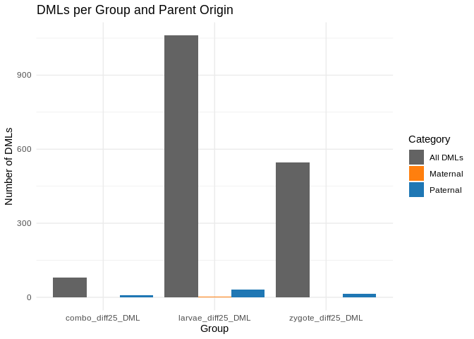
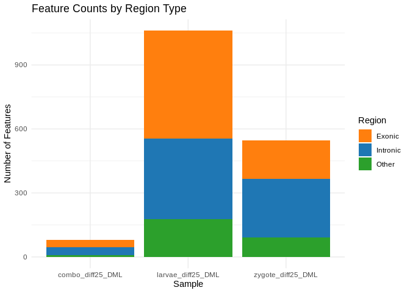

07.2-DML-adult-comparison-low-cov
================
Kathleen Durkin
2025-06-10

- <a href="#1-adult-comparison" id="toc-1-adult-comparison">1 Adult
  comparison</a>
  - <a href="#11-combo" id="toc-11-combo">1.1 Combo</a>
  - <a href="#12-zygote" id="toc-12-zygote">1.2 Zygote</a>
  - <a href="#13-larvae" id="toc-13-larvae">1.3 Larvae</a>
  - <a href="#14-plot" id="toc-14-plot">1.4 Plot</a>
- <a href="#2-genomic-features" id="toc-2-genomic-features">2 Genomic
  features</a>
  - <a href="#21-combo" id="toc-21-combo">2.1 Combo</a>
  - <a href="#22-zygote" id="toc-22-zygote">2.2 Zygote</a>
  - <a href="#23-larve" id="toc-23-larve">2.3 Larve</a>
  - <a href="#24-plot" id="toc-24-plot">2.4 Plot</a>
- <a href="#3-genomic-features-of-features-shared-with-parents"
  id="toc-3-genomic-features-of-features-shared-with-parents">3 Genomic
  features of features shared with parents</a>
  - <a href="#31-combo" id="toc-31-combo">3.1 Combo</a>
  - <a href="#32-zygote" id="toc-32-zygote">3.2 Zygote</a>
  - <a href="#33-larvae" id="toc-33-larvae">3.3 Larvae</a>
- <a href="#4-note-on-intronexon-annotation-quality"
  id="toc-4-note-on-intronexon-annotation-quality">4 Note on intron/exon
  annotation quality</a>
- <a href="#5-summary" id="toc-5-summary">5 Summary</a>

In `06.2-diff-methyl-split-lifestage-low-cov` I identified loci in the
larval samples that are differentially methylated based on parental OA
treatment. I now want to see whether any of those DMLs were also present
in the adults

Note: I’m first checking the adult DML tables, but I may also want to
look a the methylomes of both the larvae and the larvae’s parents in
more detail, since not all adult oysters whose gametes were sequenced in
Venkatamaran et al. 2024 were used for fertilization crosses.

``` r
library(tidyverse)
```

    ## ── Attaching core tidyverse packages ──────────────────────── tidyverse 2.0.0 ──
    ## ✔ dplyr     1.1.4     ✔ readr     2.1.5
    ## ✔ forcats   1.0.0     ✔ stringr   1.5.1
    ## ✔ ggplot2   3.5.1     ✔ tibble    3.2.1
    ## ✔ lubridate 1.9.4     ✔ tidyr     1.3.1
    ## ✔ purrr     1.0.2     
    ## ── Conflicts ────────────────────────────────────────── tidyverse_conflicts() ──
    ## ✖ dplyr::filter() masks stats::filter()
    ## ✖ dplyr::lag()    masks stats::lag()
    ## ℹ Use the conflicted package (<http://conflicted.r-lib.org/>) to force all conflicts to become errors

# 1 Adult comparison

Download adult DMLs (both female (eggs) and male (sperm))

``` bash
curl -L https://github.com/sr320/ceabigr/raw/refs/heads/main/data/female_dml.bed -o ../data/adult_female_dml.bed
curl -L https://github.com/sr320/ceabigr/raw/refs/heads/main/data/male_dml.bed -o ../data/adult_male_dml.bed
```

## 1.1 Combo

``` bash
echo "Combo DMLs that are also differentially methylated in female parents"
/home/shared/bedtools2/bin/bedtools intersect -a ../output/06.2-diff-methyl-split-lifestage-low-cov/combo_diff25_DML.bed -b ../data/adult_female_dml.bed

/home/shared/bedtools2/bin/bedtools intersect -a ../output/06.2-diff-methyl-split-lifestage-low-cov/combo_diff25_DML.bed -b ../data/adult_female_dml.bed > ../output/07.2-DML-adult-comparison-low-cov/combo_diff25_DML_female-parent.bed

echo ""

echo "Combo DMLs that are also differentially methylated in male parents"
/home/shared/bedtools2/bin/bedtools intersect -a ../output/06.2-diff-methyl-split-lifestage-low-cov/combo_diff25_DML.bed -b ../data/adult_male_dml.bed

/home/shared/bedtools2/bin/bedtools intersect -a ../output/06.2-diff-methyl-split-lifestage-low-cov/combo_diff25_DML.bed -b ../data/adult_male_dml.bed > ../output/07.2-DML-adult-comparison-low-cov/combo_diff25_DML_male-parent.bed

echo""

echo "Total Combo DMLs:"
cat ../output/06.2-diff-methyl-split-lifestage-low-cov/combo_diff25_DML.bed | wc -l

echo "Shared with female parent:"
/home/shared/bedtools2/bin/bedtools intersect -a ../output/06.2-diff-methyl-split-lifestage-low-cov/combo_diff25_DML.bed -b ../data/adult_female_dml.bed | wc -l

echo "Shared with male parent:"
/home/shared/bedtools2/bin/bedtools intersect -a ../output/06.2-diff-methyl-split-lifestage-low-cov/combo_diff25_DML.bed -b ../data/adult_male_dml.bed | wc -l
```

    ## Combo DMLs that are also differentially methylated in female parents
    ## 
    ## Combo DMLs that are also differentially methylated in male parents
    ## NC_035781.1  25673140    25673141    *   -39.1790509548828
    ## NC_035782.1  47299108    47299109    *   -34.422923550188
    ## NC_035783.1  52252693    52252694    *   26.7821373865913
    ## NC_035784.1  49924370    49924371    *   -33.2490735429982
    ## NC_035784.1  87061084    87061085    *   -35.1225016118633
    ## NC_035784.1  97989944    97989945    *   -30.3350801209192
    ## NC_035787.1  28915240    28915241    *   -41.9475033268137
    ## 
    ## Total Combo DMLs:
    ## 81
    ## Shared with female parent:
    ## 0
    ## Shared with male parent:
    ## 7

7 Combo DMLs present in the male parents (8.64%)

## 1.2 Zygote

``` bash
echo "Zygote DMLs that are also differentially methylated in female parents"
/home/shared/bedtools2/bin/bedtools intersect -a ../output/06.2-diff-methyl-split-lifestage-low-cov/zygote_diff25_DML.bed -b ../data/adult_female_dml.bed

/home/shared/bedtools2/bin/bedtools intersect -a ../output/06.2-diff-methyl-split-lifestage-low-cov/zygote_diff25_DML.bed -b ../data/adult_female_dml.bed > ../output/07.2-DML-adult-comparison-low-cov/zygote_diff25_DML_female-parent.bed

echo ""

echo "Zygote DMLs that are also differentially methylated in male parents"
/home/shared/bedtools2/bin/bedtools intersect -a ../output/06.2-diff-methyl-split-lifestage-low-cov/zygote_diff25_DML.bed -b ../data/adult_male_dml.bed

/home/shared/bedtools2/bin/bedtools intersect -a ../output/06.2-diff-methyl-split-lifestage-low-cov/zygote_diff25_DML.bed -b ../data/adult_male_dml.bed > ../output/07.2-DML-adult-comparison-low-cov/zygote_diff25_DML_male-parent.bed

echo""

echo "Total Zygote DMLs:"
cat ../output/06.2-diff-methyl-split-lifestage-low-cov/zygote_diff25_DML.bed | wc -l

echo "Shared with female parent:"
/home/shared/bedtools2/bin/bedtools intersect -a ../output/06.2-diff-methyl-split-lifestage-low-cov/zygote_diff25_DML.bed -b ../data/adult_female_dml.bed | wc -l

echo "Shared with male parent:"
/home/shared/bedtools2/bin/bedtools intersect -a ../output/06.2-diff-methyl-split-lifestage-low-cov/zygote_diff25_DML.bed -b ../data/adult_male_dml.bed | wc -l
```

    ## Zygote DMLs that are also differentially methylated in female parents
    ## 
    ## Zygote DMLs that are also differentially methylated in male parents
    ## NC_035781.1  25673140    25673141    *   -36.7269984917044
    ## NC_035781.1  37440520    37440521    *   34.5574387947269
    ## NC_035782.1  71753641    71753642    *   -25.1806751806752
    ## NC_035783.1  52252693    52252694    *   32.0849989480328
    ## NC_035784.1  49924370    49924371    *   -26.2908023184869
    ## NC_035784.1  65168093    65168094    *   33.9722222222222
    ## NC_035784.1  87061084    87061085    *   -36.1766247379455
    ## NC_035784.1  97989401    97989402    *   -50.494333252954
    ## NC_035784.1  97989406    97989407    *   -47.3514977153495
    ## NC_035784.1  97989875    97989876    *   -40.0524246395806
    ## NC_035784.1  97989944    97989945    *   -38.1846635367762
    ## NC_035786.1  1076688 1076689 *   -26.8421052631579
    ## NC_035787.1  28915240    28915241    *   -49.1935483870968
    ## NC_035787.1  59337727    59337728    *   32.7175697865353
    ## NC_035787.1  64378833    64378834    *   -34.1454478842279
    ## 
    ## Total Zygote DMLs:
    ## 545
    ## Shared with female parent:
    ## 0
    ## Shared with male parent:
    ## 15

15 Zygote DMLs present in the male parents (2.75%)

## 1.3 Larvae

``` bash
echo "Larval DMLs that are also differentially methylated in female parents"
/home/shared/bedtools2/bin/bedtools intersect -a ../output/06.2-diff-methyl-split-lifestage-low-cov/larvae_diff25_DML.bed -b ../data/adult_female_dml.bed

/home/shared/bedtools2/bin/bedtools intersect -a ../output/06.2-diff-methyl-split-lifestage-low-cov/larvae_diff25_DML.bed -b ../data/adult_female_dml.bed > ../output/07.2-DML-adult-comparison-low-cov/larvae_diff25_DML_female-parent.bed

echo ""

echo "Larval DMLs that are also differentially methylated in male parents"
/home/shared/bedtools2/bin/bedtools intersect -a ../output/06.2-diff-methyl-split-lifestage-low-cov/larvae_diff25_DML.bed -b ../data/adult_male_dml.bed

/home/shared/bedtools2/bin/bedtools intersect -a ../output/06.2-diff-methyl-split-lifestage-low-cov/larvae_diff25_DML.bed -b ../data/adult_male_dml.bed > ../output/07.2-DML-adult-comparison-low-cov/larvae_diff25_DML_male-parent.bed

echo""

echo "Total Larvae DMLs:"
cat ../output/06.2-diff-methyl-split-lifestage-low-cov/larvae_diff25_DML.bed | wc -l

echo "Shared with female parent:"
/home/shared/bedtools2/bin/bedtools intersect -a ../output/06.2-diff-methyl-split-lifestage-low-cov/larvae_diff25_DML.bed -b ../data/adult_female_dml.bed | wc -l

echo "Shared with male parent:"
/home/shared/bedtools2/bin/bedtools intersect -a ../output/06.2-diff-methyl-split-lifestage-low-cov/larvae_diff25_DML.bed -b ../data/adult_male_dml.bed | wc -l
```

    ## Larval DMLs that are also differentially methylated in female parents
    ## NC_035784.1  55219889    55219890    *   25.9769141162766
    ## NC_035787.1  16030648    16030649    *   26.7291531997414
    ## 
    ## Larval DMLs that are also differentially methylated in male parents
    ## NC_035780.1  35986740    35986741    *   -28.5220214568041
    ## NC_035781.1  3526622 3526623 *   34.7167462129072
    ## NC_035781.1  25673140    25673141    *   -41.5593445794788
    ## NC_035781.1  26727632    26727633    *   -28.7410793933988
    ## NC_035781.1  26806675    26806676    *   27.082016934159
    ## NC_035781.1  29772141    29772142    *   36.0805860805861
    ## NC_035782.1  24060438    24060439    *   38.4426652892562
    ## NC_035782.1  26888747    26888748    *   58.5085271317829
    ## NC_035782.1  29823540    29823541    *   39.8692810457516
    ## NC_035782.1  40870711    40870712    *   -26.8234909744344
    ## NC_035782.1  47258193    47258194    *   44.4847020933977
    ## NC_035782.1  47299108    47299109    *   -33.0487864195729
    ## NC_035782.1  60872551    60872552    *   -26.2364121447313
    ## NC_035783.1  36624198    36624199    *   -39.9703557312253
    ## NC_035783.1  44244024    44244025    *   27.7597143009435
    ## NC_035784.1  1992179 1992180 *   -25.6944444444444
    ## NC_035784.1  29061095    29061096    *   -28.3720930232558
    ## NC_035784.1  44546656    44546657    *   27.6904761904762
    ## NC_035784.1  49924370    49924371    *   -38.1826642412962
    ## NC_035784.1  53155300    53155301    *   31.20098687109
    ## NC_035784.1  54995194    54995195    *   -38.9187253848908
    ## NC_035784.1  55195530    55195531    *   47.9409479409479
    ## NC_035784.1  65707318    65707319    *   25.0903263403263
    ## NC_035784.1  87061084    87061085    *   -35.1708260029105
    ## NC_035784.1  90135106    90135107    *   35.6055096418733
    ## NC_035784.1  97989944    97989945    *   -33.5751742728977
    ## NC_035786.1  34111581    34111582    *   -33.7386018237082
    ## NC_035787.1  28915240    28915241    *   -36.4877344877345
    ## NC_035787.1  36903770    36903771    *   25.5874250526657
    ## NC_035787.1  53514203    53514204    *   41.1166945840313
    ## NC_035788.1  40553566    40553567    *   46.0424536787192
    ## 
    ## Total Larvae DMLs:
    ## 1061
    ## Shared with female parent:
    ## 2
    ## Shared with male parent:
    ## 31

31 Larvae DMLs present in male parents (2.92%)

2 Larvae DMLs present in female parents (0.19%) (though both the DMLs
shared with female parents have nearly insignificant methylation
differences)

## 1.4 Plot

``` r
samples <- c("combo_diff25_DML", "zygote_diff25_DML", "larvae_diff25_DML")

# Build df
dml_counts_df <- map_dfr(samples, function(samp) {
  
  # Read in files
  all_feats   <- read_tsv(paste0("../output/06.2-diff-methyl-split-lifestage-low-cov/", samp, ".bed"), col_names = FALSE, show_col_types = FALSE)
  maternal_feats <- read_tsv(paste0("../output/07.2-DML-adult-comparison-low-cov/", samp, "_female-parent.bed"), col_names = FALSE, show_col_types = FALSE)
  paternal_feats   <- read_tsv(paste0("../output/07.2-DML-adult-comparison-low-cov/", samp, "_male-parent.bed"), col_names = FALSE, show_col_types = FALSE)
  
  # Compute counts
  n_all     <- nrow(all_feats)
  n_maternal <- nrow(maternal_feats)
  n_paternal   <- nrow(paternal_feats)
  
  # Return long-format counts for plotting
  tibble(
    Sample = samp,
    Category = c("All DMLs", "Maternal", "Paternal"),
    Count = c(n_all, n_maternal, n_paternal)
  )
})
```

``` r
ggplot(dml_counts_df, aes(x = Sample, y = Count, fill = Category)) +
  geom_col(position = "dodge") +
  labs(title = "DMLs per Group and Parent Origin",
       y = "Number of DMLs",
       x = "Group") +
  scale_fill_manual(values = c("All DMLs" = "#636363", "Maternal" = "#ff7f0e", "Paternal" = "#1f77b4")) +
  theme_minimal()
```

<!-- -->

# 2 Genomic features

We can also compare to different genomic features

Download tracks

``` bash
curl -L http://eagle.fish.washington.edu/Cvirg_tracks/C_virginica-3.0_Gnomon_exon.bed -o ../data/C_virginica-3.0_Gnomon_exon.bed
curl -L http://eagle.fish.washington.edu/Cvirg_tracks/C_virginica-3.0_intron.bed -o ../data/C_virginica-3.0_intron.bed
```

Note that, by default, `bedtools intersect` outputs a line for each
instance of intersection, including if e.g. a DML intersects multiple
exons because the exons overlap. To only output a single line to
indicate the DML intersects *at least one* feature, use th `-u` option.

## 2.1 Combo

``` bash
echo "Total Combo DMLs"
cat ../output/06.2-diff-methyl-split-lifestage-low-cov/combo_diff25_DML.bed | wc -l

echo "Number of Combo DMLs in exons:"
/home/shared/bedtools2/bin/bedtools intersect -a ../output/06.2-diff-methyl-split-lifestage-low-cov/combo_diff25_DML.bed -b ../data/C_virginica-3.0_Gnomon_exon.bed -u | wc -l

/home/shared/bedtools2/bin/bedtools intersect -a ../output/06.2-diff-methyl-split-lifestage-low-cov/combo_diff25_DML.bed -b ../data/C_virginica-3.0_Gnomon_exon.bed -u > ../output/07.2-DML-adult-comparison-low-cov/combo_diff25_DML_exon.bed

echo "Number of Combo DMLs in introns:"
/home/shared/bedtools2/bin/bedtools intersect -a ../output/06.2-diff-methyl-split-lifestage-low-cov/combo_diff25_DML.bed -b ../data/C_virginica-3.0_intron.bed -u | wc -l

/home/shared/bedtools2/bin/bedtools intersect -a ../output/06.2-diff-methyl-split-lifestage-low-cov/combo_diff25_DML.bed -b ../data/C_virginica-3.0_intron.bed -u > ../output/07.2-DML-adult-comparison-low-cov/combo_diff25_DML_intron.bed
```

    ## Total Combo DMLs
    ## 81
    ## Number of Combo DMLs in exons:
    ## 34
    ## Number of Combo DMLs in introns:
    ## 40

## 2.2 Zygote

``` bash
echo "Total Zygote DMLs"
cat ../output/06.2-diff-methyl-split-lifestage-low-cov/zygote_diff25_DML.bed | wc -l

echo "Number of Zygote DMLs in exons:"
/home/shared/bedtools2/bin/bedtools intersect -a ../output/06.2-diff-methyl-split-lifestage-low-cov/zygote_diff25_DML.bed -b ../data/C_virginica-3.0_Gnomon_exon.bed -u | wc -l

/home/shared/bedtools2/bin/bedtools intersect -a ../output/06.2-diff-methyl-split-lifestage-low-cov/zygote_diff25_DML.bed -b ../data/C_virginica-3.0_Gnomon_exon.bed -u > ../output/07.2-DML-adult-comparison-low-cov/zygote_diff25_DML_exon.bed

echo "Number of Zygote DMLs in introns:"
/home/shared/bedtools2/bin/bedtools intersect -a ../output/06.2-diff-methyl-split-lifestage-low-cov/zygote_diff25_DML.bed -b ../data/C_virginica-3.0_intron.bed -u | wc -l

/home/shared/bedtools2/bin/bedtools intersect -a ../output/06.2-diff-methyl-split-lifestage-low-cov/zygote_diff25_DML.bed -b ../data/C_virginica-3.0_intron.bed -u > ../output/07.2-DML-adult-comparison-low-cov/zygote_diff25_DML_intron.bed
```

    ## Total Zygote DMLs
    ## 545
    ## Number of Zygote DMLs in exons:
    ## 178
    ## Number of Zygote DMLs in introns:
    ## 276

## 2.3 Larve

``` bash
echo "Total Larvae DMLs"
cat ../output/06.2-diff-methyl-split-lifestage-low-cov/larvae_diff25_DML.bed | wc -l

echo "Number of Larvae DMLs in exons:"
/home/shared/bedtools2/bin/bedtools intersect -a ../output/06.2-diff-methyl-split-lifestage-low-cov/larvae_diff25_DML.bed -b ../data/C_virginica-3.0_Gnomon_exon.bed -u | wc -l

/home/shared/bedtools2/bin/bedtools intersect -a ../output/06.2-diff-methyl-split-lifestage-low-cov/larvae_diff25_DML.bed -b ../data/C_virginica-3.0_Gnomon_exon.bed -u > ../output/07.2-DML-adult-comparison-low-cov/larvae_diff25_DML_exon.bed

echo "Number of Larvae DMLs in introns:"
/home/shared/bedtools2/bin/bedtools intersect -a ../output/06.2-diff-methyl-split-lifestage-low-cov/larvae_diff25_DML.bed -b ../data/C_virginica-3.0_intron.bed -u | wc -l

/home/shared/bedtools2/bin/bedtools intersect -a ../output/06.2-diff-methyl-split-lifestage-low-cov/larvae_diff25_DML.bed -b ../data/C_virginica-3.0_intron.bed -u > ../output/07.2-DML-adult-comparison-low-cov/larvae_diff25_DML_intron.bed
```

    ## Total Larvae DMLs
    ## 1061
    ## Number of Larvae DMLs in exons:
    ## 507
    ## Number of Larvae DMLs in introns:
    ## 376

## 2.4 Plot

``` r
samples <- c("combo_diff25_DML", "zygote_diff25_DML", "larvae_diff25_DML")

# Build df
counts_df <- map_dfr(samples, function(samp) {
  
  # Read in files
  all_feats   <- read_tsv(paste0("../output/06.2-diff-methyl-split-lifestage-low-cov/", samp, ".bed"), col_names = FALSE, show_col_types = FALSE)
  intron_feats <- read_tsv(paste0("../output/07.2-DML-adult-comparison-low-cov/", samp, "_intron.bed"), col_names = FALSE, show_col_types = FALSE)
  exon_feats   <- read_tsv(paste0("../output/07.2-DML-adult-comparison-low-cov/", samp, "_exon.bed"), col_names = FALSE, show_col_types = FALSE)
  
  # Compute counts
  n_all     <- nrow(all_feats)
  n_introns <- nrow(intron_feats)
  n_exons   <- nrow(exon_feats)
  n_other   <- n_all - n_introns - n_exons  # optional
  
  # Return long-format counts for plotting
  tibble(
    Sample = samp,
    Region = c("Intronic", "Exonic", "Other"),
    Count = c(n_introns, n_exons, n_other)
  )
})
```

``` r
ggplot(counts_df, aes(x = Sample, y = Count, fill = Region)) +
  geom_bar(stat = "identity") +
  labs(title = "Feature Counts by Region Type",
       x = "Sample",
       y = "Number of Features") +
  scale_fill_manual(values = c("Intronic" = "#1f77b4",
                               "Exonic" = "#ff7f0e",
                               "Other" = "#2ca02c")) +
  theme_minimal()
```

<!-- -->

# 3 Genomic features of features shared with parents

## 3.1 Combo

``` bash
echo "Female Parents:"
echo "Total Combo DMLs shared with female parents"
cat ../output/07.2-DML-adult-comparison-low-cov/combo_diff25_DML_female-parent.bed | wc -l

echo ""

echo "Male Parents:"
echo "Total Combo DMLs shared with male parents"
cat ../output/07.2-DML-adult-comparison-low-cov/combo_diff25_DML_male-parent.bed | wc -l

echo "Number of shared Combo DMLs in exons:"
/home/shared/bedtools2/bin/bedtools intersect -a ../output/07.2-DML-adult-comparison-low-cov/combo_diff25_DML_male-parent.bed -b ../data/C_virginica-3.0_Gnomon_exon.bed -u | wc -l

echo "Number of shared Combo DMLs in introns:"
/home/shared/bedtools2/bin/bedtools intersect -a ../output/07.2-DML-adult-comparison-low-cov/combo_diff25_DML_male-parent.bed -b ../data/C_virginica-3.0_intron.bed -u | wc -l
```

    ## Female Parents:
    ## Total Combo DMLs shared with female parents
    ## 0
    ## 
    ## Male Parents:
    ## Total Combo DMLs shared with male parents
    ## 7
    ## Number of shared Combo DMLs in exons:
    ## 3
    ## Number of shared Combo DMLs in introns:
    ## 4

## 3.2 Zygote

``` bash
echo "Female Parents:"
echo "Total Zygote DMLs shared with female parents"
cat ../output/07.2-DML-adult-comparison-low-cov/zygote_diff25_DML_female-parent.bed | wc -l

echo ""

echo "Male Parents:"
echo "Total Zygote DMLs shared with male parents"
cat ../output/07.2-DML-adult-comparison-low-cov/zygote_diff25_DML_male-parent.bed | wc -l

echo "Number of shared Zygote DMLs in exons:"
/home/shared/bedtools2/bin/bedtools intersect -a ../output/07.2-DML-adult-comparison-low-cov/zygote_diff25_DML_male-parent.bed -b ../data/C_virginica-3.0_Gnomon_exon.bed -u | wc -l

echo "Number of shared Zygote DMLs in introns:"
/home/shared/bedtools2/bin/bedtools intersect -a ../output/07.2-DML-adult-comparison-low-cov/zygote_diff25_DML_male-parent.bed -b ../data/C_virginica-3.0_intron.bed -u | wc -l
```

    ## Female Parents:
    ## Total Zygote DMLs shared with female parents
    ## 0
    ## 
    ## Male Parents:
    ## Total Zygote DMLs shared with male parents
    ## 15
    ## Number of shared Zygote DMLs in exons:
    ## 8
    ## Number of shared Zygote DMLs in introns:
    ## 7

## 3.3 Larvae

``` bash
echo "Female Parents:"
echo "Total Larvae DMLs shared with female parents"
cat ../output/07.2-DML-adult-comparison-low-cov/larvae_diff25_DML_female-parent.bed | wc -l

echo "Number of shared Larvae DMLs in exons:"
/home/shared/bedtools2/bin/bedtools intersect -a ../output/07.2-DML-adult-comparison-low-cov/larvae_diff25_DML_female-parent.bed -b ../data/C_virginica-3.0_Gnomon_exon.bed -u | wc -l

echo "Number of shared Larvae DMLs in introns:"
/home/shared/bedtools2/bin/bedtools intersect -a ../output/07.2-DML-adult-comparison-low-cov/larvae_diff25_DML_female-parent.bed -b ../data/C_virginica-3.0_intron.bed -u | wc -l

echo ""

echo "Male Parents:"
echo "Total Larvae DMLs shared with male parents"
cat ../output/07.2-DML-adult-comparison-low-cov/larvae_diff25_DML_male-parent.bed | wc -l

echo "Number of shared Larvae DMLs in exons:"
/home/shared/bedtools2/bin/bedtools intersect -a ../output/07.2-DML-adult-comparison-low-cov/larvae_diff25_DML_male-parent.bed -b ../data/C_virginica-3.0_Gnomon_exon.bed -u | wc -l

echo "Number of shared Larvae DMLs in introns:"
/home/shared/bedtools2/bin/bedtools intersect -a ../output/07.2-DML-adult-comparison-low-cov/larvae_diff25_DML_male-parent.bed -b ../data/C_virginica-3.0_intron.bed -u | wc -l
```

    ## Female Parents:
    ## Total Larvae DMLs shared with female parents
    ## 2
    ## Number of shared Larvae DMLs in exons:
    ## 2
    ## Number of shared Larvae DMLs in introns:
    ## 0
    ## 
    ## Male Parents:
    ## Total Larvae DMLs shared with male parents
    ## 31
    ## Number of shared Larvae DMLs in exons:
    ## 15
    ## Number of shared Larvae DMLs in introns:
    ## 13

# 4 Note on intron/exon annotation quality

While working with these tracks I noticed some potential overlap between
the intron and exon tracks (which should be biologically impossible,
since they are mutually exclusive by definition)

``` bash
echo "Number of introns"
cat ../data/C_virginica-3.0_intron.bed | wc -l 
echo "Number of exons"
cat ../data/C_virginica-3.0_Gnomon_exon.bed | wc -l 
echo "Number of intron/exon overlaps"
/home/shared/bedtools2/bin/bedtools intersect -a ../data/C_virginica-3.0_Gnomon_exon.bed -b ../data/C_virginica-3.0_intron.bed | wc -l

echo ""

/home/shared/bedtools2/bin/bedtools intersect -a ../data/C_virginica-3.0_Gnomon_exon.bed -b ../data/C_virginica-3.0_intron.bed | head -10
```

    ## Number of introns
    ## 319262
    ## Number of exons
    ## 731279
    ## Number of intron/exon overlaps
    ## 53715
    ## 
    ## NC_035780.1  28961   28962
    ## NC_035780.1  43111   43112
    ## NC_035780.1  43111   43112
    ## NC_035780.1  85606   85607
    ## NC_035780.1  99840   99841
    ## NC_035780.1  108305  108306
    ## NC_035780.1  151859  151860
    ## NC_035780.1  163809  163810
    ## NC_035780.1  164820  164821
    ## NC_035780.1  190449  190450

After looking manually at the overlaps, and checking some examples in
IGV, the problem seems to be slightly messy annotation. All the overlaps
are only a single nucleotide long, and they represent places where the
end of an intron and start of an exon (or vice versa) were annotated as
overlapping by 1. Weirdly, only a portion of intron/exon interfaces are
overlapping like this. The others appear to have a single nucleotide
*separating* them, i.e. a nucleotide that is not annotated as intronic
*or* exonic sitting between the two regions.

These 1-nt errors (overlaps and gaps) probably represent **improper
handling of gtf/gff and bed files**, since the two use different
annotation systems.

# 5 Summary

For all groups considered (Combo/grouped, Zygote only, and Larvae only),
a small subset of offspring DMLs were also differentially methylated
based on exposure in the parents. Shared DMLs were almost exclusively
found in the male parents. This is consistent with methylation work in
vertebrates that shows only the **paternal** contribution is stably
inherited!

Offspring DMLs are mostly found in gene bodies, and are roughly equally
distributed between introns and exons. This observation holds for
offspring DMLs that were also differentially methylated in parents.
