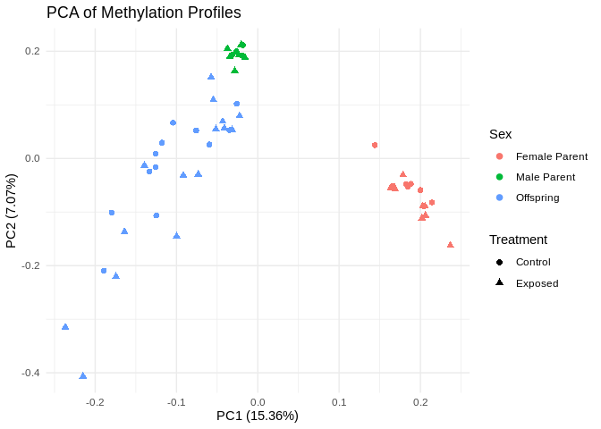

09-multifactor-diff-methyl
================
Kathleen Durkin
2025-06-10

true

Again, I’ll be excluding the following low-quantity samples

- CF01-CM01-Zygote (40.4 M)

- CF08-CM04-Larvae (6.2 M)

- CF08-CM05-Larvae (6.2 M)

- EF04-EM04-Zygote (97.3 M)

- EF05-EM05-Zygote (53.8 M)

Inputs:

- Methylation calls extracted from WGBS reads using `Bismark`:
  `[].fastp-trim_bismark_bt2_pe.deduplicated.bismark.cov.gz`, stored on
  Gannet: [offspring
  data](https://gannet.fish.washington.edu/gitrepos/ceasmallr/output/02.20-bismark-methylation-extraction/),
  [parent
  data](https://gannet.fish.washington.edu/seashell/bu-mox/scrubbed/120321-cvBS/)

# Download methylation calls if needed

Offspring:

``` bash
# Run wget to retrieve FastQs and MD5 files
# Note: the --no-clobber command will skip re-downloading any files that are already present in the output directory
wget \
--directory-prefix ../data/bismark-methyl-extraction \
--recursive \
--no-check-certificate \
--continue \
--cut-dirs 4 \
--no-host-directories \
--no-parent \
--quiet \
--no-clobber \
--accept="*.deduplicated.bismark.cov.gz,checksums.md5" https://gannet.fish.washington.edu/gitrepos/ceasmallr/output/02.20-bismark-methylation-extraction/
```

``` bash
cd ../data/bismark-methyl-extraction/

echo "How many methylation calling files were downloaded?"
ls *.deduplicated.bismark.cov.gz | wc -l

echo ""

echo "Check file checksums:"
grep '.deduplicated.bismark.cov.gz' checksums.md5 | md5sum -c -
```

We should have N=32 (n=15 ControlxControl crosses, n=17 ExposedxExposed
crosses)

Parent:

``` bash
# Parent metadata
curl -L https://github.com/sr320/ceabigr/raw/refs/heads/main/data/adult-meta.csv -o ../data/adult-meta.csv
```

    ##   % Total    % Received % Xferd  Average Speed   Time    Time     Time  Current
    ##                                  Dload  Upload   Total   Spent    Left  Speed
    ##   0     0    0     0    0     0      0      0 --:--:-- --:--:-- --:--:--     0  0     0    0     0    0     0      0      0 --:--:-- --:--:-- --:--:--     0
    ## 100   726  100   726    0     0   1810      0 --:--:-- --:--:-- --:--:--  1810

``` bash
# Run wget to retrieve FastQs and MD5 files
# Note: the --no-clobber command will skip re-downloading any files that are already present in the output directory
wget \
--directory-prefix ../data/bismark-methyl-extraction-parent \
--recursive \
--no-check-certificate \
--continue \
--cut-dirs 4 \
--no-host-directories \
--no-parent \
--quiet \
--no-clobber \
--accept="*.deduplicated.bismark.cov.gz,checksums.md5" https://gannet.fish.washington.edu/seashell/bu-mox/scrubbed/120321-cvBS/
```

Rename files to instead use the updated Sample IDs

``` bash
cd ../data/bismark-methyl-extraction-parent/

metadata="../adult-meta.csv"

# Skip header and read line by line
tail -n +2 "$metadata" | while IFS=',' read -r SampleID OldSampleID Treatment Sex TreatmentN ParentID; do
  # Find files starting with SampleID
  for file in ${SampleID}*; do
    # Check that file exists to avoid glob expansion issues
    [ -e "$file" ] || continue

    # New file name: replace SampleID with ParentID
    newname="${file/$SampleID/$ParentID}"

    # Rename the file
    echo "Renaming $file to $newname"
    mv "$file" "$newname"
  done
done
```

# methylKit

Load packages

``` r
# Install packages if necessary
# if (!require("BiocManager", quietly = TRUE))
#     install.packages("BiocManager")
# BiocManager::install("methylKit")
# BiocManager::install("genomation")

# Load
library(tidyr)
library(dplyr)
```

    ## 
    ## Attaching package: 'dplyr'

    ## The following objects are masked from 'package:stats':
    ## 
    ##     filter, lag

    ## The following objects are masked from 'package:base':
    ## 
    ##     intersect, setdiff, setequal, union

``` r
library(methylKit)
```

    ## Loading required package: GenomicRanges

    ## Loading required package: stats4

    ## Loading required package: BiocGenerics

    ## 
    ## Attaching package: 'BiocGenerics'

    ## The following objects are masked from 'package:dplyr':
    ## 
    ##     combine, intersect, setdiff, union

    ## The following objects are masked from 'package:stats':
    ## 
    ##     IQR, mad, sd, var, xtabs

    ## The following objects are masked from 'package:base':
    ## 
    ##     anyDuplicated, aperm, append, as.data.frame, basename, cbind,
    ##     colnames, dirname, do.call, duplicated, eval, evalq, Filter, Find,
    ##     get, grep, grepl, intersect, is.unsorted, lapply, Map, mapply,
    ##     match, mget, order, paste, pmax, pmax.int, pmin, pmin.int,
    ##     Position, rank, rbind, Reduce, rownames, sapply, setdiff, sort,
    ##     table, tapply, union, unique, unsplit, which.max, which.min

    ## Loading required package: S4Vectors

    ## 
    ## Attaching package: 'S4Vectors'

    ## The following objects are masked from 'package:dplyr':
    ## 
    ##     first, rename

    ## The following object is masked from 'package:tidyr':
    ## 
    ##     expand

    ## The following objects are masked from 'package:base':
    ## 
    ##     expand.grid, I, unname

    ## Loading required package: IRanges

    ## 
    ## Attaching package: 'IRanges'

    ## The following objects are masked from 'package:dplyr':
    ## 
    ##     collapse, desc, slice

    ## Loading required package: GenomeInfoDb

    ## 
    ## Attaching package: 'methylKit'

    ## The following object is masked from 'package:dplyr':
    ## 
    ##     select

    ## The following object is masked from 'package:tidyr':
    ## 
    ##     unite

``` r
library(genomation)
```

    ## Loading required package: grid

    ## Warning: replacing previous import 'Biostrings::pattern' by 'grid::pattern'
    ## when loading 'genomation'

    ## 
    ## Attaching package: 'genomation'

    ## The following objects are masked from 'package:methylKit':
    ## 
    ##     getFeatsWithTargetsStats, getFlanks, getMembers,
    ##     getTargetAnnotationStats, plotTargetAnnotation

``` r
library(GenomicRanges)
library(gridExtra)
```

    ## 
    ## Attaching package: 'gridExtra'

    ## The following object is masked from 'package:BiocGenerics':
    ## 
    ##     combine

    ## The following object is masked from 'package:dplyr':
    ## 
    ##     combine

``` r
library(ggplot2)
library(ggfortify)
```

# Offspring

## Create object

``` r
# Define path to my samples directory
data_dir_offspring <- "../data/bismark-methyl-extraction"

# List all .bismark.cov.gz files in the samples directory
file.list_offspring <- list.files(path = data_dir_offspring, pattern = "\\.bismark.cov.gz$", full.names = TRUE)
# Exclude samples with less than 100M cytosines analyzed (poor coverage)
file.list_offspring <- file.list_offspring[!grepl("CF01-CM01-Zygote|CF08-CM04-Larvae|CF08-CM05-Larvae|EF04-EM04-Zygote|EF05-EM05-Zygote", file.list_offspring)]


# Extract just the filenames
file.names_offspring <- basename(file.list_offspring)

# Create sample IDs by stripping file extensions
sample.ids_offspring <- sub("_R1_001.fastp-trim_bismark_bt2_pe.deduplicated.bismark.cov.gz", "", file.names_offspring)
sample.ids_offspring <- sub("_R1_001.fastp-trim.REPAIRED_bismark_bt2_pe.deduplicated.bismark.cov.gz", ".REP", sample.ids_offspring)


# Assign treatment based on first letter of filename
# E = parents exposed to OA treatment
# C = parents held in control
treatment_offspring <- ifelse(startsWith(file.names_offspring, "E"), 1,
                    ifelse(startsWith(file.names_offspring, "C"), 0, NA))

# Read in methylation data
myobj_offspring <- methRead(as.list(file.list_offspring),
  sample.id = as.list(sample.ids_offspring),
  pipeline = "bismarkCoverage",
  assembly = "mm10",
  treatment = treatment_offspring,
  mincov = 5
)
```

    ## Received list of locations.

    ## Uncompressing file.

    ## Reading file.

    ## Uncompressing file.

    ## Reading file.

    ## Uncompressing file.

    ## Reading file.

    ## Uncompressing file.

    ## Reading file.

    ## Uncompressing file.

    ## Reading file.

    ## Uncompressing file.

    ## Reading file.

    ## Uncompressing file.

    ## Reading file.

    ## Uncompressing file.

    ## Reading file.

    ## Uncompressing file.

    ## Reading file.

    ## Uncompressing file.

    ## Reading file.

    ## Uncompressing file.

    ## Reading file.

    ## Uncompressing file.

    ## Reading file.

    ## Uncompressing file.

    ## Reading file.

    ## Uncompressing file.

    ## Reading file.

    ## Uncompressing file.

    ## Reading file.

    ## Uncompressing file.

    ## Reading file.

    ## Uncompressing file.

    ## Reading file.

    ## Uncompressing file.

    ## Reading file.

    ## Uncompressing file.

    ## Reading file.

    ## Uncompressing file.

    ## Reading file.

    ## Uncompressing file.

    ## Reading file.

    ## Uncompressing file.

    ## Reading file.

    ## Uncompressing file.

    ## Reading file.

    ## Uncompressing file.

    ## Reading file.

    ## Uncompressing file.

    ## Reading file.

    ## Uncompressing file.

    ## Reading file.

    ## Uncompressing file.

    ## Reading file.

``` r
# Inspect
str(myobj_offspring)
```

    ## Formal class 'methylRawList' [package "methylKit"] with 2 slots
    ##   ..@ .Data    :List of 27
    ##   .. ..$ :'data.frame':  5851814 obs. of  7 variables:
    ## Formal class 'methylRaw' [package "methylKit"] with 8 slots
    ##   .. .. .. ..@ .Data     :List of 7
    ##   .. .. .. .. ..$ : chr [1:5851814] "NC_007175.2" "NC_007175.2" "NC_007175.2" "NC_007175.2" ...
    ##   .. .. .. .. ..$ : int [1:5851814] 50 51 52 88 89 147 148 193 194 246 ...
    ##   .. .. .. .. ..$ : int [1:5851814] 50 51 52 88 89 147 148 193 194 246 ...
    ##   .. .. .. .. ..$ : chr [1:5851814] "*" "*" "*" "*" ...
    ##   .. .. .. .. ..$ : int [1:5851814] 15 59 16 113 184 163 188 211 142 221 ...
    ##   .. .. .. .. ..$ : int [1:5851814] 0 1 0 4 3 0 3 1 0 3 ...
    ##   .. .. .. .. ..$ : int [1:5851814] 15 58 16 109 181 163 185 210 142 218 ...
    ##   .. .. .. ..@ sample.id : chr "CF01-CM02-Larvae"
    ##   .. .. .. ..@ assembly  : chr "mm10"
    ##   .. .. .. ..@ context   : chr "CpG"
    ##   .. .. .. ..@ resolution: chr "base"
    ##   .. .. .. ..@ names     : chr [1:7] "chr" "start" "end" "strand" ...
    ##   .. .. .. ..@ row.names : int [1:5851814] 1 2 3 4 5 6 7 8 9 10 ...
    ##   .. .. .. ..@ .S3Class  : chr "data.frame"
    ##   .. ..$ :'data.frame':  840883 obs. of  7 variables:
    ## Formal class 'methylRaw' [package "methylKit"] with 8 slots
    ##   .. .. .. ..@ .Data     :List of 7
    ##   .. .. .. .. ..$ : chr [1:840883] "NC_007175.2" "NC_007175.2" "NC_007175.2" "NC_007175.2" ...
    ##   .. .. .. .. ..$ : int [1:840883] 49 50 51 52 88 89 147 148 149 193 ...
    ##   .. .. .. .. ..$ : int [1:840883] 49 50 51 52 88 89 147 148 149 193 ...
    ##   .. .. .. .. ..$ : chr [1:840883] "*" "*" "*" "*" ...
    ##   .. .. .. .. ..$ : int [1:840883] 80 19 82 19 206 173 235 257 8 63 ...
    ##   .. .. .. .. ..$ : int [1:840883] 3 2 2 0 10 9 6 12 0 1 ...
    ##   .. .. .. .. ..$ : int [1:840883] 77 17 80 19 196 164 229 245 8 62 ...
    ##   .. .. .. ..@ sample.id : chr "CF02-CM02-Zygote"
    ##   .. .. .. ..@ assembly  : chr "mm10"
    ##   .. .. .. ..@ context   : chr "CpG"
    ##   .. .. .. ..@ resolution: chr "base"
    ##   .. .. .. ..@ names     : chr [1:7] "chr" "start" "end" "strand" ...
    ##   .. .. .. ..@ row.names : int [1:840883] 1 2 3 4 5 6 7 8 9 10 ...
    ##   .. .. .. ..@ .S3Class  : chr "data.frame"
    ##   .. ..$ :'data.frame':  1967167 obs. of  7 variables:
    ## Formal class 'methylRaw' [package "methylKit"] with 8 slots
    ##   .. .. .. ..@ .Data     :List of 7
    ##   .. .. .. .. ..$ : chr [1:1967167] "NC_007175.2" "NC_007175.2" "NC_007175.2" "NC_007175.2" ...
    ##   .. .. .. .. ..$ : int [1:1967167] 50 51 52 88 89 147 148 149 193 194 ...
    ##   .. .. .. .. ..$ : int [1:1967167] 50 51 52 88 89 147 148 149 193 194 ...
    ##   .. .. .. .. ..$ : chr [1:1967167] "*" "*" "*" "*" ...
    ##   .. .. .. .. ..$ : int [1:1967167] 25 51 29 101 325 107 397 7 84 237 ...
    ##   .. .. .. .. ..$ : int [1:1967167] 0 2 0 1 6 1 12 0 3 6 ...
    ##   .. .. .. .. ..$ : int [1:1967167] 25 49 29 100 319 106 385 7 81 231 ...
    ##   .. .. .. ..@ sample.id : chr "CF03-CM03-Zygote"
    ##   .. .. .. ..@ assembly  : chr "mm10"
    ##   .. .. .. ..@ context   : chr "CpG"
    ##   .. .. .. ..@ resolution: chr "base"
    ##   .. .. .. ..@ names     : chr [1:7] "chr" "start" "end" "strand" ...
    ##   .. .. .. ..@ row.names : int [1:1967167] 1 2 3 4 5 6 7 8 9 10 ...
    ##   .. .. .. ..@ .S3Class  : chr "data.frame"
    ##   .. ..$ :'data.frame':  4848779 obs. of  7 variables:
    ## Formal class 'methylRaw' [package "methylKit"] with 8 slots
    ##   .. .. .. ..@ .Data     :List of 7
    ##   .. .. .. .. ..$ : chr [1:4848779] "NC_007175.2" "NC_007175.2" "NC_007175.2" "NC_007175.2" ...
    ##   .. .. .. .. ..$ : int [1:4848779] 51 88 89 147 148 193 194 246 247 257 ...
    ##   .. .. .. .. ..$ : int [1:4848779] 51 88 89 147 148 193 194 246 247 257 ...
    ##   .. .. .. .. ..$ : chr [1:4848779] "*" "*" "*" "*" ...
    ##   .. .. .. .. ..$ : int [1:4848779] 44 92 83 127 70 231 55 242 35 256 ...
    ##   .. .. .. .. ..$ : int [1:4848779] 4 2 0 3 1 8 1 8 1 4 ...
    ##   .. .. .. .. ..$ : int [1:4848779] 40 90 83 124 69 223 54 234 34 252 ...
    ##   .. .. .. ..@ sample.id : chr "CF03-CM04-Larvae"
    ##   .. .. .. ..@ assembly  : chr "mm10"
    ##   .. .. .. ..@ context   : chr "CpG"
    ##   .. .. .. ..@ resolution: chr "base"
    ##   .. .. .. ..@ names     : chr [1:7] "chr" "start" "end" "strand" ...
    ##   .. .. .. ..@ row.names : int [1:4848779] 1 2 3 4 5 6 7 8 9 10 ...
    ##   .. .. .. ..@ .S3Class  : chr "data.frame"
    ##   .. ..$ :'data.frame':  5351344 obs. of  7 variables:
    ## Formal class 'methylRaw' [package "methylKit"] with 8 slots
    ##   .. .. .. ..@ .Data     :List of 7
    ##   .. .. .. .. ..$ : chr [1:5351344] "NC_007175.2" "NC_007175.2" "NC_007175.2" "NC_007175.2" ...
    ##   .. .. .. .. ..$ : int [1:5351344] 50 51 52 88 89 147 148 193 194 246 ...
    ##   .. .. .. .. ..$ : int [1:5351344] 50 51 52 88 89 147 148 193 194 246 ...
    ##   .. .. .. .. ..$ : chr [1:5351344] "*" "*" "*" "*" ...
    ##   .. .. .. .. ..$ : int [1:5351344] 10 17 11 38 130 58 147 114 109 150 ...
    ##   .. .. .. .. ..$ : int [1:5351344] 0 1 0 1 1 2 4 6 4 5 ...
    ##   .. .. .. .. ..$ : int [1:5351344] 10 16 11 37 129 56 143 108 105 145 ...
    ##   .. .. .. ..@ sample.id : chr "CF03-CM05-Larvae"
    ##   .. .. .. ..@ assembly  : chr "mm10"
    ##   .. .. .. ..@ context   : chr "CpG"
    ##   .. .. .. ..@ resolution: chr "base"
    ##   .. .. .. ..@ names     : chr [1:7] "chr" "start" "end" "strand" ...
    ##   .. .. .. ..@ row.names : int [1:5351344] 1 2 3 4 5 6 7 8 9 10 ...
    ##   .. .. .. ..@ .S3Class  : chr "data.frame"
    ##   .. ..$ :'data.frame':  2688484 obs. of  7 variables:
    ## Formal class 'methylRaw' [package "methylKit"] with 8 slots
    ##   .. .. .. ..@ .Data     :List of 7
    ##   .. .. .. .. ..$ : chr [1:2688484] "NC_007175.2" "NC_007175.2" "NC_007175.2" "NC_007175.2" ...
    ##   .. .. .. .. ..$ : int [1:2688484] 50 51 52 88 89 147 148 149 193 194 ...
    ##   .. .. .. .. ..$ : int [1:2688484] 50 51 52 88 89 147 148 149 193 194 ...
    ##   .. .. .. .. ..$ : chr [1:2688484] "*" "*" "*" "*" ...
    ##   .. .. .. .. ..$ : int [1:2688484] 85 116 99 252 669 323 731 13 263 496 ...
    ##   .. .. .. .. ..$ : int [1:2688484] 1 1 1 8 9 8 21 0 8 9 ...
    ##   .. .. .. .. ..$ : int [1:2688484] 84 115 98 244 660 315 710 13 255 487 ...
    ##   .. .. .. ..@ sample.id : chr "CF04-CM04-Zygote"
    ##   .. .. .. ..@ assembly  : chr "mm10"
    ##   .. .. .. ..@ context   : chr "CpG"
    ##   .. .. .. ..@ resolution: chr "base"
    ##   .. .. .. ..@ names     : chr [1:7] "chr" "start" "end" "strand" ...
    ##   .. .. .. ..@ row.names : int [1:2688484] 1 2 3 4 5 6 7 8 9 10 ...
    ##   .. .. .. ..@ .S3Class  : chr "data.frame"
    ##   .. ..$ :'data.frame':  7065718 obs. of  7 variables:
    ## Formal class 'methylRaw' [package "methylKit"] with 8 slots
    ##   .. .. .. ..@ .Data     :List of 7
    ##   .. .. .. .. ..$ : chr [1:7065718] "NC_007175.2" "NC_007175.2" "NC_007175.2" "NC_007175.2" ...
    ##   .. .. .. .. ..$ : int [1:7065718] 50 51 52 88 89 147 148 193 194 246 ...
    ##   .. .. .. .. ..$ : int [1:7065718] 50 51 52 88 89 147 148 193 194 246 ...
    ##   .. .. .. .. ..$ : chr [1:7065718] "*" "*" "*" "*" ...
    ##   .. .. .. .. ..$ : int [1:7065718] 5 24 6 50 77 85 80 110 61 124 ...
    ##   .. .. .. .. ..$ : int [1:7065718] 0 0 0 1 0 0 0 1 0 0 ...
    ##   .. .. .. .. ..$ : int [1:7065718] 5 24 6 49 77 85 80 109 61 124 ...
    ##   .. .. .. ..@ sample.id : chr "CF05-CM02-Larvae"
    ##   .. .. .. ..@ assembly  : chr "mm10"
    ##   .. .. .. ..@ context   : chr "CpG"
    ##   .. .. .. ..@ resolution: chr "base"
    ##   .. .. .. ..@ names     : chr [1:7] "chr" "start" "end" "strand" ...
    ##   .. .. .. ..@ row.names : int [1:7065718] 1 2 3 4 5 6 7 8 9 10 ...
    ##   .. .. .. ..@ .S3Class  : chr "data.frame"
    ##   .. ..$ :'data.frame':  3875130 obs. of  7 variables:
    ## Formal class 'methylRaw' [package "methylKit"] with 8 slots
    ##   .. .. .. ..@ .Data     :List of 7
    ##   .. .. .. .. ..$ : chr [1:3875130] "NC_007175.2" "NC_007175.2" "NC_007175.2" "NC_007175.2" ...
    ##   .. .. .. .. ..$ : int [1:3875130] 50 51 52 88 89 131 147 148 149 193 ...
    ##   .. .. .. .. ..$ : int [1:3875130] 50 51 52 88 89 131 147 148 149 193 ...
    ##   .. .. .. .. ..$ : chr [1:3875130] "*" "*" "*" "*" ...
    ##   .. .. .. .. ..$ : int [1:3875130] 107 110 113 239 855 5 373 902 19 435 ...
    ##   .. .. .. .. ..$ : int [1:3875130] 4 2 2 7 19 0 8 18 1 12 ...
    ##   .. .. .. .. ..$ : int [1:3875130] 103 108 111 232 836 5 365 884 18 423 ...
    ##   .. .. .. ..@ sample.id : chr "CF05-CM05-Zygote"
    ##   .. .. .. ..@ assembly  : chr "mm10"
    ##   .. .. .. ..@ context   : chr "CpG"
    ##   .. .. .. ..@ resolution: chr "base"
    ##   .. .. .. ..@ names     : chr [1:7] "chr" "start" "end" "strand" ...
    ##   .. .. .. ..@ row.names : int [1:3875130] 1 2 3 4 5 6 7 8 9 10 ...
    ##   .. .. .. ..@ .S3Class  : chr "data.frame"
    ##   .. ..$ :'data.frame':  2417862 obs. of  7 variables:
    ## Formal class 'methylRaw' [package "methylKit"] with 8 slots
    ##   .. .. .. ..@ .Data     :List of 7
    ##   .. .. .. .. ..$ : chr [1:2417862] "NC_007175.2" "NC_007175.2" "NC_007175.2" "NC_007175.2" ...
    ##   .. .. .. .. ..$ : int [1:2417862] 50 51 52 88 89 147 148 149 193 194 ...
    ##   .. .. .. .. ..$ : int [1:2417862] 50 51 52 88 89 147 148 149 193 194 ...
    ##   .. .. .. .. ..$ : chr [1:2417862] "*" "*" "*" "*" ...
    ##   .. .. .. .. ..$ : int [1:2417862] 51 65 59 143 467 172 569 9 134 358 ...
    ##   .. .. .. .. ..$ : int [1:2417862] 2 4 0 5 10 4 20 0 3 6 ...
    ##   .. .. .. .. ..$ : int [1:2417862] 49 61 59 138 457 168 549 9 131 352 ...
    ##   .. .. .. ..@ sample.id : chr "CF06-CM01-Zygote"
    ##   .. .. .. ..@ assembly  : chr "mm10"
    ##   .. .. .. ..@ context   : chr "CpG"
    ##   .. .. .. ..@ resolution: chr "base"
    ##   .. .. .. ..@ names     : chr [1:7] "chr" "start" "end" "strand" ...
    ##   .. .. .. ..@ row.names : int [1:2417862] 1 2 3 4 5 6 7 8 9 10 ...
    ##   .. .. .. ..@ .S3Class  : chr "data.frame"
    ##   .. ..$ :'data.frame':  2369237 obs. of  7 variables:
    ## Formal class 'methylRaw' [package "methylKit"] with 8 slots
    ##   .. .. .. ..@ .Data     :List of 7
    ##   .. .. .. .. ..$ : chr [1:2369237] "NC_007175.2" "NC_007175.2" "NC_007175.2" "NC_007175.2" ...
    ##   .. .. .. .. ..$ : int [1:2369237] 50 52 88 89 147 148 193 194 246 247 ...
    ##   .. .. .. .. ..$ : int [1:2369237] 50 52 88 89 147 148 193 194 246 247 ...
    ##   .. .. .. .. ..$ : chr [1:2369237] "*" "*" "*" "*" ...
    ##   .. .. .. .. ..$ : int [1:2369237] 12 14 8 136 13 140 10 91 16 31 ...
    ##   .. .. .. .. ..$ : int [1:2369237] 0 2 0 0 0 8 0 4 1 2 ...
    ##   .. .. .. .. ..$ : int [1:2369237] 12 12 8 136 13 132 10 87 15 29 ...
    ##   .. .. .. ..@ sample.id : chr "CF06-CM02-Larvae"
    ##   .. .. .. ..@ assembly  : chr "mm10"
    ##   .. .. .. ..@ context   : chr "CpG"
    ##   .. .. .. ..@ resolution: chr "base"
    ##   .. .. .. ..@ names     : chr [1:7] "chr" "start" "end" "strand" ...
    ##   .. .. .. ..@ row.names : int [1:2369237] 1 2 3 4 5 6 7 8 9 10 ...
    ##   .. .. .. ..@ .S3Class  : chr "data.frame"
    ##   .. ..$ :'data.frame':  1177245 obs. of  7 variables:
    ## Formal class 'methylRaw' [package "methylKit"] with 8 slots
    ##   .. .. .. ..@ .Data     :List of 7
    ##   .. .. .. .. ..$ : chr [1:1177245] "NC_007175.2" "NC_007175.2" "NC_007175.2" "NC_007175.2" ...
    ##   .. .. .. .. ..$ : int [1:1177245] 50 51 52 88 89 147 148 149 169 193 ...
    ##   .. .. .. .. ..$ : int [1:1177245] 50 51 52 88 89 147 148 149 169 193 ...
    ##   .. .. .. .. ..$ : chr [1:1177245] "*" "*" "*" "*" ...
    ##   .. .. .. .. ..$ : int [1:1177245] 86 205 102 483 586 587 611 9 9 514 ...
    ##   .. .. .. .. ..$ : int [1:1177245] 2 1 0 6 5 4 9 0 0 10 ...
    ##   .. .. .. .. ..$ : int [1:1177245] 84 204 102 477 581 583 602 9 9 504 ...
    ##   .. .. .. ..@ sample.id : chr "CF07-CM02-Zygote"
    ##   .. .. .. ..@ assembly  : chr "mm10"
    ##   .. .. .. ..@ context   : chr "CpG"
    ##   .. .. .. ..@ resolution: chr "base"
    ##   .. .. .. ..@ names     : chr [1:7] "chr" "start" "end" "strand" ...
    ##   .. .. .. ..@ row.names : int [1:1177245] 1 2 3 4 5 6 7 8 9 10 ...
    ##   .. .. .. ..@ .S3Class  : chr "data.frame"
    ##   .. ..$ :'data.frame':  964840 obs. of  7 variables:
    ## Formal class 'methylRaw' [package "methylKit"] with 8 slots
    ##   .. .. .. ..@ .Data     :List of 7
    ##   .. .. .. .. ..$ : chr [1:964840] "NC_007175.2" "NC_007175.2" "NC_007175.2" "NC_007175.2" ...
    ##   .. .. .. .. ..$ : int [1:964840] 49 50 51 52 88 89 147 148 149 193 ...
    ##   .. .. .. .. ..$ : int [1:964840] 49 50 51 52 88 89 147 148 149 193 ...
    ##   .. .. .. .. ..$ : chr [1:964840] "*" "*" "*" "*" ...
    ##   .. .. .. .. ..$ : int [1:964840] 106 36 110 37 241 357 266 453 6 79 ...
    ##   .. .. .. .. ..$ : int [1:964840] 2 0 4 1 11 4 7 6 0 3 ...
    ##   .. .. .. .. ..$ : int [1:964840] 104 36 106 36 230 353 259 447 6 76 ...
    ##   .. .. .. ..@ sample.id : chr "CF08-CM03-Zygote"
    ##   .. .. .. ..@ assembly  : chr "mm10"
    ##   .. .. .. ..@ context   : chr "CpG"
    ##   .. .. .. ..@ resolution: chr "base"
    ##   .. .. .. ..@ names     : chr [1:7] "chr" "start" "end" "strand" ...
    ##   .. .. .. ..@ row.names : int [1:964840] 1 2 3 4 5 6 7 8 9 10 ...
    ##   .. .. .. ..@ .S3Class  : chr "data.frame"
    ##   .. ..$ :'data.frame':  2460792 obs. of  7 variables:
    ## Formal class 'methylRaw' [package "methylKit"] with 8 slots
    ##   .. .. .. ..@ .Data     :List of 7
    ##   .. .. .. .. ..$ : chr [1:2460792] "NC_007175.2" "NC_007175.2" "NC_007175.2" "NC_007175.2" ...
    ##   .. .. .. .. ..$ : int [1:2460792] 50 51 52 88 89 131 147 148 149 169 ...
    ##   .. .. .. .. ..$ : int [1:2460792] 50 51 52 88 89 131 147 148 149 169 ...
    ##   .. .. .. .. ..$ : chr [1:2460792] "*" "*" "*" "*" ...
    ##   .. .. .. .. ..$ : int [1:2460792] 105 44 112 81 1070 6 114 1217 21 5 ...
    ##   .. .. .. .. ..$ : int [1:2460792] 8 0 7 3 26 0 4 42 2 0 ...
    ##   .. .. .. .. ..$ : int [1:2460792] 97 44 105 78 1044 6 110 1175 19 5 ...
    ##   .. .. .. ..@ sample.id : chr "EF01-EM01-Zygote"
    ##   .. .. .. ..@ assembly  : chr "mm10"
    ##   .. .. .. ..@ context   : chr "CpG"
    ##   .. .. .. ..@ resolution: chr "base"
    ##   .. .. .. ..@ names     : chr [1:7] "chr" "start" "end" "strand" ...
    ##   .. .. .. ..@ row.names : int [1:2460792] 1 2 3 4 5 6 7 8 9 10 ...
    ##   .. .. .. ..@ .S3Class  : chr "data.frame"
    ##   .. ..$ :'data.frame':  3260550 obs. of  7 variables:
    ## Formal class 'methylRaw' [package "methylKit"] with 8 slots
    ##   .. .. .. ..@ .Data     :List of 7
    ##   .. .. .. .. ..$ : chr [1:3260550] "NC_007175.2" "NC_007175.2" "NC_007175.2" "NC_007175.2" ...
    ##   .. .. .. .. ..$ : int [1:3260550] 49 50 51 52 88 89 147 148 193 194 ...
    ##   .. .. .. .. ..$ : int [1:3260550] 49 50 51 52 88 89 147 148 193 194 ...
    ##   .. .. .. .. ..$ : chr [1:3260550] "*" "*" "*" "*" ...
    ##   .. .. .. .. ..$ : int [1:3260550] 257 39 269 44 534 436 804 567 604 385 ...
    ##   .. .. .. .. ..$ : int [1:3260550] 1 0 3 0 5 1 7 10 5 7 ...
    ##   .. .. .. .. ..$ : int [1:3260550] 256 39 266 44 529 435 797 557 599 378 ...
    ##   .. .. .. ..@ sample.id : chr "EF02-EM02-Zygote"
    ##   .. .. .. ..@ assembly  : chr "mm10"
    ##   .. .. .. ..@ context   : chr "CpG"
    ##   .. .. .. ..@ resolution: chr "base"
    ##   .. .. .. ..@ names     : chr [1:7] "chr" "start" "end" "strand" ...
    ##   .. .. .. ..@ row.names : int [1:3260550] 1 2 3 4 5 6 7 8 9 10 ...
    ##   .. .. .. ..@ .S3Class  : chr "data.frame"
    ##   .. ..$ :'data.frame':  959245 obs. of  7 variables:
    ## Formal class 'methylRaw' [package "methylKit"] with 8 slots
    ##   .. .. .. ..@ .Data     :List of 7
    ##   .. .. .. .. ..$ : chr [1:959245] "NC_007175.2" "NC_007175.2" "NC_007175.2" "NC_007175.2" ...
    ##   .. .. .. .. ..$ : int [1:959245] 50 51 52 88 89 147 148 149 193 194 ...
    ##   .. .. .. .. ..$ : int [1:959245] 50 51 52 88 89 147 148 149 193 194 ...
    ##   .. .. .. .. ..$ : chr [1:959245] "*" "*" "*" "*" ...
    ##   .. .. .. .. ..$ : int [1:959245] 27 68 29 105 262 108 302 6 46 170 ...
    ##   .. .. .. .. ..$ : int [1:959245] 0 0 0 1 10 2 4 1 4 9 ...
    ##   .. .. .. .. ..$ : int [1:959245] 27 68 29 104 252 106 298 5 42 161 ...
    ##   .. .. .. ..@ sample.id : chr "EF03-EM03-Zygote.REP"
    ##   .. .. .. ..@ assembly  : chr "mm10"
    ##   .. .. .. ..@ context   : chr "CpG"
    ##   .. .. .. ..@ resolution: chr "base"
    ##   .. .. .. ..@ names     : chr [1:7] "chr" "start" "end" "strand" ...
    ##   .. .. .. ..@ row.names : int [1:959245] 1 2 3 4 5 6 7 8 9 10 ...
    ##   .. .. .. ..@ .S3Class  : chr "data.frame"
    ##   .. ..$ :'data.frame':  4981586 obs. of  7 variables:
    ## Formal class 'methylRaw' [package "methylKit"] with 8 slots
    ##   .. .. .. ..@ .Data     :List of 7
    ##   .. .. .. .. ..$ : chr [1:4981586] "NC_007175.2" "NC_007175.2" "NC_007175.2" "NC_007175.2" ...
    ##   .. .. .. .. ..$ : int [1:4981586] 50 51 52 88 89 147 148 149 193 194 ...
    ##   .. .. .. .. ..$ : int [1:4981586] 50 51 52 88 89 147 148 149 193 194 ...
    ##   .. .. .. .. ..$ : chr [1:4981586] "*" "*" "*" "*" ...
    ##   .. .. .. .. ..$ : int [1:4981586] 12 16 15 44 132 58 137 5 62 101 ...
    ##   .. .. .. .. ..$ : int [1:4981586] 1 1 0 3 7 7 1 0 2 0 ...
    ##   .. .. .. .. ..$ : int [1:4981586] 11 15 15 41 125 51 136 5 60 101 ...
    ##   .. .. .. ..@ sample.id : chr "EF03-EM04-Larvae"
    ##   .. .. .. ..@ assembly  : chr "mm10"
    ##   .. .. .. ..@ context   : chr "CpG"
    ##   .. .. .. ..@ resolution: chr "base"
    ##   .. .. .. ..@ names     : chr [1:7] "chr" "start" "end" "strand" ...
    ##   .. .. .. ..@ row.names : int [1:4981586] 1 2 3 4 5 6 7 8 9 10 ...
    ##   .. .. .. ..@ .S3Class  : chr "data.frame"
    ##   .. ..$ :'data.frame':  5265992 obs. of  7 variables:
    ## Formal class 'methylRaw' [package "methylKit"] with 8 slots
    ##   .. .. .. ..@ .Data     :List of 7
    ##   .. .. .. .. ..$ : chr [1:5265992] "NC_007175.2" "NC_007175.2" "NC_007175.2" "NC_007175.2" ...
    ##   .. .. .. .. ..$ : int [1:5265992] 50 51 52 88 89 147 148 193 194 246 ...
    ##   .. .. .. .. ..$ : int [1:5265992] 50 51 52 88 89 147 148 193 194 246 ...
    ##   .. .. .. .. ..$ : chr [1:5265992] "*" "*" "*" "*" ...
    ##   .. .. .. .. ..$ : int [1:5265992] 9 15 9 23 126 33 156 46 112 53 ...
    ##   .. .. .. .. ..$ : int [1:5265992] 0 0 0 1 6 2 4 1 0 1 ...
    ##   .. .. .. .. ..$ : int [1:5265992] 9 15 9 22 120 31 152 45 112 52 ...
    ##   .. .. .. ..@ sample.id : chr "EF03-EM05-Larvae"
    ##   .. .. .. ..@ assembly  : chr "mm10"
    ##   .. .. .. ..@ context   : chr "CpG"
    ##   .. .. .. ..@ resolution: chr "base"
    ##   .. .. .. ..@ names     : chr [1:7] "chr" "start" "end" "strand" ...
    ##   .. .. .. ..@ row.names : int [1:5265992] 1 2 3 4 5 6 7 8 9 10 ...
    ##   .. .. .. ..@ .S3Class  : chr "data.frame"
    ##   .. ..$ :'data.frame':  6759382 obs. of  7 variables:
    ## Formal class 'methylRaw' [package "methylKit"] with 8 slots
    ##   .. .. .. ..@ .Data     :List of 7
    ##   .. .. .. .. ..$ : chr [1:6759382] "NC_007175.2" "NC_007175.2" "NC_007175.2" "NC_007175.2" ...
    ##   .. .. .. .. ..$ : int [1:6759382] 50 51 52 88 89 147 148 193 194 246 ...
    ##   .. .. .. .. ..$ : int [1:6759382] 50 51 52 88 89 147 148 193 194 246 ...
    ##   .. .. .. .. ..$ : chr [1:6759382] "*" "*" "*" "*" ...
    ##   .. .. .. .. ..$ : int [1:6759382] 10 34 11 69 91 117 101 172 89 193 ...
    ##   .. .. .. .. ..$ : int [1:6759382] 0 0 0 0 1 0 0 5 0 2 ...
    ##   .. .. .. .. ..$ : int [1:6759382] 10 34 11 69 90 117 101 167 89 191 ...
    ##   .. .. .. ..@ sample.id : chr "EF04-EM05-Larvae"
    ##   .. .. .. ..@ assembly  : chr "mm10"
    ##   .. .. .. ..@ context   : chr "CpG"
    ##   .. .. .. ..@ resolution: chr "base"
    ##   .. .. .. ..@ names     : chr [1:7] "chr" "start" "end" "strand" ...
    ##   .. .. .. ..@ row.names : int [1:6759382] 1 2 3 4 5 6 7 8 9 10 ...
    ##   .. .. .. ..@ .S3Class  : chr "data.frame"
    ##   .. ..$ :'data.frame':  4374079 obs. of  7 variables:
    ## Formal class 'methylRaw' [package "methylKit"] with 8 slots
    ##   .. .. .. ..@ .Data     :List of 7
    ##   .. .. .. .. ..$ : chr [1:4374079] "NC_007175.2" "NC_007175.2" "NC_007175.2" "NC_007175.2" ...
    ##   .. .. .. .. ..$ : int [1:4374079] 50 51 52 88 89 147 148 193 194 246 ...
    ##   .. .. .. .. ..$ : int [1:4374079] 50 51 52 88 89 147 148 193 194 246 ...
    ##   .. .. .. .. ..$ : chr [1:4374079] "*" "*" "*" "*" ...
    ##   .. .. .. .. ..$ : int [1:4374079] 8 54 10 87 147 150 145 256 106 282 ...
    ##   .. .. .. .. ..$ : int [1:4374079] 0 0 1 2 2 3 2 1 1 2 ...
    ##   .. .. .. .. ..$ : int [1:4374079] 8 54 9 85 145 147 143 255 105 280 ...
    ##   .. .. .. ..@ sample.id : chr "EF05-EM01-Larvae"
    ##   .. .. .. ..@ assembly  : chr "mm10"
    ##   .. .. .. ..@ context   : chr "CpG"
    ##   .. .. .. ..@ resolution: chr "base"
    ##   .. .. .. ..@ names     : chr [1:7] "chr" "start" "end" "strand" ...
    ##   .. .. .. ..@ row.names : int [1:4374079] 1 2 3 4 5 6 7 8 9 10 ...
    ##   .. .. .. ..@ .S3Class  : chr "data.frame"
    ##   .. ..$ :'data.frame':  7805846 obs. of  7 variables:
    ## Formal class 'methylRaw' [package "methylKit"] with 8 slots
    ##   .. .. .. ..@ .Data     :List of 7
    ##   .. .. .. .. ..$ : chr [1:7805846] "NC_007175.2" "NC_007175.2" "NC_007175.2" "NC_007175.2" ...
    ##   .. .. .. .. ..$ : int [1:7805846] 51 88 89 147 148 193 194 246 247 257 ...
    ##   .. .. .. .. ..$ : int [1:7805846] 51 88 89 147 148 193 194 246 247 257 ...
    ##   .. .. .. .. ..$ : chr [1:7805846] "*" "*" "*" "*" ...
    ##   .. .. .. .. ..$ : int [1:7805846] 35 58 58 82 73 144 58 152 43 161 ...
    ##   .. .. .. .. ..$ : int [1:7805846] 1 0 4 4 6 6 5 10 7 9 ...
    ##   .. .. .. .. ..$ : int [1:7805846] 34 58 54 78 67 138 53 142 36 152 ...
    ##   .. .. .. ..@ sample.id : chr "EF05-EM06-Larvae"
    ##   .. .. .. ..@ assembly  : chr "mm10"
    ##   .. .. .. ..@ context   : chr "CpG"
    ##   .. .. .. ..@ resolution: chr "base"
    ##   .. .. .. ..@ names     : chr [1:7] "chr" "start" "end" "strand" ...
    ##   .. .. .. ..@ row.names : int [1:7805846] 1 2 3 4 5 6 7 8 9 10 ...
    ##   .. .. .. ..@ .S3Class  : chr "data.frame"
    ##   .. ..$ :'data.frame':  7027364 obs. of  7 variables:
    ## Formal class 'methylRaw' [package "methylKit"] with 8 slots
    ##   .. .. .. ..@ .Data     :List of 7
    ##   .. .. .. .. ..$ : chr [1:7027364] "NC_007175.2" "NC_007175.2" "NC_007175.2" "NC_007175.2" ...
    ##   .. .. .. .. ..$ : int [1:7027364] 50 51 88 89 147 148 193 194 246 247 ...
    ##   .. .. .. .. ..$ : int [1:7027364] 50 51 88 89 147 148 193 194 246 247 ...
    ##   .. .. .. .. ..$ : chr [1:7027364] "*" "*" "*" "*" ...
    ##   .. .. .. .. ..$ : int [1:7027364] 5 48 74 67 95 86 124 67 137 30 ...
    ##   .. .. .. .. ..$ : int [1:7027364] 0 0 0 0 0 1 2 1 1 1 ...
    ##   .. .. .. .. ..$ : int [1:7027364] 5 48 74 67 95 85 122 66 136 29 ...
    ##   .. .. .. ..@ sample.id : chr "EF06-EM01-Larvae"
    ##   .. .. .. ..@ assembly  : chr "mm10"
    ##   .. .. .. ..@ context   : chr "CpG"
    ##   .. .. .. ..@ resolution: chr "base"
    ##   .. .. .. ..@ names     : chr [1:7] "chr" "start" "end" "strand" ...
    ##   .. .. .. ..@ row.names : int [1:7027364] 1 2 3 4 5 6 7 8 9 10 ...
    ##   .. .. .. ..@ .S3Class  : chr "data.frame"
    ##   .. ..$ :'data.frame':  5162358 obs. of  7 variables:
    ## Formal class 'methylRaw' [package "methylKit"] with 8 slots
    ##   .. .. .. ..@ .Data     :List of 7
    ##   .. .. .. .. ..$ : chr [1:5162358] "NC_007175.2" "NC_007175.2" "NC_007175.2" "NC_007175.2" ...
    ##   .. .. .. .. ..$ : int [1:5162358] 50 51 52 88 89 147 148 193 194 246 ...
    ##   .. .. .. .. ..$ : int [1:5162358] 50 51 52 88 89 147 148 193 194 246 ...
    ##   .. .. .. .. ..$ : chr [1:5162358] "*" "*" "*" "*" ...
    ##   .. .. .. .. ..$ : int [1:5162358] 15 23 16 36 173 57 177 89 117 111 ...
    ##   .. .. .. .. ..$ : int [1:5162358] 0 0 0 0 3 1 4 1 2 8 ...
    ##   .. .. .. .. ..$ : int [1:5162358] 15 23 16 36 170 56 173 88 115 103 ...
    ##   .. .. .. ..@ sample.id : chr "EF06-EM02-Larvae"
    ##   .. .. .. ..@ assembly  : chr "mm10"
    ##   .. .. .. ..@ context   : chr "CpG"
    ##   .. .. .. ..@ resolution: chr "base"
    ##   .. .. .. ..@ names     : chr [1:7] "chr" "start" "end" "strand" ...
    ##   .. .. .. ..@ row.names : int [1:5162358] 1 2 3 4 5 6 7 8 9 10 ...
    ##   .. .. .. ..@ .S3Class  : chr "data.frame"
    ##   .. ..$ :'data.frame':  383637 obs. of  7 variables:
    ## Formal class 'methylRaw' [package "methylKit"] with 8 slots
    ##   .. .. .. ..@ .Data     :List of 7
    ##   .. .. .. .. ..$ : chr [1:383637] "NC_007175.2" "NC_007175.2" "NC_007175.2" "NC_007175.2" ...
    ##   .. .. .. .. ..$ : int [1:383637] 50 51 52 88 89 147 148 193 194 246 ...
    ##   .. .. .. .. ..$ : int [1:383637] 50 51 52 88 89 147 148 193 194 246 ...
    ##   .. .. .. .. ..$ : chr [1:383637] "*" "*" "*" "*" ...
    ##   .. .. .. .. ..$ : int [1:383637] 24 73 27 152 266 199 354 129 234 141 ...
    ##   .. .. .. .. ..$ : int [1:383637] 0 0 1 4 10 5 17 8 7 5 ...
    ##   .. .. .. .. ..$ : int [1:383637] 24 73 26 148 256 194 337 121 227 136 ...
    ##   .. .. .. ..@ sample.id : chr "EF06-EM06-Larvae"
    ##   .. .. .. ..@ assembly  : chr "mm10"
    ##   .. .. .. ..@ context   : chr "CpG"
    ##   .. .. .. ..@ resolution: chr "base"
    ##   .. .. .. ..@ names     : chr [1:7] "chr" "start" "end" "strand" ...
    ##   .. .. .. ..@ row.names : int [1:383637] 1 2 3 4 5 6 7 8 9 10 ...
    ##   .. .. .. ..@ .S3Class  : chr "data.frame"
    ##   .. ..$ :'data.frame':  486201 obs. of  7 variables:
    ## Formal class 'methylRaw' [package "methylKit"] with 8 slots
    ##   .. .. .. ..@ .Data     :List of 7
    ##   .. .. .. .. ..$ : chr [1:486201] "NC_007175.2" "NC_007175.2" "NC_007175.2" "NC_007175.2" ...
    ##   .. .. .. .. ..$ : int [1:486201] 50 51 52 88 89 147 148 193 194 246 ...
    ##   .. .. .. .. ..$ : int [1:486201] 50 51 52 88 89 147 148 193 194 246 ...
    ##   .. .. .. .. ..$ : chr [1:486201] "*" "*" "*" "*" ...
    ##   .. .. .. .. ..$ : int [1:486201] 19 112 18 236 168 330 238 141 125 173 ...
    ##   .. .. .. .. ..$ : int [1:486201] 0 0 0 0 1 2 6 0 1 4 ...
    ##   .. .. .. .. ..$ : int [1:486201] 19 112 18 236 167 328 232 141 124 169 ...
    ##   .. .. .. ..@ sample.id : chr "EF07-EM01-Zygote"
    ##   .. .. .. ..@ assembly  : chr "mm10"
    ##   .. .. .. ..@ context   : chr "CpG"
    ##   .. .. .. ..@ resolution: chr "base"
    ##   .. .. .. ..@ names     : chr [1:7] "chr" "start" "end" "strand" ...
    ##   .. .. .. ..@ row.names : int [1:486201] 1 2 3 4 5 6 7 8 9 10 ...
    ##   .. .. .. ..@ .S3Class  : chr "data.frame"
    ##   .. ..$ :'data.frame':  5284607 obs. of  7 variables:
    ## Formal class 'methylRaw' [package "methylKit"] with 8 slots
    ##   .. .. .. ..@ .Data     :List of 7
    ##   .. .. .. .. ..$ : chr [1:5284607] "NC_007175.2" "NC_007175.2" "NC_007175.2" "NC_007175.2" ...
    ##   .. .. .. .. ..$ : int [1:5284607] 50 51 52 88 89 147 148 193 194 246 ...
    ##   .. .. .. .. ..$ : int [1:5284607] 50 51 52 88 89 147 148 193 194 246 ...
    ##   .. .. .. .. ..$ : chr [1:5284607] "*" "*" "*" "*" ...
    ##   .. .. .. .. ..$ : int [1:5284607] 5 30 6 54 59 84 78 110 55 121 ...
    ##   .. .. .. .. ..$ : int [1:5284607] 0 1 0 0 1 0 0 1 1 1 ...
    ##   .. .. .. .. ..$ : int [1:5284607] 5 29 6 54 58 84 78 109 54 120 ...
    ##   .. .. .. ..@ sample.id : chr "EF07-EM03-Larvae"
    ##   .. .. .. ..@ assembly  : chr "mm10"
    ##   .. .. .. ..@ context   : chr "CpG"
    ##   .. .. .. ..@ resolution: chr "base"
    ##   .. .. .. ..@ names     : chr [1:7] "chr" "start" "end" "strand" ...
    ##   .. .. .. ..@ row.names : int [1:5284607] 1 2 3 4 5 6 7 8 9 10 ...
    ##   .. .. .. ..@ .S3Class  : chr "data.frame"
    ##   .. ..$ :'data.frame':  5748055 obs. of  7 variables:
    ## Formal class 'methylRaw' [package "methylKit"] with 8 slots
    ##   .. .. .. ..@ .Data     :List of 7
    ##   .. .. .. .. ..$ : chr [1:5748055] "NC_007175.2" "NC_007175.2" "NC_007175.2" "NC_007175.2" ...
    ##   .. .. .. .. ..$ : int [1:5748055] 51 88 89 147 148 193 194 246 247 257 ...
    ##   .. .. .. .. ..$ : int [1:5748055] 51 88 89 147 148 193 194 246 247 257 ...
    ##   .. .. .. .. ..$ : chr [1:5748055] "*" "*" "*" "*" ...
    ##   .. .. .. .. ..$ : int [1:5748055] 15 24 44 52 36 116 19 112 6 118 ...
    ##   .. .. .. .. ..$ : int [1:5748055] 0 0 1 0 1 1 0 0 0 1 ...
    ##   .. .. .. .. ..$ : int [1:5748055] 15 24 43 52 35 115 19 112 6 117 ...
    ##   .. .. .. ..@ sample.id : chr "EF08-EM03-Larvae"
    ##   .. .. .. ..@ assembly  : chr "mm10"
    ##   .. .. .. ..@ context   : chr "CpG"
    ##   .. .. .. ..@ resolution: chr "base"
    ##   .. .. .. ..@ names     : chr [1:7] "chr" "start" "end" "strand" ...
    ##   .. .. .. ..@ row.names : int [1:5748055] 1 2 3 4 5 6 7 8 9 10 ...
    ##   .. .. .. ..@ .S3Class  : chr "data.frame"
    ##   .. ..$ :'data.frame':  4717695 obs. of  7 variables:
    ## Formal class 'methylRaw' [package "methylKit"] with 8 slots
    ##   .. .. .. ..@ .Data     :List of 7
    ##   .. .. .. .. ..$ : chr [1:4717695] "NC_007175.2" "NC_007175.2" "NC_007175.2" "NC_007175.2" ...
    ##   .. .. .. .. ..$ : int [1:4717695] 50 51 52 88 89 147 148 193 194 246 ...
    ##   .. .. .. .. ..$ : int [1:4717695] 50 51 52 88 89 147 148 193 194 246 ...
    ##   .. .. .. .. ..$ : chr [1:4717695] "*" "*" "*" "*" ...
    ##   .. .. .. .. ..$ : int [1:4717695] 17 15 19 29 159 32 152 57 97 71 ...
    ##   .. .. .. .. ..$ : int [1:4717695] 0 1 0 0 4 1 3 2 1 0 ...
    ##   .. .. .. .. ..$ : int [1:4717695] 17 14 19 29 155 31 149 55 96 71 ...
    ##   .. .. .. ..@ sample.id : chr "EF08-EM04-Larvae"
    ##   .. .. .. ..@ assembly  : chr "mm10"
    ##   .. .. .. ..@ context   : chr "CpG"
    ##   .. .. .. ..@ resolution: chr "base"
    ##   .. .. .. ..@ names     : chr [1:7] "chr" "start" "end" "strand" ...
    ##   .. .. .. ..@ row.names : int [1:4717695] 1 2 3 4 5 6 7 8 9 10 ...
    ##   .. .. .. ..@ .S3Class  : chr "data.frame"
    ##   ..@ treatment: num [1:27] 0 0 0 0 0 0 0 0 0 0 ...

``` r
head(myobj_offspring[[1]])
```

    ##           chr start end strand coverage numCs numTs
    ## 1 NC_007175.2    50  50      *       15     0    15
    ## 2 NC_007175.2    51  51      *       59     1    58
    ## 3 NC_007175.2    52  52      *       16     0    16
    ## 4 NC_007175.2    88  88      *      113     4   109
    ## 5 NC_007175.2    89  89      *      184     3   181
    ## 6 NC_007175.2   147 147      *      163     0   163

## Filter

We want to filter out bases with low coverage (\<10 reads) because they
will reduce reliability in downstream analyses. We also want to discard
any bases with exceptionally high coverage (in the 99.9th percentile),
as this is an indication of PCR amplification bias.

``` r
myobj.filt_offspring <- filterByCoverage(myobj_offspring,
                      lo.count=5,
                      lo.perc=NULL,
                      hi.count=NULL,
                      hi.perc=99.9)
```

## Normalization

Next, we normalize the coverage values among samples.

``` r
myobj.filt.norm_offspring <- normalizeCoverage(myobj.filt_offspring, method = "median")
```

## Merge

Data doesn’t appear to be two-stranded, so will use `destrand=FALSE`

``` r
methylBase_offspring <- methylKit::unite(myobj.filt.norm_offspring, destrand=FALSE)
```

    ## uniting...

``` r
nrow(methylBase_offspring)
```

    ## [1] 22874

After removing low-quantity samples and reducing minimum coverage, we
retain 22,874 CpG sites

# Parents

## Create object

``` r
# Define path to my samples directory
data_dir_parents <- "../data/bismark-methyl-extraction-parent"

# List all .bismark.cov.gz files in the samples directory
file.list_parents <- list.files(path = data_dir_parents, pattern = "\\.bismark.cov.gz$", full.names = TRUE)

# Extract just the filenames
file.names_parents <- basename(file.list_parents)

# Create sample IDs by stripping file extensions
sample.ids_parents <- sub("_R1_val_1_bismark_bt2_pe.deduplicated.bismark.cov", "", file.names_parents)


# Assign treatment based on first letter of filename
# E = parents exposed to OA treatment
# C = parents held in control
treatment_parents <- ifelse(startsWith(file.names_parents, "E"), 1,
                    ifelse(startsWith(file.names_parents, "C"), 0, NA))

# Read in methylation data
myobj_parents <- methRead(as.list(file.list_parents),
  sample.id = as.list(sample.ids_parents),
  pipeline = "bismarkCoverage",
  assembly = "mm10",
  treatment = treatment_parents,
  mincov = 5
)
```

    ## Received list of locations.

    ## Uncompressing file.

    ## Reading file.

    ## Uncompressing file.

    ## Reading file.

    ## Uncompressing file.

    ## Reading file.

    ## Uncompressing file.

    ## Reading file.

    ## Uncompressing file.

    ## Reading file.

    ## Uncompressing file.

    ## Reading file.

    ## Uncompressing file.

    ## Reading file.

    ## Uncompressing file.

    ## Reading file.

    ## Uncompressing file.

    ## Reading file.

    ## Uncompressing file.

    ## Reading file.

    ## Uncompressing file.

    ## Reading file.

    ## Uncompressing file.

    ## Reading file.

    ## Uncompressing file.

    ## Reading file.

    ## Uncompressing file.

    ## Reading file.

    ## Uncompressing file.

    ## Reading file.

    ## Uncompressing file.

    ## Reading file.

    ## Uncompressing file.

    ## Reading file.

    ## Uncompressing file.

    ## Reading file.

    ## Uncompressing file.

    ## Reading file.

    ## Uncompressing file.

    ## Reading file.

    ## Uncompressing file.

    ## Reading file.

    ## Uncompressing file.

    ## Reading file.

    ## Uncompressing file.

    ## Reading file.

    ## Uncompressing file.

    ## Reading file.

    ## Uncompressing file.

    ## Reading file.

    ## Uncompressing file.

    ## Reading file.

``` r
# Inspect
str(myobj_parents)
```

    ## Formal class 'methylRawList' [package "methylKit"] with 2 slots
    ##   ..@ .Data    :List of 26
    ##   .. ..$ :'data.frame':  16195346 obs. of  7 variables:
    ## Formal class 'methylRaw' [package "methylKit"] with 8 slots
    ##   .. .. .. ..@ .Data     :List of 7
    ##   .. .. .. .. ..$ : chr [1:16195346] "NC_035782.1" "NC_035782.1" "NC_035782.1" "NC_035782.1" ...
    ##   .. .. .. .. ..$ : int [1:16195346] 194 678 679 698 725 726 1485 4457 4458 4492 ...
    ##   .. .. .. .. ..$ : int [1:16195346] 194 678 679 698 725 726 1485 4457 4458 4492 ...
    ##   .. .. .. .. ..$ : chr [1:16195346] "*" "*" "*" "*" ...
    ##   .. .. .. .. ..$ : int [1:16195346] 5 12 9 17 20 12 8 13 29 12 ...
    ##   .. .. .. .. ..$ : int [1:16195346] 4 7 5 3 15 8 0 8 21 0 ...
    ##   .. .. .. .. ..$ : int [1:16195346] 1 5 4 14 5 4 8 5 8 12 ...
    ##   .. .. .. ..@ sample.id : chr "CF01.gz"
    ##   .. .. .. ..@ assembly  : chr "mm10"
    ##   .. .. .. ..@ context   : chr "CpG"
    ##   .. .. .. ..@ resolution: chr "base"
    ##   .. .. .. ..@ names     : chr [1:7] "chr" "start" "end" "strand" ...
    ##   .. .. .. ..@ row.names : int [1:16195346] 1 2 3 4 5 6 7 8 9 10 ...
    ##   .. .. .. ..@ .S3Class  : chr "data.frame"
    ##   .. ..$ :'data.frame':  16052946 obs. of  7 variables:
    ## Formal class 'methylRaw' [package "methylKit"] with 8 slots
    ##   .. .. .. ..@ .Data     :List of 7
    ##   .. .. .. .. ..$ : chr [1:16052946] "NC_035785.1" "NC_035785.1" "NC_035785.1" "NC_035785.1" ...
    ##   .. .. .. .. ..$ : int [1:16052946] 219 524 525 557 558 728 729 1331 1404 1495 ...
    ##   .. .. .. .. ..$ : int [1:16052946] 219 524 525 557 558 728 729 1331 1404 1495 ...
    ##   .. .. .. .. ..$ : chr [1:16052946] "*" "*" "*" "*" ...
    ##   .. .. .. .. ..$ : int [1:16052946] 11 13 14 11 17 33 21 6 10 18 ...
    ##   .. .. .. .. ..$ : int [1:16052946] 8 10 12 8 17 21 17 4 0 0 ...
    ##   .. .. .. .. ..$ : int [1:16052946] 3 3 2 3 0 12 4 2 10 18 ...
    ##   .. .. .. ..@ sample.id : chr "CF02.gz"
    ##   .. .. .. ..@ assembly  : chr "mm10"
    ##   .. .. .. ..@ context   : chr "CpG"
    ##   .. .. .. ..@ resolution: chr "base"
    ##   .. .. .. ..@ names     : chr [1:7] "chr" "start" "end" "strand" ...
    ##   .. .. .. ..@ row.names : int [1:16052946] 1 2 3 4 5 6 7 8 9 10 ...
    ##   .. .. .. ..@ .S3Class  : chr "data.frame"
    ##   .. ..$ :'data.frame':  18137131 obs. of  7 variables:
    ## Formal class 'methylRaw' [package "methylKit"] with 8 slots
    ##   .. .. .. ..@ .Data     :List of 7
    ##   .. .. .. .. ..$ : chr [1:18137131] "NC_035784.1" "NC_035784.1" "NC_035784.1" "NC_035784.1" ...
    ##   .. .. .. .. ..$ : int [1:18137131] 155 291 292 313 314 470 471 611 612 683 ...
    ##   .. .. .. .. ..$ : int [1:18137131] 155 291 292 313 314 470 471 611 612 683 ...
    ##   .. .. .. .. ..$ : chr [1:18137131] "*" "*" "*" "*" ...
    ##   .. .. .. .. ..$ : int [1:18137131] 31 22 15 19 12 26 13 23 26 22 ...
    ##   .. .. .. .. ..$ : int [1:18137131] 18 4 0 7 2 8 5 4 11 15 ...
    ##   .. .. .. .. ..$ : int [1:18137131] 13 18 15 12 10 18 8 19 15 7 ...
    ##   .. .. .. ..@ sample.id : chr "CF03.gz"
    ##   .. .. .. ..@ assembly  : chr "mm10"
    ##   .. .. .. ..@ context   : chr "CpG"
    ##   .. .. .. ..@ resolution: chr "base"
    ##   .. .. .. ..@ names     : chr [1:7] "chr" "start" "end" "strand" ...
    ##   .. .. .. ..@ row.names : int [1:18137131] 1 2 3 4 5 6 7 8 9 10 ...
    ##   .. .. .. ..@ .S3Class  : chr "data.frame"
    ##   .. ..$ :'data.frame':  15226590 obs. of  7 variables:
    ## Formal class 'methylRaw' [package "methylKit"] with 8 slots
    ##   .. .. .. ..@ .Data     :List of 7
    ##   .. .. .. .. ..$ : chr [1:15226590] "NC_035789.1" "NC_035789.1" "NC_035789.1" "NC_035789.1" ...
    ##   .. .. .. .. ..$ : int [1:15226590] 76 78 96 97 104 105 112 113 122 123 ...
    ##   .. .. .. .. ..$ : int [1:15226590] 76 78 96 97 104 105 112 113 122 123 ...
    ##   .. .. .. .. ..$ : chr [1:15226590] "*" "*" "*" "*" ...
    ##   .. .. .. .. ..$ : int [1:15226590] 8 8 5 11 6 13 6 13 9 13 ...
    ##   .. .. .. .. ..$ : int [1:15226590] 0 0 0 0 0 0 1 0 1 0 ...
    ##   .. .. .. .. ..$ : int [1:15226590] 8 8 5 11 6 13 5 13 8 13 ...
    ##   .. .. .. ..@ sample.id : chr "CF04.gz"
    ##   .. .. .. ..@ assembly  : chr "mm10"
    ##   .. .. .. ..@ context   : chr "CpG"
    ##   .. .. .. ..@ resolution: chr "base"
    ##   .. .. .. ..@ names     : chr [1:7] "chr" "start" "end" "strand" ...
    ##   .. .. .. ..@ row.names : int [1:15226590] 1 2 3 4 5 6 7 8 9 10 ...
    ##   .. .. .. ..@ .S3Class  : chr "data.frame"
    ##   .. ..$ :'data.frame':  15859150 obs. of  7 variables:
    ## Formal class 'methylRaw' [package "methylKit"] with 8 slots
    ##   .. .. .. ..@ .Data     :List of 7
    ##   .. .. .. .. ..$ : chr [1:15859150] "NC_035787.1" "NC_035787.1" "NC_035787.1" "NC_035787.1" ...
    ##   .. .. .. .. ..$ : int [1:15859150] 10193 11914 12013 12014 14840 14868 14900 14902 14923 14925 ...
    ##   .. .. .. .. ..$ : int [1:15859150] 10193 11914 12013 12014 14840 14868 14900 14902 14923 14925 ...
    ##   .. .. .. .. ..$ : chr [1:15859150] "*" "*" "*" "*" ...
    ##   .. .. .. .. ..$ : int [1:15859150] 5 6 7 6 6 5 7 7 7 7 ...
    ##   .. .. .. .. ..$ : int [1:15859150] 0 2 0 0 0 0 1 1 0 1 ...
    ##   .. .. .. .. ..$ : int [1:15859150] 5 4 7 6 6 5 6 6 7 6 ...
    ##   .. .. .. ..@ sample.id : chr "CF05.gz"
    ##   .. .. .. ..@ assembly  : chr "mm10"
    ##   .. .. .. ..@ context   : chr "CpG"
    ##   .. .. .. ..@ resolution: chr "base"
    ##   .. .. .. ..@ names     : chr [1:7] "chr" "start" "end" "strand" ...
    ##   .. .. .. ..@ row.names : int [1:15859150] 1 2 3 4 5 6 7 8 9 10 ...
    ##   .. .. .. ..@ .S3Class  : chr "data.frame"
    ##   .. ..$ :'data.frame':  15276089 obs. of  7 variables:
    ## Formal class 'methylRaw' [package "methylKit"] with 8 slots
    ##   .. .. .. ..@ .Data     :List of 7
    ##   .. .. .. .. ..$ : chr [1:15276089] "NC_035786.1" "NC_035786.1" "NC_035786.1" "NC_035786.1" ...
    ##   .. .. .. .. ..$ : int [1:15276089] 157 224 225 274 298 338 356 357 417 418 ...
    ##   .. .. .. .. ..$ : int [1:15276089] 157 224 225 274 298 338 356 357 417 418 ...
    ##   .. .. .. .. ..$ : chr [1:15276089] "*" "*" "*" "*" ...
    ##   .. .. .. .. ..$ : int [1:15276089] 5 5 12 11 11 13 7 11 6 15 ...
    ##   .. .. .. .. ..$ : int [1:15276089] 0 0 0 0 0 0 0 0 1 0 ...
    ##   .. .. .. .. ..$ : int [1:15276089] 5 5 12 11 11 13 7 11 5 15 ...
    ##   .. .. .. ..@ sample.id : chr "CF06.gz"
    ##   .. .. .. ..@ assembly  : chr "mm10"
    ##   .. .. .. ..@ context   : chr "CpG"
    ##   .. .. .. ..@ resolution: chr "base"
    ##   .. .. .. ..@ names     : chr [1:7] "chr" "start" "end" "strand" ...
    ##   .. .. .. ..@ row.names : int [1:15276089] 1 2 3 4 5 6 7 8 9 10 ...
    ##   .. .. .. ..@ .S3Class  : chr "data.frame"
    ##   .. ..$ :'data.frame':  16197634 obs. of  7 variables:
    ## Formal class 'methylRaw' [package "methylKit"] with 8 slots
    ##   .. .. .. ..@ .Data     :List of 7
    ##   .. .. .. .. ..$ : chr [1:16197634] "NC_035782.1" "NC_035782.1" "NC_035782.1" "NC_035782.1" ...
    ##   .. .. .. .. ..$ : int [1:16197634] 109 169 170 195 310 311 371 394 678 679 ...
    ##   .. .. .. .. ..$ : int [1:16197634] 109 169 170 195 310 311 371 394 678 679 ...
    ##   .. .. .. .. ..$ : chr [1:16197634] "*" "*" "*" "*" ...
    ##   .. .. .. .. ..$ : int [1:16197634] 5 11 9 12 8 5 11 10 26 26 ...
    ##   .. .. .. .. ..$ : int [1:16197634] 0 2 5 5 0 0 0 0 20 19 ...
    ##   .. .. .. .. ..$ : int [1:16197634] 5 9 4 7 8 5 11 10 6 7 ...
    ##   .. .. .. ..@ sample.id : chr "CF07.gz"
    ##   .. .. .. ..@ assembly  : chr "mm10"
    ##   .. .. .. ..@ context   : chr "CpG"
    ##   .. .. .. ..@ resolution: chr "base"
    ##   .. .. .. ..@ names     : chr [1:7] "chr" "start" "end" "strand" ...
    ##   .. .. .. ..@ row.names : int [1:16197634] 1 2 3 4 5 6 7 8 9 10 ...
    ##   .. .. .. ..@ .S3Class  : chr "data.frame"
    ##   .. ..$ :'data.frame':  15951319 obs. of  7 variables:
    ## Formal class 'methylRaw' [package "methylKit"] with 8 slots
    ##   .. .. .. ..@ .Data     :List of 7
    ##   .. .. .. .. ..$ : chr [1:15951319] "NC_035784.1" "NC_035784.1" "NC_035784.1" "NC_035784.1" ...
    ##   .. .. .. .. ..$ : int [1:15951319] 155 291 292 313 314 470 471 611 612 683 ...
    ##   .. .. .. .. ..$ : int [1:15951319] 155 291 292 313 314 470 471 611 612 683 ...
    ##   .. .. .. .. ..$ : chr [1:15951319] "*" "*" "*" "*" ...
    ##   .. .. .. .. ..$ : int [1:15951319] 12 9 11 5 5 19 6 17 24 15 ...
    ##   .. .. .. .. ..$ : int [1:15951319] 10 2 2 2 0 5 2 6 3 10 ...
    ##   .. .. .. .. ..$ : int [1:15951319] 2 7 9 3 5 14 4 11 21 5 ...
    ##   .. .. .. ..@ sample.id : chr "CF08.gz"
    ##   .. .. .. ..@ assembly  : chr "mm10"
    ##   .. .. .. ..@ context   : chr "CpG"
    ##   .. .. .. ..@ resolution: chr "base"
    ##   .. .. .. ..@ names     : chr [1:7] "chr" "start" "end" "strand" ...
    ##   .. .. .. ..@ row.names : int [1:15951319] 1 2 3 4 5 6 7 8 9 10 ...
    ##   .. .. .. ..@ .S3Class  : chr "data.frame"
    ##   .. ..$ :'data.frame':  15027553 obs. of  7 variables:
    ## Formal class 'methylRaw' [package "methylKit"] with 8 slots
    ##   .. .. .. ..@ .Data     :List of 7
    ##   .. .. .. .. ..$ : chr [1:15027553] "NC_035782.1" "NC_035782.1" "NC_035782.1" "NC_035782.1" ...
    ##   .. .. .. .. ..$ : int [1:15027553] 679 726 1043 1358 1359 1484 1485 2119 2120 2754 ...
    ##   .. .. .. .. ..$ : int [1:15027553] 679 726 1043 1358 1359 1484 1485 2119 2120 2754 ...
    ##   .. .. .. .. ..$ : chr [1:15027553] "*" "*" "*" "*" ...
    ##   .. .. .. .. ..$ : int [1:15027553] 34 35 14 33 9 52 16 10 10 6 ...
    ##   .. .. .. .. ..$ : int [1:15027553] 2 1 5 8 0 11 2 0 0 0 ...
    ##   .. .. .. .. ..$ : int [1:15027553] 32 34 9 25 9 41 14 10 10 6 ...
    ##   .. .. .. ..@ sample.id : chr "CM01.gz"
    ##   .. .. .. ..@ assembly  : chr "mm10"
    ##   .. .. .. ..@ context   : chr "CpG"
    ##   .. .. .. ..@ resolution: chr "base"
    ##   .. .. .. ..@ names     : chr [1:7] "chr" "start" "end" "strand" ...
    ##   .. .. .. ..@ row.names : int [1:15027553] 1 2 3 4 5 6 7 8 9 10 ...
    ##   .. .. .. ..@ .S3Class  : chr "data.frame"
    ##   .. ..$ :'data.frame':  13963811 obs. of  7 variables:
    ## Formal class 'methylRaw' [package "methylKit"] with 8 slots
    ##   .. .. .. ..@ .Data     :List of 7
    ##   .. .. .. .. ..$ : chr [1:13963811] "NC_035788.1" "NC_035788.1" "NC_035788.1" "NC_035788.1" ...
    ##   .. .. .. .. ..$ : int [1:13963811] 138 144 192 193 195 196 204 205 208 209 ...
    ##   .. .. .. .. ..$ : int [1:13963811] 138 144 192 193 195 196 204 205 208 209 ...
    ##   .. .. .. .. ..$ : chr [1:13963811] "*" "*" "*" "*" ...
    ##   .. .. .. .. ..$ : int [1:13963811] 5 5 5 8 5 8 5 10 5 12 ...
    ##   .. .. .. .. ..$ : int [1:13963811] 1 2 0 0 0 1 0 0 0 0 ...
    ##   .. .. .. .. ..$ : int [1:13963811] 4 3 5 8 5 7 5 10 5 12 ...
    ##   .. .. .. ..@ sample.id : chr "CM02.gz"
    ##   .. .. .. ..@ assembly  : chr "mm10"
    ##   .. .. .. ..@ context   : chr "CpG"
    ##   .. .. .. ..@ resolution: chr "base"
    ##   .. .. .. ..@ names     : chr [1:7] "chr" "start" "end" "strand" ...
    ##   .. .. .. ..@ row.names : int [1:13963811] 1 2 3 4 5 6 7 8 9 10 ...
    ##   .. .. .. ..@ .S3Class  : chr "data.frame"
    ##   .. ..$ :'data.frame':  16108471 obs. of  7 variables:
    ## Formal class 'methylRaw' [package "methylKit"] with 8 slots
    ##   .. .. .. ..@ .Data     :List of 7
    ##   .. .. .. .. ..$ : chr [1:16108471] "NC_035780.1" "NC_035780.1" "NC_035780.1" "NC_035780.1" ...
    ##   .. .. .. .. ..$ : int [1:16108471] 30 55 56 76 77 94 95 104 105 117 ...
    ##   .. .. .. .. ..$ : int [1:16108471] 30 55 56 76 77 94 95 104 105 117 ...
    ##   .. .. .. .. ..$ : chr [1:16108471] "*" "*" "*" "*" ...
    ##   .. .. .. .. ..$ : int [1:16108471] 182 589 333 641 440 730 514 945 594 1018 ...
    ##   .. .. .. .. ..$ : int [1:16108471] 0 3 0 4 3 1 0 0 2 3 ...
    ##   .. .. .. .. ..$ : int [1:16108471] 182 586 333 637 437 729 514 945 592 1015 ...
    ##   .. .. .. ..@ sample.id : chr "CM04.gz"
    ##   .. .. .. ..@ assembly  : chr "mm10"
    ##   .. .. .. ..@ context   : chr "CpG"
    ##   .. .. .. ..@ resolution: chr "base"
    ##   .. .. .. ..@ names     : chr [1:7] "chr" "start" "end" "strand" ...
    ##   .. .. .. ..@ row.names : int [1:16108471] 1 2 3 4 5 6 7 8 9 10 ...
    ##   .. .. .. ..@ .S3Class  : chr "data.frame"
    ##   .. ..$ :'data.frame':  15220138 obs. of  7 variables:
    ## Formal class 'methylRaw' [package "methylKit"] with 8 slots
    ##   .. .. .. ..@ .Data     :List of 7
    ##   .. .. .. .. ..$ : chr [1:15220138] "NC_035782.1" "NC_035782.1" "NC_035782.1" "NC_035782.1" ...
    ##   .. .. .. .. ..$ : int [1:15220138] 679 726 1484 4458 4493 4607 4902 4903 4956 5000 ...
    ##   .. .. .. .. ..$ : int [1:15220138] 679 726 1484 4458 4493 4607 4902 4903 4956 5000 ...
    ##   .. .. .. .. ..$ : chr [1:15220138] "*" "*" "*" "*" ...
    ##   .. .. .. .. ..$ : int [1:15220138] 5 5 11 20 20 21 7 10 7 5 ...
    ##   .. .. .. .. ..$ : int [1:15220138] 0 3 6 20 18 19 7 8 7 5 ...
    ##   .. .. .. .. ..$ : int [1:15220138] 5 2 5 0 2 2 0 2 0 0 ...
    ##   .. .. .. ..@ sample.id : chr "CM05.gz"
    ##   .. .. .. ..@ assembly  : chr "mm10"
    ##   .. .. .. ..@ context   : chr "CpG"
    ##   .. .. .. ..@ resolution: chr "base"
    ##   .. .. .. ..@ names     : chr [1:7] "chr" "start" "end" "strand" ...
    ##   .. .. .. ..@ row.names : int [1:15220138] 1 2 3 4 5 6 7 8 9 10 ...
    ##   .. .. .. ..@ .S3Class  : chr "data.frame"
    ##   .. ..$ :'data.frame':  15640384 obs. of  7 variables:
    ## Formal class 'methylRaw' [package "methylKit"] with 8 slots
    ##   .. .. .. ..@ .Data     :List of 7
    ##   .. .. .. .. ..$ : chr [1:15640384] "NC_035784.1" "NC_035784.1" "NC_035784.1" "NC_035784.1" ...
    ##   .. .. .. .. ..$ : int [1:15640384] 155 470 612 684 1506 1516 1519 1973 2293 2294 ...
    ##   .. .. .. .. ..$ : int [1:15640384] 155 470 612 684 1506 1516 1519 1973 2293 2294 ...
    ##   .. .. .. .. ..$ : chr [1:15640384] "*" "*" "*" "*" ...
    ##   .. .. .. .. ..$ : int [1:15640384] 10 6 10 6 12 10 8 10 15 12 ...
    ##   .. .. .. .. ..$ : int [1:15640384] 7 4 2 3 12 10 7 5 12 9 ...
    ##   .. .. .. .. ..$ : int [1:15640384] 3 2 8 3 0 0 1 5 3 3 ...
    ##   .. .. .. ..@ sample.id : chr "EF01.gz"
    ##   .. .. .. ..@ assembly  : chr "mm10"
    ##   .. .. .. ..@ context   : chr "CpG"
    ##   .. .. .. ..@ resolution: chr "base"
    ##   .. .. .. ..@ names     : chr [1:7] "chr" "start" "end" "strand" ...
    ##   .. .. .. ..@ row.names : int [1:15640384] 1 2 3 4 5 6 7 8 9 10 ...
    ##   .. .. .. ..@ .S3Class  : chr "data.frame"
    ##   .. ..$ :'data.frame':  14644897 obs. of  7 variables:
    ## Formal class 'methylRaw' [package "methylKit"] with 8 slots
    ##   .. .. .. ..@ .Data     :List of 7
    ##   .. .. .. .. ..$ : chr [1:14644897] "NC_035786.1" "NC_035786.1" "NC_035786.1" "NC_035786.1" ...
    ##   .. .. .. .. ..$ : int [1:14644897] 274 298 337 338 356 357 417 418 438 439 ...
    ##   .. .. .. .. ..$ : int [1:14644897] 274 298 337 338 356 357 417 418 438 439 ...
    ##   .. .. .. .. ..$ : chr [1:14644897] "*" "*" "*" "*" ...
    ##   .. .. .. .. ..$ : int [1:14644897] 5 8 8 12 9 12 10 16 9 15 ...
    ##   .. .. .. .. ..$ : int [1:14644897] 0 0 0 0 0 1 0 0 0 0 ...
    ##   .. .. .. .. ..$ : int [1:14644897] 5 8 8 12 9 11 10 16 9 15 ...
    ##   .. .. .. ..@ sample.id : chr "EF02.gz"
    ##   .. .. .. ..@ assembly  : chr "mm10"
    ##   .. .. .. ..@ context   : chr "CpG"
    ##   .. .. .. ..@ resolution: chr "base"
    ##   .. .. .. ..@ names     : chr [1:7] "chr" "start" "end" "strand" ...
    ##   .. .. .. ..@ row.names : int [1:14644897] 1 2 3 4 5 6 7 8 9 10 ...
    ##   .. .. .. ..@ .S3Class  : chr "data.frame"
    ##   .. ..$ :'data.frame':  13099840 obs. of  7 variables:
    ## Formal class 'methylRaw' [package "methylKit"] with 8 slots
    ##   .. .. .. ..@ .Data     :List of 7
    ##   .. .. .. .. ..$ : chr [1:13099840] "NC_035783.1" "NC_035783.1" "NC_035783.1" "NC_035783.1" ...
    ##   .. .. .. .. ..$ : int [1:13099840] 2090 2094 2102 2925 2937 2939 2944 2953 2973 4156 ...
    ##   .. .. .. .. ..$ : int [1:13099840] 2090 2094 2102 2925 2937 2939 2944 2953 2973 4156 ...
    ##   .. .. .. .. ..$ : chr [1:13099840] "*" "*" "*" "*" ...
    ##   .. .. .. .. ..$ : int [1:13099840] 5 5 5 6 5 5 5 5 5 5 ...
    ##   .. .. .. .. ..$ : int [1:13099840] 0 0 0 1 2 2 1 2 2 0 ...
    ##   .. .. .. .. ..$ : int [1:13099840] 5 5 5 5 3 3 4 3 3 5 ...
    ##   .. .. .. ..@ sample.id : chr "EF03.gz"
    ##   .. .. .. ..@ assembly  : chr "mm10"
    ##   .. .. .. ..@ context   : chr "CpG"
    ##   .. .. .. ..@ resolution: chr "base"
    ##   .. .. .. ..@ names     : chr [1:7] "chr" "start" "end" "strand" ...
    ##   .. .. .. ..@ row.names : int [1:13099840] 1 2 3 4 5 6 7 8 9 10 ...
    ##   .. .. .. ..@ .S3Class  : chr "data.frame"
    ##   .. ..$ :'data.frame':  15661247 obs. of  7 variables:
    ## Formal class 'methylRaw' [package "methylKit"] with 8 slots
    ##   .. .. .. ..@ .Data     :List of 7
    ##   .. .. .. .. ..$ : chr [1:15661247] "NC_035787.1" "NC_035787.1" "NC_035787.1" "NC_035787.1" ...
    ##   .. .. .. .. ..$ : int [1:15661247] 11223 11224 11252 11253 11310 11866 11872 11891 11914 11915 ...
    ##   .. .. .. .. ..$ : int [1:15661247] 11223 11224 11252 11253 11310 11866 11872 11891 11914 11915 ...
    ##   .. .. .. .. ..$ : chr [1:15661247] "*" "*" "*" "*" ...
    ##   .. .. .. .. ..$ : int [1:15661247] 11 5 12 5 10 5 6 6 6 11 ...
    ##   .. .. .. .. ..$ : int [1:15661247] 0 0 2 2 5 0 0 0 0 1 ...
    ##   .. .. .. .. ..$ : int [1:15661247] 11 5 10 3 5 5 6 6 6 10 ...
    ##   .. .. .. ..@ sample.id : chr "EF04.gz"
    ##   .. .. .. ..@ assembly  : chr "mm10"
    ##   .. .. .. ..@ context   : chr "CpG"
    ##   .. .. .. ..@ resolution: chr "base"
    ##   .. .. .. ..@ names     : chr [1:7] "chr" "start" "end" "strand" ...
    ##   .. .. .. ..@ row.names : int [1:15661247] 1 2 3 4 5 6 7 8 9 10 ...
    ##   .. .. .. ..@ .S3Class  : chr "data.frame"
    ##   .. ..$ :'data.frame':  15724531 obs. of  7 variables:
    ## Formal class 'methylRaw' [package "methylKit"] with 8 slots
    ##   .. .. .. ..@ .Data     :List of 7
    ##   .. .. .. .. ..$ : chr [1:15724531] "NC_035780.1" "NC_035780.1" "NC_035780.1" "NC_035780.1" ...
    ##   .. .. .. .. ..$ : int [1:15724531] 30 55 56 76 77 94 95 104 105 117 ...
    ##   .. .. .. .. ..$ : int [1:15724531] 30 55 56 76 77 94 95 104 105 117 ...
    ##   .. .. .. .. ..$ : chr [1:15724531] "*" "*" "*" "*" ...
    ##   .. .. .. .. ..$ : int [1:15724531] 155 385 266 420 367 466 413 627 466 682 ...
    ##   .. .. .. .. ..$ : int [1:15724531] 1 1 1 2 0 1 1 1 0 1 ...
    ##   .. .. .. .. ..$ : int [1:15724531] 154 384 265 418 367 465 412 626 466 681 ...
    ##   .. .. .. ..@ sample.id : chr "EF05.gz"
    ##   .. .. .. ..@ assembly  : chr "mm10"
    ##   .. .. .. ..@ context   : chr "CpG"
    ##   .. .. .. ..@ resolution: chr "base"
    ##   .. .. .. ..@ names     : chr [1:7] "chr" "start" "end" "strand" ...
    ##   .. .. .. ..@ row.names : int [1:15724531] 1 2 3 4 5 6 7 8 9 10 ...
    ##   .. .. .. ..@ .S3Class  : chr "data.frame"
    ##   .. ..$ :'data.frame':  15939052 obs. of  7 variables:
    ## Formal class 'methylRaw' [package "methylKit"] with 8 slots
    ##   .. .. .. ..@ .Data     :List of 7
    ##   .. .. .. .. ..$ : chr [1:15939052] "NC_035787.1" "NC_035787.1" "NC_035787.1" "NC_035787.1" ...
    ##   .. .. .. .. ..$ : int [1:15939052] 11223 11252 11310 20234 20235 22942 22943 23219 23220 23625 ...
    ##   .. .. .. .. ..$ : int [1:15939052] 11223 11252 11310 20234 20235 22942 22943 23219 23220 23625 ...
    ##   .. .. .. .. ..$ : chr [1:15939052] "*" "*" "*" "*" ...
    ##   .. .. .. .. ..$ : int [1:15939052] 10 11 8 9 17 5 9 7 5 5 ...
    ##   .. .. .. .. ..$ : int [1:15939052] 0 3 3 3 4 2 6 0 0 0 ...
    ##   .. .. .. .. ..$ : int [1:15939052] 10 8 5 6 13 3 3 7 5 5 ...
    ##   .. .. .. ..@ sample.id : chr "EF06.gz"
    ##   .. .. .. ..@ assembly  : chr "mm10"
    ##   .. .. .. ..@ context   : chr "CpG"
    ##   .. .. .. ..@ resolution: chr "base"
    ##   .. .. .. ..@ names     : chr [1:7] "chr" "start" "end" "strand" ...
    ##   .. .. .. ..@ row.names : int [1:15939052] 1 2 3 4 5 6 7 8 9 10 ...
    ##   .. .. .. ..@ .S3Class  : chr "data.frame"
    ##   .. ..$ :'data.frame':  15280964 obs. of  7 variables:
    ## Formal class 'methylRaw' [package "methylKit"] with 8 slots
    ##   .. .. .. ..@ .Data     :List of 7
    ##   .. .. .. .. ..$ : chr [1:15280964] "NC_035784.1" "NC_035784.1" "NC_035784.1" "NC_035784.1" ...
    ##   .. .. .. .. ..$ : int [1:15280964] 155 156 291 292 314 470 471 611 612 683 ...
    ##   .. .. .. .. ..$ : int [1:15280964] 155 156 291 292 314 470 471 611 612 683 ...
    ##   .. .. .. .. ..$ : chr [1:15280964] "*" "*" "*" "*" ...
    ##   .. .. .. .. ..$ : int [1:15280964] 12 5 5 6 7 9 11 12 23 11 ...
    ##   .. .. .. .. ..$ : int [1:15280964] 11 4 1 0 2 1 8 2 10 4 ...
    ##   .. .. .. .. ..$ : int [1:15280964] 1 1 4 6 5 8 3 10 13 7 ...
    ##   .. .. .. ..@ sample.id : chr "EF07.gz"
    ##   .. .. .. ..@ assembly  : chr "mm10"
    ##   .. .. .. ..@ context   : chr "CpG"
    ##   .. .. .. ..@ resolution: chr "base"
    ##   .. .. .. ..@ names     : chr [1:7] "chr" "start" "end" "strand" ...
    ##   .. .. .. ..@ row.names : int [1:15280964] 1 2 3 4 5 6 7 8 9 10 ...
    ##   .. .. .. ..@ .S3Class  : chr "data.frame"
    ##   .. ..$ :'data.frame':  15558187 obs. of  7 variables:
    ## Formal class 'methylRaw' [package "methylKit"] with 8 slots
    ##   .. .. .. ..@ .Data     :List of 7
    ##   .. .. .. .. ..$ : chr [1:15558187] "NC_035785.1" "NC_035785.1" "NC_035785.1" "NC_035785.1" ...
    ##   .. .. .. .. ..$ : int [1:15558187] 3909 3926 3949 3950 3954 3955 3959 3960 3963 3964 ...
    ##   .. .. .. .. ..$ : int [1:15558187] 3909 3926 3949 3950 3954 3955 3959 3960 3963 3964 ...
    ##   .. .. .. .. ..$ : chr [1:15558187] "*" "*" "*" "*" ...
    ##   .. .. .. .. ..$ : int [1:15558187] 7 8 7 9 7 9 8 8 8 9 ...
    ##   .. .. .. .. ..$ : int [1:15558187] 7 8 7 7 7 9 8 8 8 9 ...
    ##   .. .. .. .. ..$ : int [1:15558187] 0 0 0 2 0 0 0 0 0 0 ...
    ##   .. .. .. ..@ sample.id : chr "EF08.gz"
    ##   .. .. .. ..@ assembly  : chr "mm10"
    ##   .. .. .. ..@ context   : chr "CpG"
    ##   .. .. .. ..@ resolution: chr "base"
    ##   .. .. .. ..@ names     : chr [1:7] "chr" "start" "end" "strand" ...
    ##   .. .. .. ..@ row.names : int [1:15558187] 1 2 3 4 5 6 7 8 9 10 ...
    ##   .. .. .. ..@ .S3Class  : chr "data.frame"
    ##   .. ..$ :'data.frame':  13299780 obs. of  7 variables:
    ## Formal class 'methylRaw' [package "methylKit"] with 8 slots
    ##   .. .. .. ..@ .Data     :List of 7
    ##   .. .. .. .. ..$ : chr [1:13299780] "NC_035785.1" "NC_035785.1" "NC_035785.1" "NC_035785.1" ...
    ##   .. .. .. .. ..$ : int [1:13299780] 524 558 728 1748 2025 2026 2056 2400 2404 2405 ...
    ##   .. .. .. .. ..$ : int [1:13299780] 524 558 728 1748 2025 2026 2056 2400 2404 2405 ...
    ##   .. .. .. .. ..$ : chr [1:13299780] "*" "*" "*" "*" ...
    ##   .. .. .. .. ..$ : int [1:13299780] 5 7 12 5 6 18 12 11 12 11 ...
    ##   .. .. .. .. ..$ : int [1:13299780] 4 3 12 5 6 18 11 8 11 11 ...
    ##   .. .. .. .. ..$ : int [1:13299780] 1 4 0 0 0 0 1 3 1 0 ...
    ##   .. .. .. ..@ sample.id : chr "EM01.gz"
    ##   .. .. .. ..@ assembly  : chr "mm10"
    ##   .. .. .. ..@ context   : chr "CpG"
    ##   .. .. .. ..@ resolution: chr "base"
    ##   .. .. .. ..@ names     : chr [1:7] "chr" "start" "end" "strand" ...
    ##   .. .. .. ..@ row.names : int [1:13299780] 1 2 3 4 5 6 7 8 9 10 ...
    ##   .. .. .. ..@ .S3Class  : chr "data.frame"
    ##   .. ..$ :'data.frame':  14488644 obs. of  7 variables:
    ## Formal class 'methylRaw' [package "methylKit"] with 8 slots
    ##   .. .. .. ..@ .Data     :List of 7
    ##   .. .. .. .. ..$ : chr [1:14488644] "NC_035785.1" "NC_035785.1" "NC_035785.1" "NC_035785.1" ...
    ##   .. .. .. .. ..$ : int [1:14488644] 2026 2056 2400 2404 2410 2437 2467 2478 2803 2804 ...
    ##   .. .. .. .. ..$ : int [1:14488644] 2026 2056 2400 2404 2410 2437 2467 2478 2803 2804 ...
    ##   .. .. .. .. ..$ : chr [1:14488644] "*" "*" "*" "*" ...
    ##   .. .. .. .. ..$ : int [1:14488644] 6 8 5 12 12 11 7 7 5 18 ...
    ##   .. .. .. .. ..$ : int [1:14488644] 6 7 0 12 0 11 7 0 3 17 ...
    ##   .. .. .. .. ..$ : int [1:14488644] 0 1 5 0 12 0 0 7 2 1 ...
    ##   .. .. .. ..@ sample.id : chr "EM02.gz"
    ##   .. .. .. ..@ assembly  : chr "mm10"
    ##   .. .. .. ..@ context   : chr "CpG"
    ##   .. .. .. ..@ resolution: chr "base"
    ##   .. .. .. ..@ names     : chr [1:7] "chr" "start" "end" "strand" ...
    ##   .. .. .. ..@ row.names : int [1:14488644] 1 2 3 4 5 6 7 8 9 10 ...
    ##   .. .. .. ..@ .S3Class  : chr "data.frame"
    ##   .. ..$ :'data.frame':  14948205 obs. of  7 variables:
    ## Formal class 'methylRaw' [package "methylKit"] with 8 slots
    ##   .. .. .. ..@ .Data     :List of 7
    ##   .. .. .. .. ..$ : chr [1:14948205] "NC_035782.1" "NC_035782.1" "NC_035782.1" "NC_035782.1" ...
    ##   .. .. .. .. ..$ : int [1:14948205] 395 508 517 679 699 725 726 1043 1358 1359 ...
    ##   .. .. .. .. ..$ : int [1:14948205] 395 508 517 679 699 725 726 1043 1358 1359 ...
    ##   .. .. .. .. ..$ : chr [1:14948205] "*" "*" "*" "*" ...
    ##   .. .. .. .. ..$ : int [1:14948205] 19 10 7 12 19 6 66 7 14 6 ...
    ##   .. .. .. .. ..$ : int [1:14948205] 18 10 7 11 14 1 19 2 10 3 ...
    ##   .. .. .. .. ..$ : int [1:14948205] 1 0 0 1 5 5 47 5 4 3 ...
    ##   .. .. .. ..@ sample.id : chr "EM03.gz"
    ##   .. .. .. ..@ assembly  : chr "mm10"
    ##   .. .. .. ..@ context   : chr "CpG"
    ##   .. .. .. ..@ resolution: chr "base"
    ##   .. .. .. ..@ names     : chr [1:7] "chr" "start" "end" "strand" ...
    ##   .. .. .. ..@ row.names : int [1:14948205] 1 2 3 4 5 6 7 8 9 10 ...
    ##   .. .. .. ..@ .S3Class  : chr "data.frame"
    ##   .. ..$ :'data.frame':  16319069 obs. of  7 variables:
    ## Formal class 'methylRaw' [package "methylKit"] with 8 slots
    ##   .. .. .. ..@ .Data     :List of 7
    ##   .. .. .. .. ..$ : chr [1:16319069] "NC_035780.1" "NC_035780.1" "NC_035780.1" "NC_035780.1" ...
    ##   .. .. .. .. ..$ : int [1:16319069] 30 55 56 76 77 94 95 104 105 117 ...
    ##   .. .. .. .. ..$ : int [1:16319069] 30 55 56 76 77 94 95 104 105 117 ...
    ##   .. .. .. .. ..$ : chr [1:16319069] "*" "*" "*" "*" ...
    ##   .. .. .. .. ..$ : int [1:16319069] 244 783 417 852 569 945 663 1208 765 1319 ...
    ##   .. .. .. .. ..$ : int [1:16319069] 0 0 0 1 2 2 2 2 1 2 ...
    ##   .. .. .. .. ..$ : int [1:16319069] 244 783 417 851 567 943 661 1206 764 1317 ...
    ##   .. .. .. ..@ sample.id : chr "EM04.gz"
    ##   .. .. .. ..@ assembly  : chr "mm10"
    ##   .. .. .. ..@ context   : chr "CpG"
    ##   .. .. .. ..@ resolution: chr "base"
    ##   .. .. .. ..@ names     : chr [1:7] "chr" "start" "end" "strand" ...
    ##   .. .. .. ..@ row.names : int [1:16319069] 1 2 3 4 5 6 7 8 9 10 ...
    ##   .. .. .. ..@ .S3Class  : chr "data.frame"
    ##   .. ..$ :'data.frame':  16083087 obs. of  7 variables:
    ## Formal class 'methylRaw' [package "methylKit"] with 8 slots
    ##   .. .. .. ..@ .Data     :List of 7
    ##   .. .. .. .. ..$ : chr [1:16083087] "NC_035787.1" "NC_035787.1" "NC_035787.1" "NC_035787.1" ...
    ##   .. .. .. .. ..$ : int [1:16083087] 11223 11224 11252 11253 11310 11311 11841 11867 11873 11892 ...
    ##   .. .. .. .. ..$ : int [1:16083087] 11223 11224 11252 11253 11310 11311 11841 11867 11873 11892 ...
    ##   .. .. .. .. ..$ : chr [1:16083087] "*" "*" "*" "*" ...
    ##   .. .. .. .. ..$ : int [1:16083087] 7 9 8 8 5 6 10 11 12 13 ...
    ##   .. .. .. .. ..$ : int [1:16083087] 0 0 8 7 5 6 10 11 11 11 ...
    ##   .. .. .. .. ..$ : int [1:16083087] 7 9 0 1 0 0 0 0 1 2 ...
    ##   .. .. .. ..@ sample.id : chr "EM05.gz"
    ##   .. .. .. ..@ assembly  : chr "mm10"
    ##   .. .. .. ..@ context   : chr "CpG"
    ##   .. .. .. ..@ resolution: chr "base"
    ##   .. .. .. ..@ names     : chr [1:7] "chr" "start" "end" "strand" ...
    ##   .. .. .. ..@ row.names : int [1:16083087] 1 2 3 4 5 6 7 8 9 10 ...
    ##   .. .. .. ..@ .S3Class  : chr "data.frame"
    ##   .. ..$ :'data.frame':  14727061 obs. of  7 variables:
    ## Formal class 'methylRaw' [package "methylKit"] with 8 slots
    ##   .. .. .. ..@ .Data     :List of 7
    ##   .. .. .. .. ..$ : chr [1:14727061] "NC_035786.1" "NC_035786.1" "NC_035786.1" "NC_035786.1" ...
    ##   .. .. .. .. ..$ : int [1:14727061] 273 297 298 337 338 356 357 417 418 438 ...
    ##   .. .. .. .. ..$ : int [1:14727061] 273 297 298 337 338 356 357 417 418 438 ...
    ##   .. .. .. .. ..$ : chr [1:14727061] "*" "*" "*" "*" ...
    ##   .. .. .. .. ..$ : int [1:14727061] 7 7 6 13 10 19 12 21 17 17 ...
    ##   .. .. .. .. ..$ : int [1:14727061] 0 0 0 0 0 0 0 0 0 0 ...
    ##   .. .. .. .. ..$ : int [1:14727061] 7 7 6 13 10 19 12 21 17 17 ...
    ##   .. .. .. ..@ sample.id : chr "EM06.gz"
    ##   .. .. .. ..@ assembly  : chr "mm10"
    ##   .. .. .. ..@ context   : chr "CpG"
    ##   .. .. .. ..@ resolution: chr "base"
    ##   .. .. .. ..@ names     : chr [1:7] "chr" "start" "end" "strand" ...
    ##   .. .. .. ..@ row.names : int [1:14727061] 1 2 3 4 5 6 7 8 9 10 ...
    ##   .. .. .. ..@ .S3Class  : chr "data.frame"
    ##   ..@ treatment: num [1:26] 0 0 0 0 0 0 0 0 0 0 ...

``` r
head(myobj_parents[[1]])
```

    ##           chr start end strand coverage numCs numTs
    ## 1 NC_035782.1   194 194      *        5     4     1
    ## 2 NC_035782.1   678 678      *       12     7     5
    ## 3 NC_035782.1   679 679      *        9     5     4
    ## 4 NC_035782.1   698 698      *       17     3    14
    ## 5 NC_035782.1   725 725      *       20    15     5
    ## 6 NC_035782.1   726 726      *       12     8     4

## Filter

We want to filter out bases with low coverage (\<10 reads) because they
will reduce reliability in downstream analyses. We also want to discard
any bases with exceptionally high coverage (in the 99.9th percentile),
as this is an indication of PCR amplification bias.

``` r
myobj.filt_parents <- filterByCoverage(myobj_parents,
                      lo.count=10,
                      lo.perc=NULL,
                      hi.count=NULL,
                      hi.perc=99.9)
```

## Normalization

Next, we normalize the coverage values among samples.

``` r
myobj.filt.norm_parents <- normalizeCoverage(myobj.filt_parents, method = "median")
```

## Merge

Data doesn’t appear to be two-stranded, so will use `destrand=FALSE`

``` r
methylBase_parents <- methylKit::unite(myobj.filt.norm_parents, destrand=FALSE)
```

    ## uniting...

``` r
nrow(methylBase_parents)
```

    ## [1] 2447226

After removing low-quantity samples and reducing minimum coverage, we
retain 2,447,226 CpG sites

# PCA

``` r
# Extract percent methylation matrices
meth_offspring <- percMethylation(methylBase_offspring)
meth_parent    <- percMethylation(methylBase_parents)

# Only keep positions that are present in all offspring *and* parents
# Get positions for each matrix (chr, start, strand)
pos_offspring <- getData(methylBase_offspring)[, c("chr", "start", "strand")]
pos_parent    <- getData(methylBase_parents)[, c("chr", "start", "strand")]

# Find shared CpGs
common_pos <- inner_join(pos_offspring, pos_parent, by = c("chr", "start", "strand"))

# Subset matrices to shared positions
# Create row indices for shared CpGs in both matrices
idx_offspring <- which(paste(pos_offspring$chr, pos_offspring$start, pos_offspring$strand) %in%
                         paste(common_pos$chr, common_pos$start, common_pos$strand))
idx_parent <- which(paste(pos_parent$chr, pos_parent$start, pos_parent$strand) %in%
                      paste(common_pos$chr, common_pos$start, common_pos$strand))

meth_offspring_common <- meth_offspring[idx_offspring, ]
meth_parent_common    <- meth_parent[idx_parent, ]

# Combine the matrices
combined_matrix <- cbind(meth_offspring_common, meth_parent_common)

# Transpose for PCA
pca_input <- t(combined_matrix)

# Remove CpGs (columns) with zero variance across all samples (will break PCA)
pca_input_filtered <- pca_input[, apply(pca_input, 2, var, na.rm = TRUE) != 0]

# Run PCA
pca_result <- prcomp(pca_input_filtered, scale. = TRUE)
```

``` r
# Create metadata for plotting
sample_names <- rownames(pca_input_filtered)
# Identify sample roles and traits
metadata <- data.frame(
  Sample = sample_names,
  stringsAsFactors = FALSE
) %>%
  mutate(
    # Assign 'Offspring' if name contains a dash (e.g., CF01-CM03)
    Role = ifelse(grepl("-", Sample), "Offspring", "Parent"),
    
    # Extract treatment from the first character
    Treatment = substr(Sample, 1, 1),
    
    # Assign combined sex/role label
    Sex = case_when(
      Role == "Offspring" ~ "Offspring",
      grepl("M", substr(Sample, 2, 2)) ~ "Male Parent",
      grepl("F", substr(Sample, 2, 2)) ~ "Female Parent",
      TRUE ~ "Unknown"
    ),
    
    # Clean up treatment
    Treatment = recode(Treatment, "C" = "Control", "E" = "Exposed")
  )

autoplot(pca_result, data = metadata, colour = "Sex", shape = "Treatment", size=2) +
  ggtitle("PCA of Methylation Profiles") +
  theme_minimal() +
  theme(legend.position = "right")
```

<!-- -->
