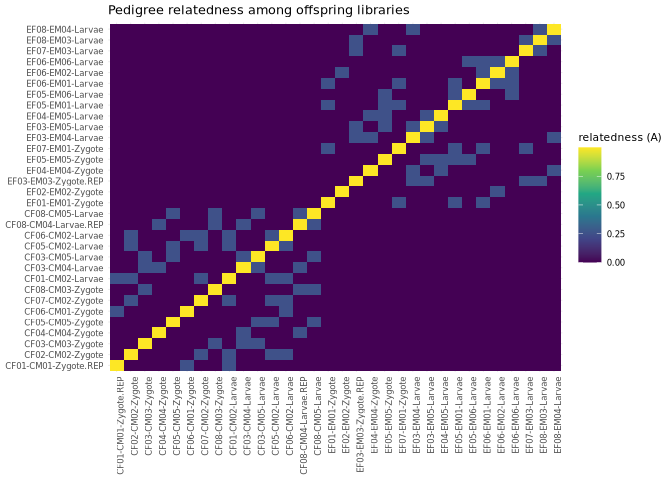

11-diff-methyl-MACAU
================
Kathleen Durkin
2026-09-18

- [1 Download methylation calls](#1-download-methylation-calls)
- [2 Read Bismark coverage into a BSseq
  object](#2-read-bismark-coverage-into-a-bsseq-object)
- [3 Build the pedigree and relatedness
  matrix](#3-build-the-pedigree-and-relatedness-matrix)
- [4 PQLseq2: binomial mixed model for parental-treatment
  effect](#4-pqlseq2-binomial-mixed-model-for-parental-treatment-effect)
- [5 Results: call DMLs](#5-results-call-dmls)
- [6 Save outputs](#6-save-outputs)
- [7 Interpretation/notes/next steps](#7-interpretationnotesnext-steps)

Differential methylation analysis using `MACAU`, which has built-in
functionality for incorporating informatin on population structure. This
will help account for pseudoreplication in our `ceasmallr` samples
stemming from shared parentage among the specimens.

As in `10-diff-methyl-DSS.Rmd` and `10.1-diff-methyl-DSS-parents.Rmd`,
will need to run this .rmd using a .sh script on Klone (copy below for
posterity)

``` bash
#!/bin/bash
#SBATCH --account=srlab
#SBATCH --partition=cpu-g2-mem2x
#SBATCH --cpus-per-task=8
#SBATCH --mem=200G
#SBATCH --time=1-00:00:00
#SBATCH --output=macau_%j.out
#SBATCH --error=macau_%j.err
#SBATCH --chdir=/gscratch/srlab/kdurkin1/ceasmallr/code

apptainer exec --bind /gscratch:/gscratch \
 /gscratch/srlab/kdurkin1/srlab-R4.4-bioinformatics-container-703094b.sif \
  bash -c 'source /srlab/programs/miniforge3-24.7.1-0/etc/profile.d/conda.sh && conda activate /gscratch/srlab/kdurkin1/.conda/envs/macau && Rscript -e "rmarkdown::render(\"11-diff-methyl-MACAU.Rmd\")"'
```

``` r
# Ended up needing to use PQLseq2 to implement the MACAU approach, instead of the MACAU 2.0 R package, which seemed to have some incompatabilites related to being built with an older version of R (?)
# PQLseq2 is also supported by MACAU authors (?)

library(PQLseq2)
library(bsseq)
library(BiocParallel)
library(nadiv)
library(readr)
library(dplyr)
library(stringr)
library(tibble)
library(ggplot2)
library(BiocParallel)
```

# 1 Download methylation calls

(if necessary — same offspring files as used in
`10-diff-methyl-DSS.Rmd`)

``` bash
wget \
--directory-prefix ../data/bismark-methyl-extraction \
--recursive \
--no-check-certificate \
--continue \
--cut-dirs 4 \
--no-host-directories \
--no-parent \
--quiet \
--no-clobber \
--accept="*.deduplicated.bismark.cov.gz,checksums.md5" https://gannet.fish.washington.edu/gitrepos/ceasmallr/output/02.20-bismark-methylation-extraction/
```

We should have N=32 (n=15 ControlxControl crosses, n=17 ExposedxExposed
crosses)

# 2 Read Bismark coverage into a BSseq object

Same as `10-diff-methyl-DSS.Rmd`: Bismark `.cov` columns (no header) are
`chr start end meth% count_methylated count_unmethylated`; positions are
1-based. Read into a `BSseq` object so we get the union of CpG positions
across samples, then pull the methylated-count and total-count matrices
MACAU needs.

``` r
file.list  <- list.files("../data/bismark-methyl-extraction", pattern = "\\.bismark\\.cov\\.gz$", full.names = TRUE)

# As in 06.2, could drop the low-yield libraries (<100M Cs); leaving all in for now to maximize sample size
# drop <- c("CF01-CM01-Zygote", "CF08-CM04-Larvae", "CF08-CM05-Larvae", "EF04-EM04-Zygote", "EF05-EM05-Zygote")
# file.list <- file.list[!str_detect(basename(file.list), str_c(drop, collapse = "|"))]

# format sample IDs
sample.ids <- basename(file.list) %>%
  str_replace("_R1_001\\.fastp-trim_bismark_bt2_pe\\.deduplicated\\.bismark\\.cov\\.gz$", "") %>%
  str_replace("_R1_001\\.fastp-trim\\.REPAIRED_bismark_bt2_pe\\.deduplicated\\.bismark\\.cov\\.gz$", ".REP")

# Grab treatment and lifestage info from Sample IDs
#   first letter of the cross code = parental treatment (C = control, E = exposed)
#   stage encoded in the ID string (Zygote / Larvae)
meta <- tibble(
  sample    = sample.ids,
  file      = file.list,
  treatment = case_when(str_starts(sample.ids, "E") ~ "Exposed",
                        str_starts(sample.ids, "C") ~ "Control",
                        TRUE ~ NA_character_),
  stage     = case_when(str_detect(sample.ids, "Zygote") ~ "Zygote",
                        str_detect(sample.ids, "Larvae") ~ "Larvae",
                        TRUE ~ NA_character_)
) %>%
  # reference levels: Control (so the coefficient = effect of exposure) and Zygote (earlier stage)
  mutate(treatment = factor(treatment, levels = c("Control", "Exposed")),
         stage     = factor(stage,     levels = c("Zygote",  "Larvae")))

knitr::kable(count(meta, treatment, stage))
```

| treatment | stage  |   n |
|:----------|:-------|----:|
| Control   | Zygote |   8 |
| Control   | Larvae |   7 |
| Exposed   | Zygote |   6 |
| Exposed   | Larvae |  11 |

``` r
colData <- DataFrame(treatment = meta$treatment,
                     stage     = meta$stage,
                     row.names = meta$sample)

BSobj <- read.bismark(files          = meta$file,
                      colData        = colData,
                      rmZeroCov      = TRUE,          # drops positions covered in 0 samples
                      strandCollapse = FALSE,         # .cov isn't a cytosine report; leave off
                      BPPARAM        = MulticoreParam(workers = 12, progressbar = TRUE),
                      verbose        = TRUE)
```

    ## [read.bismark] Parsing files and constructing valid loci ...

    ##   |                                                                              |                                                                      |   0%  |                                                                              |==                                                                    |   3%  |                                                                              |=====                                                                 |   6%  |                                                                              |=======                                                               |  10%  |                                                                              |=========                                                             |  13%  |                                                                              |===========                                                           |  16%  |                                                                              |==============                                                        |  19%  |                                                                              |================                                                      |  23%  |                                                                              |==================                                                    |  26%  |                                                                              |====================                                                  |  29%  |                                                                              |=======================                                               |  32%  |                                                                              |=========================                                             |  35%  |                                                                              |===========================                                           |  39%  |                                                                              |=============================                                         |  42%  |                                                                              |================================                                      |  45%  |                                                                              |==================================                                    |  48%  |                                                                              |====================================                                  |  52%  |                                                                              |======================================                                |  55%  |                                                                              |=========================================                             |  58%  |                                                                              |===========================================                           |  61%  |                                                                              |=============================================                         |  65%  |                                                                              |===============================================                       |  68%  |                                                                              |==================================================                    |  71%  |                                                                              |====================================================                  |  74%  |                                                                              |======================================================                |  77%  |                                                                              |========================================================              |  81%  |                                                                              |===========================================================           |  84%  |                                                                              |=============================================================         |  87%  |                                                                              |===============================================================       |  90%  |                                                                              |=================================================================     |  94%  |                                                                              |====================================================================  |  97%  |                                                                              |======================================================================| 100%

    ## Done in 83.2 secs

    ## [read.bismark] Parsing files and constructing 'M' and 'Cov' matrices ...

    ##   |                                                                              |                                                                      |   0%  |                                                                              |==                                                                    |   3%  |                                                                              |====                                                                  |   6%  |                                                                              |=======                                                               |   9%  |                                                                              |=========                                                             |  12%  |                                                                              |===========                                                           |  16%  |                                                                              |=============                                                         |  19%  |                                                                              |===============                                                       |  22%  |                                                                              |==================                                                    |  25%  |                                                                              |====================                                                  |  28%  |                                                                              |======================                                                |  31%  |                                                                              |========================                                              |  34%  |                                                                              |==========================                                            |  38%  |                                                                              |============================                                          |  41%  |                                                                              |===============================                                       |  44%  |                                                                              |=================================                                     |  47%  |                                                                              |===================================                                   |  50%  |                                                                              |=====================================                                 |  53%  |                                                                              |=======================================                               |  56%  |                                                                              |==========================================                            |  59%  |                                                                              |============================================                          |  62%  |                                                                              |==============================================                        |  66%  |                                                                              |================================================                      |  69%  |                                                                              |==================================================                    |  72%  |                                                                              |====================================================                  |  75%  |                                                                              |=======================================================               |  78%  |                                                                              |=========================================================             |  81%  |                                                                              |===========================================================           |  84%  |                                                                              |=============================================================         |  88%  |                                                                              |===============================================================       |  91%  |                                                                              |==================================================================    |  94%  |                                                                              |====================================================================  |  97%  |                                                                              |======================================================================| 100%

    ## Done in 32.9 secs

    ## [read.bismark] Constructing BSseq object ...

``` r
BSobj    # positions are the UNION across samples; missing positions get N = 0
```

    ## An object of type 'BSseq' with
    ##   31596324 methylation loci
    ##   32 samples
    ## has not been smoothed
    ## All assays are in-memory

``` r
# Require non-zero coverage in >= half the samples of each treatment x stage cell.
cov_check <- getCoverage(BSobj, type = "Cov")
cells     <- interaction(meta$treatment, meta$stage, drop = TRUE)

keep <- Reduce(`&`, lapply(levels(cells), function(cl) {
  idx <- which(cells == cl)
  rowSums(cov_check[, idx, drop = FALSE] > 0) >= ceiling(length(idx) / 2)
}))

BSobj <- BSobj[keep, ]
cat("Loci retained after coverage filter:", nrow(BSobj), "\n")
```

    ## Loci retained after coverage filter: 6337469

``` r
# Separation-aware filter
# Was getting errors (fatal `solve(): solution not found`) related to within-group sites
# that were either all 0% or all 100%.
# To prevent, require enough covered samples AND both methylated and unmethylated signal. 
# within each treatment group
Mmat <- getCoverage(BSobj, type = "M")
Cmat <- getCoverage(BSobj, type = "Cov")
Umat <- Cmat - Mmat
grp  <- meta$treatment

# Can adjust these parameters if desired
ok <- sapply(levels(grp), function(g) {
  j       <- which(grp == g)
  covered <- rowSums(Cmat[, j, drop = FALSE] >= 5)   # samples with >=5x in this group
  hasM    <- rowSums(Mmat[, j, drop = FALSE] >  0)   # samples with >=1 methylated read
  hasU    <- rowSums(Umat[, j, drop = FALSE] >  0)   # samples with >=1 unmethylated read
  (covered >= 3) & (hasM >= 2) & (hasU >= 2)
})
BSobj <- BSobj[ok[, "Control"] & ok[, "Exposed"], ]
cat("Loci retained after separation-aware filter:", nrow(BSobj), "\n")
```

    ## Loci retained after separation-aware filter: 2148546

Per-site mixed-model fitting is *very* slow across whole genome. As in
the DSS workflow, add a test-run switch that thins loci for
troubleshooting.

``` r
# Keeps all samples but randomly thins loci genome-wide.
# set test_run to FALSE for full-data runs
test_run  <- FALSE
test_frac <- 0.02      # keep 2% of loci

if (test_run) {
  set.seed(1)
  idx   <- sort(sample(nrow(BSobj), size = floor(nrow(BSobj) * test_frac)))
  BSobj <- BSobj[idx, ]
  cat("TEST RUN — loci subsampled to:", nrow(BSobj), "\n")
}
```

Pull the two count matrices MACAU needs *both* methylated counts (`X`)
and total coverage (`N`). Rows = loci, columns = samples, in the same
sample order as `meta`.

``` r
gr       <- granges(BSobj)
site_ids <- paste0(as.character(seqnames(gr)), "_", start(gr))

meth_mat <- as.matrix(getCoverage(BSobj, type = "M"))    # methylated read counts
cov_mat  <- as.matrix(getCoverage(BSobj, type = "Cov"))  # total read counts (library size)
rownames(meth_mat) <- rownames(cov_mat) <- site_ids
colnames(meth_mat) <- colnames(cov_mat) <- meta$sample

# check columns line up
stopifnot(identical(colnames(meth_mat), meta$sample),
          identical(dim(meth_mat), dim(cov_mat)),
          all(meth_mat <= cov_mat))


cat("Count matrices:", nrow(meth_mat), "loci x", ncol(meth_mat), "samples\n")
```

    ## Count matrices: 2148546 loci x 32 samples

# 3 Build the pedigree and relatedness matrix

Each offspring library ID encodes its parents: `Dam-Sire-Stage`
(e.g. `CF03-CM04-Larvae` represents a dam of `CF03`, sire of `CM04`).

I need to build a pedigree where the parents are unrelated founders
(unknown parents, these oysters were collected from the wild, see
Mcnally et al. 2022, so we don’t know genetic background) and each
offspring points to its dam and sire, then convert to a relatedness
matrix (full sibs 0.5, half sibs 0.25, self 1, so we’d expect a matrix
with a diagonal of 1, and some 0.25s scattered throughout both groups –
we have no full siblings, so don’t expect any 0.5 values).

``` r
# pull dam/sire IDs
parents_of <- str_split_fixed(meta$sample, "-", 3)
offspring_ped <- tibble(
  id   = meta$sample,
  dam  = parents_of[, 1],
  sire = parents_of[, 2]
)

# founder rows: every parent that appears, with unknown parents
founder_ped <- tibble(
  id   = unique(c(offspring_ped$dam, offspring_ped$sire)),
  dam  = NA_character_,
  sire = NA_character_
)

ped <- bind_rows(founder_ped, offspring_ped) %>%
  distinct(id, .keep_all = TRUE) %>%
  as.data.frame()

cat("Pedigree:", nrow(founder_ped), "founders (parents) +",
    nrow(offspring_ped), "offspring\n")
```

    ## Pedigree: 27 founders (parents) + 32 offspring

``` r
head(ped)
```

    ##     id  dam sire
    ## 1 CF01 <NA> <NA>
    ## 2 CF02 <NA> <NA>
    ## 3 CF03 <NA> <NA>
    ## 4 CF04 <NA> <NA>
    ## 5 CF05 <NA> <NA>
    ## 6 CF06 <NA> <NA>

``` r
# nadiv::makeA() generates additive relationship matrix A for the whole pedigree.
# prepPed() orders records and fills in any implied founders first.
ped_prepped <- nadiv::prepPed(ped)
A_full      <- as.matrix(nadiv::makeA(ped_prepped))

# Subset to just the offspring libraries
K <- A_full[meta$sample, meta$sample]
stopifnot(identical(rownames(K), colnames(meth_mat)),
          isSymmetric(K))
```

Quick look at the relatedness structure (how much pseudoreplication are
we actually modeling?):

``` r
# heatmap
ord <- order(meta$treatment, meta$stage)
as.data.frame(as.table(K[ord, ord])) %>%
  ggplot(aes(Var1, Var2, fill = Freq)) +
  geom_tile() +
  scale_fill_viridis_c(name = "relatedness (A)") +
  theme_minimal(base_size = 8) +
  theme(axis.text.x = element_text(angle = 90, hjust = 1)) +
  labs(x = NULL, y = NULL, title = "Pedigree relatedness among offspring libraries")
```

<!-- -->

# 4 PQLseq2: binomial mixed model for parental-treatment effect

Fit, per CpG, a binomial mixed model:

`meth_i / total_i ~ Binomial(total_i, p_i)`,
`logit(p_i) = intercept + treatment_i + stage_i + u_i`,
`u ~ N(0, h2 * K)`

- **Predictor tested (`x`)** = parental `treatment` (Control = 0,
  Exposed = 1).
- **Covariate adjusted for (`W`)** = `stage` (Zygote = 0, Larvae = 1).
  PQLseq2 fits its own intercept, so `W` holds covariates only.
- **Random-effect covariance (`K`)** = the pedigree relatedness matrix.

Runs kept failing due to single sites throwing `solve()` errors and,
while these only repesent fit failures for single CpG sites, the error
kills the entire run. This should hopefully be addressed by the
within-group filtering added above, but to make double sure I’m adding a
wrapper tot he `pqlseq2()` function that essentially parses the full set
of sites in chunks, and retries failed chunks in small batches.
Ultimately, this should function to eaxclude failed sites from the run,
rather than letting them corrupt/kill the whole job. Will also check,
though, for how many sites ended up being dropped (high \# could
indicate lingering data preprocessing issues)

(utills::capture.output() added bc first successful run had *thousands*
of lines of output messages about \# of sites, chunks, etc.)

``` r
run_pqlseq2_safe <- function(Y, x, K, W, lib_size, chunk = 1000, ncores = 8, ...) {
  idx_chunks <- split(seq_len(nrow(Y)), ceiling(seq_len(nrow(Y)) / chunk))
  out <- vector("list", length(idx_chunks))
  for (i in seq_along(idx_chunks)) {
    rows <- idx_chunks[[i]]
    utils::capture.output(
    res  <- try(pqlseq2(Y = Y[rows, , drop = FALSE], x = x, K = K, W = W,
                        lib_size = lib_size[rows, , drop = FALSE],
                        ncores = ncores, ...), silent = TRUE)
    )
    if (inherits(res, "try-error")) {
      # if a site in this chunk threw a fatal solve() error, redo it site-by-site
      # so the singular one is dropped but its chunk-mates are kept
      res <- dplyr::bind_rows(lapply(rows, function(r) {
        utils::capture.output(
        s <- try(pqlseq2(Y = Y[r, , drop = FALSE], x = x, K = K, W = W,
                         lib_size = lib_size[r, , drop = FALSE],
                         ncores = 1, ...), silent = TRUE)
        )
        if (inherits(s, "try-error")) NULL else s
      }))
    }
    out[[i]] <- res
  }
  dplyr::bind_rows(out)
}
```

``` r
treatment_num <- as.numeric(meta$treatment) - 1   # Control=0, Exposed=1
stage_num     <- as.numeric(meta$stage)     - 1   # Zygote=0,  Larvae=1

fit_pql <- run_pqlseq2_safe(
  Y        = meth_mat,                 # q x n methylated counts (rownames = "chr_pos")
  x        = treatment_num,            # predictor of interest (parental treatment)
  K        = K,                        # n x n pedigree relatedness -> random effect
  W        = cbind(stage = stage_num), # covariates (life stage)
  lib_size = cov_mat,                  # q x n total coverage
  chunk    = 1000,
  ncores   = 8,
  model    = "BMM",                    # binomial mixed model (MACAU model)
  filter   = TRUE,                     # drop sites w/o >=2 individuals having counts>5 (should be redundant)
  check_K  = TRUE,
  verbose  = FALSE
)

# wrapper check: how much of the data was actually fittable?
n_in <- nrow(meth_mat); n_out <- nrow(fit_pql); n_conv <- sum(fit_pql$converged, na.rm = TRUE)
cat("sites into fit:      ", n_in, "\n",
    "sites returned:      ", n_out, " (", round(100 * n_out / n_in, 1), "% survived fitting)\n",
    "of those, converged: ", n_conv, " (", round(100 * n_conv / n_out, 1), "%)\n", sep = "")
```

    ## sites into fit:      2148546
    ## sites returned:      2148546 (100% survived fitting)
    ## of those, converged: 1997127 (93%)

``` r
head(fit_pql)
```

    ##          outcome  n intercept se_intercept       beta   se_beta     pvalue
    ## 1 NC_007175.2_49 31 -4.035420    0.3181180  0.2946013 0.4041593 0.46604839
    ## 2 NC_007175.2_50 31 -3.643355    0.4000642  0.3819395 0.6318924 0.54555277
    ## 3 NC_007175.2_51 32 -3.686781    0.3325835 -0.9784464 0.4904543 0.04604510
    ## 4 NC_007175.2_52 31 -4.572153    0.5797449  0.1587980 0.7907265 0.84083511
    ## 5 NC_007175.2_88 32 -3.623185    0.2072900 -0.7102227 0.3178756 0.02546472
    ## 6 NC_007175.2_89 32 -4.195998    0.2633442  0.4007804 0.3670981 0.27494171
    ##          h2    sigma2 converged elapsed_time
    ## 1 0.0000000 0.3029549      TRUE  0.000646653
    ## 2 0.0000000 0.3950827      TRUE  0.000940705
    ## 3 1.0000000 0.4155439      TRUE  3.970676517
    ## 4 0.0000000 0.9539051      TRUE  0.000803488
    ## 5 0.0000000 0.1880950      TRUE  0.275307586
    ## 6 0.6881588 0.3761060      TRUE  3.740853141

# 5 Results: call DMLs

`pqlseq2()` returns `beta` (logit-scale effect of exposure), `se_beta`,
Wald `pvalue`, and `h2` (variance explained by relatedness). Add a
BH-FDR, keep converged fits, call DMLs at FDR \< 0.05.

``` r
res <- fit_pql %>%
  as_tibble() %>%
  filter(as.logical(converged)) %>%
  mutate(padj = p.adjust(pvalue, method = "BH"),
         pos  = as.integer(str_extract(outcome, "[0-9]+$")),   # site id = "chr_pos"
         chr  = str_remove(outcome, "_[0-9]+$")) %>%
  arrange(pvalue)

dml <- filter(res, padj < 0.05)
cat("Converged sites tested:", nrow(res), "\n")
```

    ## Converged sites tested: 1997127

``` r
cat("Treatment DMLs (FDR < 0.05):", nrow(dml), "\n")
```

    ## Treatment DMLs (FDR < 0.05): 799

``` r
cat("  hyper in exposed (beta > 0):", sum(dml$beta > 0), "\n")
```

    ##   hyper in exposed (beta > 0): 361

``` r
cat("  hypo  in exposed (beta < 0):", sum(dml$beta < 0), "\n")
```

    ##   hypo  in exposed (beta < 0): 438

``` r
head(dml)
```

    ## # A tibble: 6 x 14
    ##   outcome           n intercept se_intercept  beta se_beta   pvalue    h2 sigma2
    ##   <chr>         <int>     <dbl>        <dbl> <dbl>   <dbl>    <dbl> <dbl>  <dbl>
    ## 1 NC_035783.1_~    25     -1.16        0.329 -2.23   0.247 2.07e-19   NaN 0     
    ## 2 NC_035783.1_~    23     -1.24        0.367 -3.19   0.372 9.87e-18     0 0.0927
    ## 3 NC_035783.1_~    25     -1.33        0.360 -2.75   0.323 1.40e-17     1 0.0574
    ## 4 NC_035783.1_~    24     -1.34        0.352 -2.54   0.301 3.23e-17     1 0.0215
    ## 5 NC_035787.1_~    25      1.64        0.502  2.42   0.302 1.20e-15     1 0.0462
    ## 6 NC_035783.1_~    23     -1.66        0.448 -3.27   0.420 6.68e-15     0 0.179 
    ## # i 5 more variables: converged <lgl>, elapsed_time <dbl>, padj <dbl>,
    ## #   pos <int>, chr <chr>

Breakdown of what each column represents:

- `n` : The per-site sample size – for that site, how many individuals
  (out of 32) had coverage at this site and were used during model
  fitting
- `intercept` : baseline methylation for the reference group (Control,
  Zygote) on the logit scale
- `se_intercept` : SE of interecpt ^
- `beta` : DML effect – change in log-odds methylation, adjusted for
  lifestage and relatedness. Sign indicates direction (hyper-or
  hypo-methylated)
- `se_beta` : SE of `beta` ^
- `pvalue` : Wald-test p-value (H_0 is beta=0, no treatment effect) –
  NOTE this is not corrected for multiple testing in default output,
  have to correct manually
- `h2` : heritability metric, fraction of latent variance assigned to
  relatedness – eaaentially, how much of methylation variance at the
  site is explained by pedigree. High `h2` indicates signal at the DML
  is family-structured
- `sigma2`: total variance component (kinship + residual)
- `converged` : did the model fit converge?
- `elapsed_time` : time required to fit the site

I’ve added:

- `padj` : *adjusted* pvalue (BH, calculated from `pvalue`)
- `pos`/`chr` parsed genomic coordinates

NOTE that `beta` is a logit-scale log-odds, *not* a % methylation
difference, so magnitudes are not directly comparable to methylation
difference values produced by `DSS` or `methylKit`. I can still,
however, compare direction (+/- to indicate hyper-/hypomethylation) and
rank.

# 6 Save outputs

``` r
save_bed <- function(df, path, score_col) {
  if (is.null(df) || nrow(df) == 0) {
    file.create(path)
    message("save_bed: no rows for ", basename(path), " — wrote empty file.")
    return(invisible(NULL))
  }
  if (all(c("chr","start","end") %in% names(df))) {
    start <- df$start; end <- df$end
  } else if (all(c("chr","pos") %in% names(df))) {
    start <- df$pos - 1L; end <- df$pos
  } else {
    stop("save_bed: df lacks chr/start/end or chr/pos for ", basename(path))
  }
  score <- if (score_col %in% names(df)) df[[score_col]] else NA_real_
  bed <- data.frame(chr = df$chr, start = start, end = end, score = score)
  write.table(bed, path, quote = FALSE, sep = "\t", row.names = FALSE, col.names = FALSE)
}

write_tsv(res, "../output/11-diff-methyl-MACAU/pqlseq_treatment_test.tsv")
save_bed(dml, "../output/11-diff-methyl-MACAU/treatment_DML.bed", "beta")
```

# 7 Interpretation/notes/next steps

I believe the test run here is most comparable to the DSS test
`DMLfit.multiFactor(BSobj, design = design, formula = ~ treatment + stage)`,
which adjusts for lifestage but does not permit/account for an
interaction effect between parental treatment and lifestage.

Applying the above `DSS` model fit to all samples identified 11,356
DMLs. This is more than 10X the number of significant DMLs identified as
here, 799! Part of that is probably explained by the difference in \# of
sites tested (this *MACAU* work required an additional filter to remove
invariant sites within treatment groups): when using all samples,
6,337,469 sites tested in `DSS` work; 2,148,546 sites tested in `MACAU`
work.

However, the difference may also be explained in part by relatedness
effects – `DSS` may have been identiying some treatment-related DMLs
that are actually artifacts of shared parentage (pseudoreplication). I
think that DMLs identified in both sets would be the most robust.

Keep in mind, however, that `MACAU` is unable to identify loci for which
treatment effect *Differs by stage*, which `DSS` can answer using a
`~treatment + stage + treatment:stage` design.

I also have a concern about the way I’ve created the relatedness matrix
here. Because all offspring were generated using within-treatment
crosses (control M x contol F; exposed M x exposed F), by using parent
IDs to generate the matrix, I’ve also *nested* relatedness and
treatment. This is visible in the relatedness matrix heatmap, which
shows 0 relatedness for all cross-treatment comparisons (i.e. all CxC
and ExE comparisons are completely unrelated). The down-stream analysis
problem becomes evident when looking at the `h2` values of output DMLs.
All are either 0 (no variance explained by relatedness), 1 (all
explained by relatedness), or NA. This is a pretty clear indicator of
covariate confounding – the treatment parameter and relatedness matrix
are colinear by nature of the experimental design and matrix
construction approach.

The fix should be conceptually strightforward, if a little annoying to
implement. WGBS data is essentially modified WGS data – I can use WGBS
data with a bisulfite-conversion-aware caller (e.g., `Revelio`) to call
SNPs and then generate a relatedness matrix using `GEMMA`, as
recommended in the `MACAU` user manual.
