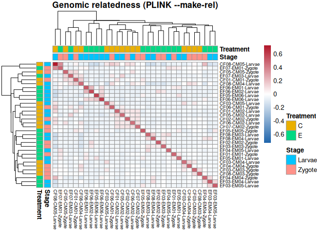

12-snp-calling-BS-Snper
================
Kathleen Durkin
2026-09-23

- [1 Load libraries](#1-load-libraries)
- [2 Download all sample BAM files](#2-download-all-sample-bam-files)
- [3 Merge samples](#3-merge-samples)
- [4 Identify SNPs across samples](#4-identify-snps-across-samples)
- [5 Identify SNPs per-sample](#5-identify-snps-per-sample)
- [6 Merge vcf files](#6-merge-vcf-files)

During my first attempt using `MACAU` (`11-diff-methyl-MACAU`), I
realized that generating the sample relatedness matrix from parent IDs
alone led to complete nesting/collinearity of the relatedness matrix and
the treatment condition.

To try to reduce this problem, I’m going to call variants from the
offspring WGBS data. The SNPs can then be used to generate a more
accurate relatedness matrix. They will also be important to exclude C-T
SNPs, which can falsely present as an unmethylated C site (following the
bisulfite conversion).

I’ll be using `BS-Snper` for WGBS variant calling, and referencing a
past example from Yamani (accessed through the [Roberts Lab
Handbook](https://robertslab.github.io/resources/bio_DNA-methylation/#bs-snper))

# 1 Load libraries

``` r
library(dplyr)
```

    ## 
    ## Attaching package: 'dplyr'

    ## The following objects are masked from 'package:stats':
    ## 
    ##     filter, lag

    ## The following objects are masked from 'package:base':
    ## 
    ##     intersect, setdiff, setequal, union

``` r
library(tidyr)
library(pheatmap)
```

# 2 Download all sample BAM files

(if needed)

``` bash
# Run wget to retrieve FastQs and MD5 files
# Note: the --no-clobber command will skip re-downloading any files that are already present in the output directory
wget \
--directory-prefix ../output/02.10-bismark-deduplication \
--recursive \
--no-check-certificate \
--continue \
--cut-dirs 4 \
--no-host-directories \
--no-parent \
--quiet \
--no-clobber \
--accept="*dedup.sorted.bam" https://gannet.fish.washington.edu/gitrepos/ceasmallr/output/02.10-bismark-deduplication/
```

``` bash
cd ../output/02.10-bismark-deduplication

echo "How many bam files were downloaded?"
ls *dedup.sorted.bam | wc -l

echo ""

echo "Check file checksums:"
grep 'dedup.sorted.bam' checksums.md5 | md5sum -c -
```

We should have N=32 (n=15 ControlxControl crosses, n=17 ExposedxExposed
crosses)

# 3 Merge samples

First, to ID SNPs *accross* all samples, for use in removing C/T
transitions during methyl analysis, I first need to merge all sample
BAMs into a single BAM file, which will be used as input to `BS-Snper`.

merge to single BAM using `samtools`

``` bash
samtools merge \
--threads 20 \
-o ../output/12-snp-calling-BS-Snper/merged_offspring_dedup.sorted.bam \
../output/02.10-bismark-deduplication/*dedup.sorted.bam \
```

check

``` bash
samtools view \
--threads 20 \
../output/12-snp-calling-BS-Snper/merged_offspring_threads_dedup.sorted.bam \
| head
```

create index file (in case I want to view in IGV)

``` bash
samtools index \
-b ../output/12-snp-calling-BS-Snper/merged_offspring_dedup.sorted.bam 
```

# 4 Identify SNPs across samples

Options for the script are found here and below. Input and output files
should be absolute paths.

–fa: Reference genome file in fasta format –input: Input bam file (I’m
using deduplicated sorted bams) –output: Temporary file storing SNP
candidates –methcg: CpG methylation information –methchg: CHG
methylation information –methchh: CHH methylation information
–minhetfreq: Threshold of frequency for calling heterozygous SNP
–minhomfreq: Threshold of frequency for calling homozygous SNP
–minquali: Threshold of base quality –mincover: Threshold of minimum
depth of covered reads –maxcover: Threshold of maximum depth of covered
reads –minread2: Minimum mutation reads number –errorate: Minimum
mutation rate –mapvalue: Minimum read mapping value SNP.out: Final SNP
result file ERR.log: Log file

``` bash
#Defaults: --minhetfreq 0.1 --minhomfreq 0.85 --minquali 15 --maxcover 1000 --minread2 2 --errorate 0.02 --mapvalue 20
#Saving output to gannet
/home/shared/BS-Snper-master/BS-Snper.pl \
--fa ../data/Cvirginica_v300/Cvirginica_v300.fa \
--input ../output/12-snp-calling-BS-Snper/merged_offspring_dedup.sorted.bam \
--output ../output/12-snp-calling-BS-Snper/SNP-candidates.txt \
--methcg ../output/12-snp-calling-BS-Snper/CpG-meth-info.tab \
--methchg ../output/12-snp-calling-BS-Snper/CHG-meth-info.tab \
--methchh ../output/12-snp-calling-BS-Snper/CHH-meth-info.tab \
--mincover 5 \
> ../output/12-snp-calling-BS-Snper/SNP-results.vcf 2> ../output/12-snp-calling-BS-Snper/merged.ERR.log
```

# 5 Identify SNPs per-sample

To call per-sample variants (to ultimately generate a relatedness
matrix), I need to run `BS-Snper` separately one each sample BAM. Since
there are \>30 samples, want to parallelize this to save time.

``` bash
mkdir -p ../output/12-snp-calling-BS-Snper/per-sample

# function to run BS-Snper once
run_bssnper() {
  bam=$1
  s=$(basename ${bam} _dedup.sorted.bam)
  ~/BS-Snper-master/BS-Snper.pl \
    ${bam} \
    --fa ../data/Cvirginica_v300/Cvirginica_v300.fa \
    --output ../output/12-snp-calling-BS-Snper/per-sample/${s}.candidates.txt \
    --methcg ../output/12-snp-calling-BS-Snper/per-sample/${s}.CpG.tab \
    --methchg ../output/12-snp-calling-BS-Snper/per-sample/${s}.CHG.tab \
    --methchh ../output/12-snp-calling-BS-Snper/per-sample/${s}.CHH.tab \
    --mincover 5 \
    > ../output/12-snp-calling-BS-Snper/per-sample/${s}.vcf 2> ../output/12-snp-calling-BS-Snper/per-sample/${s}.err.log \
  && rm ../output/12-snp-calling-BS-Snper/per-sample/${s}.candidates.txt ../output/12-snp-calling-BS-Snper/per-sample/${s}.C*.tab
}
export -f run_bssnper

# list out all of the sample BAM files, then feed into function run_bssnper using `parallel` to parallelize
ls ../output/02.10-bismark-deduplication/*_dedup.sorted.bam | parallel -j 20 --joblog ../output/12-snp-calling-BS-Snper/per-sample/parallel.log run_bssnper {}
```

# 6 Merge vcf files

Now that I have a variant file for each sample, combine into single file
for conversion to relatedness matrix

File should end up as a multi-sample .vcf.gz file, which has one row per
SNP position, one genotype column per sample.

``` bash
cd ../output/12-snp-calling-BS-Snper/per-sample

# For each sample's output .vcf file, pull the sample name and rewrite file header
# to include unique sample ID and chromosome names/lengths (required for BS-Snper)
# Also compress to .vcf.gz file type, which is required to merge all files using `bcftools` merge
for vcf in *.vcf; do
  s=${vcf%.vcf}
  echo ${s} > ${s}.name
  /home/shared/bcftools-1.14/bcftools reheader -s ${s}.name --fai ../../../data/Cvirginica_v300.fa.fai ${vcf} \
    | /home/shared/bcftools-1.14/bcftools view -f PASS -Oz -o ${s}.vcf.gz
  /home/shared/bcftools-1.14/bcftools index ${s}.vcf.gz
done

# merge all files using `bcftools` merge
ls *.vcf.gz > vcf_list.txt
/home/shared/bcftools-1.14/bcftools merge -l vcf_list.txt -Oz -o merged.vcf.gz
```

Filter to keep:

- only biallelic sites
- only single base substitutions (SNPs)
- only sites with genotypes in at least half of the samples
- only sites where the rarer allele is at a frequency of at least 5%
  (rare variants not super useful for relatedness estimaes, add noise)

``` bash
cd ../output/12-snp-calling-BS-Snper/per-sample

/home/shared/bcftools-1.14/bcftools view -m2 -M2 -v snps merged.vcf.gz \
  | /home/shared/bcftools-1.14/bcftools view -i 'F_MISSING < 0.5 && MAF > 0.05' -Oz -o merged.filtered.vcf.gz
```

Use `plink` to build the relatedness matrix (`MACAU` reccommends using
`GEMMA`, but we already have `plink` installed on Raven at
`/home/shared/plink_linux_x86_64_20230116/plink`)

`--allow-extra-chr` : `plink` expects human-style chromosomes, need this
option to permit the oyster chromosomes

``` bash
/home/shared/plink_linux_x86_64_20230116/plink --vcf merged.filtered.vcf.gz \
  --allow-extra-chr --double-id \
  --set-missing-var-ids @:# \
  --make-rel square \
  --out relatedness
```

Build a heatmap showing the sample relatedness

``` r
rel_dir <- "../output/12-snp-calling-BS-Snper/per-sample"

# read in relatedness matrix
rel <- as.matrix(read.table(file.path(rel_dir, "relatedness.rel")))

# read sample ids from the helper doc
ids <- read.table(file.path(rel_dir, "relatedness.rel.id"))$V2
dimnames(rel) <- list(ids, ids)

# Parse annotations from sample names
# (e.g., "CF01-CM01-Zygote" used to pull Control and Zygote)
parts <- do.call(rbind, strsplit(ids, "-"))
annot <- data.frame(
  Stage     = parts[, 3],
  Treatment = substr(parts[, 1], 1, 1),   # C or E
  row.names = ids
)

# Build heatmap
pheatmap(rel,
         annotation_row = annot,
         annotation_col = annot,
         color = colorRampPalette(c("#2166ac", "white", "#b2182b"))(100),
         breaks = seq(-max(abs(rel)), max(abs(rel)), length.out = 101),
         fontsize_row = 7, fontsize_col = 7,
         main = "Genomic relatedness (PLINK --make-rel)")
```

<!-- -->

Looks good! Half-sibs are grouped together, as expected, and grouping is
associated with neither treatment nor stage, which is also great! Only
confusing thing is why `CF08-CM05-Larvae` and `EF07-EM01-Zygote` are so
closely related…

It could just be because one of those samples has extremely low
coverage, and they share a relatively high proportion of SNPs by chance
(`CF08-CM05-Larvae` only has 6.2 million C’s, compared to \>200 million
in most samples)
