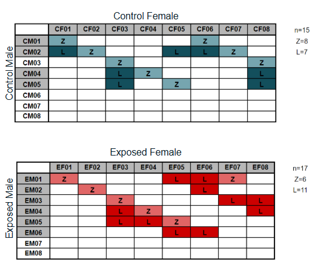
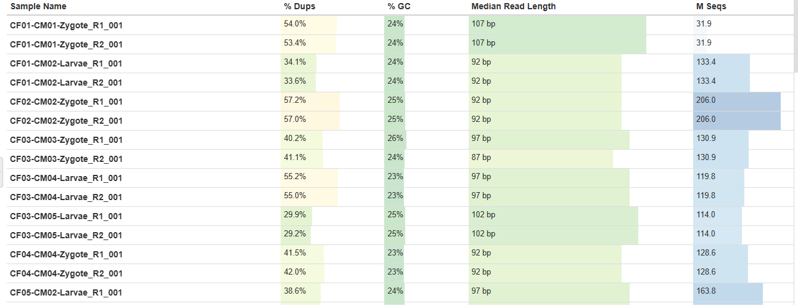
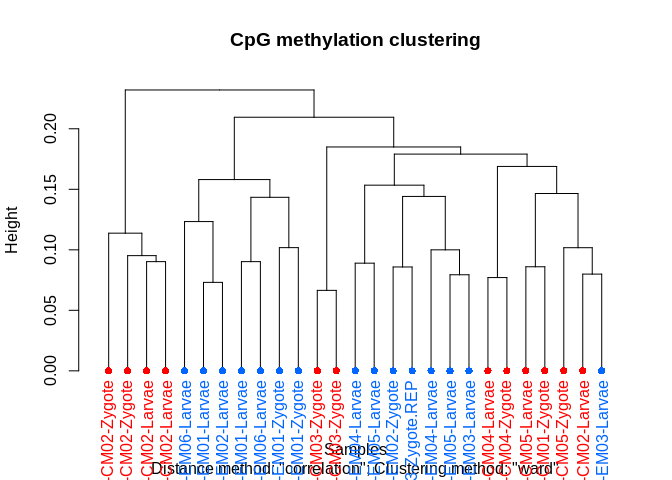
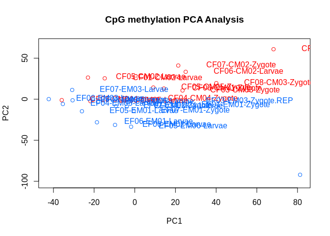
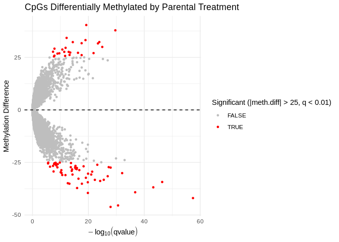

## Introduction

DNA methylation is a key epigenetic modification to the DNA molecule that influences expression without altering the nucleotide sequence. 

In vertebrates, the mechanisms of DNA methylation function and inheritance are fairly well-characterized. Methylation of a promotor region acts as an "on/off switch" for expression of that gene, and it's implicated in gene regulation, plasticity, environmental response, reproduction, development, disease, and aging. DNA methylation is also known to be stably heritable. In the worlds of ecology and conservation, DNA methylation has been increasingly recognized as an important contributor to phentoypic variation, fitness, and acclimation/adaptation.

**In invertebrates, however, previous knowledge of DNA methylation does not hold.** Global methylation levels, genomic distribution, and associations with expression differ significantly from vertebrates, and are highly variable among taxa. Though differential methylation patterns have been associated with environmental factors, it remains unclear how methylation influences expression, and ultimately phenotype. It also remains unclear whether and to what extent methylation patterns are inherited by offspring.

This project aims to investigate the functions and heritability of environmentally-induced DNA methylation in a commercially important marine invertebrate.

### Experimental Design

Adult Eastern oysters (*Crassostrea virginica*) were exposed to elevated pCO2 treatment for 30 days. Following this, their gonads were sampled for gametes (sperm or eggs). Fertilization crosses were performed within treatments, resulting in ControlxControl and ExposedxExposed offspring, and these offspring were reared in control conditions. 9 hours post-fertilization, zygotes were sampled, and 3 days post-fertilization, larvae were sampled. 



Whole genome bisulfite sequencing (WGBS) was used to map DNA methylation patterns of samples. While this project focuses only on offspring methylation, previous partner studies also examined parental methylation and expression (sperm and eggs), and offspring physiology.


### Preliminary Results

From partner studies, parental exposure to elevated pCO2 resulted in:

-   No differential gene expression in parent gametes (though exposure did affect gene activity features like transcript expression per gene)

-   Differential methylation in parent gametes (both eggs and sperm)

-   Improved shell growth rate in larvae (improvements were enhanced when offspring were also reared in elevated pCO2)


## Workflow

I began with raw WGBS reads of zygote and larvae samples, in FastQ file format. These can be found in our large-file storage: [](https://gannet.fish.washington.edu/gitrepos/ceasmallr/)


### Quality Control

**Trimming**. Raw WGBS FastQs were concatenated, trimmed using `fastp`, repaired if necessary using `BBtools`, and the quality-checked using `FastQC` and `MultiQC`. 

Outputs of trimming are still formatted as FastQ files:

```{r, engine='bash'}
curl -s https://gannet.fish.washington.edu/gitrepos/ceasmallr/output/00.00-trimming-fastp/CF01-CM01-Zygote_R1_001.fastp-trim.REPAIRED.fq.gz | gunzip -c | head
```

MultiQC provides high-level summaries of multiple data quality metrics:



### Preprocessing

**Alignment**. Trimmed WGBS FastQs were aligned to the *C. virginica* genome using `Bismark` and `Bowtie`, then summarized using `MultiQC`.

**Deduplication**. After reads were aligned to the *C. virginica* genome, they were deduplicated using `Bismark` to remove read duplication caused by PCR amplification during WGBS.

**Methylation extraction**. `Bismark` was used to call the methylation state of all sequenced cytosine positions.

This produces coverage files for each read which list, for each cytosine nucleotide in the genome, the number of reads that were methylated and unmethylated, and the methylation percentage (# methylated/all)

```{r, engine='bash'}
curl -s https://gannet.fish.washington.edu/gitrepos/ceasmallr/output/02.20-bismark-methylation-extraction/CF01-CM01-Zygote_R1_001.fastp-trim.REPAIRED.CpG_report.merged_CpG_evidence.cov.gz | gunzip -c | head -5
```

### Analysis

*Note that all below analysis steps were performed on three data subsets: all offspring lifestages in combination; only the zygote samples; and only the larvae samples. This is a preliminary way to account for the possible effects of lifestage on methylation*

Differential methylation analysis was performed using the R package `methylKit`. This process involves:

**Filtering**. Filtered out bases with low coverage that may reduce reliability in downstream analyses. Also discarded bases with exceptionally high coverage, as this is an indication of PCR amplification bias.

**Normalization**. Normalized the coverage values among samples.

**Data structure/Outlier detection**. Used visualization methods like creating cluster dendrograms and PCAs to get a sense of data structure, variation, etc.




**Differential methylation**. Tested for differential methylation of CpG sites. This is a statistical test that determines whether methylation level significantly differs among treatment groups.

Results were saved as BED files that show the genomic coordinates of each differential methylated locus (DML), as well as the percent methylation difference between treatment groups at that site (positive and negative values indicate hyper- and hypo-methylation, respectively).

```{r, engine='bash'}
head -5 ../output/06.2-diff-methyl-split-lifestage-low-cov/combo_diff25_DML.bed
```

Results can also be visualized in a volcano plot:



**Genomic distribution**. Using annotated tracks of our genome's introns and exons, examined distribution of DMLs accross genomic features


**Parental comparison**. Identified cytosines that were differentially methylated based on parent exposure in *both* the offspring and the parents. These "shared" marks would be strong indicators of methylation inheritance.


**Investingating Maternal/Paternal Contributions**. From both offspring and parent gonad methylation data, `methylKit` was used to extract and filter data. Cs present in both datasets with sufficient coverage were used to compare high-level methylation patterns between the two groups. After dimensionality reduction, plotted PCA to examine similarity based on treatment and sex/


## Summary

For all groups considered (Combo/grouped, Zygote only, and Larvae only), I *observed differential methylation based on parental exposure*. 
Offspring DMLs are mostly found in gene bodies, and are roughly equally distributed between introns and exons. This, is consistent with genomic distribution of DMLs in the parent gonads.

A small subset of these DMLs were *also differentially methylated in the parent gonads*, and were also largely geneic and equally distributed among introns/exons. Shared DMLs were almost exclusively found in the male parent gonads. This is consistent with methylation work in vertebrates that shows only the **paternal** contribution is stably inherited!

As further confirmation of paternal contribution being most influential, PCA of both offspring and parent methylation shows hat offspring clearly cluster with male parents, separate from the female parents.

## Next Steps

- **Regional Differential Methylation Analysis**. Regional differences (e.g. differential methylation of a gene) may be more meaningful that differential methylation of single C sites. 

- **Multifactor Analysis**. Figure out how to better incorporate parental influences into differential methylation analyses. Consider individual parental contributions, instead of only looking at the overall patterns of all parents


